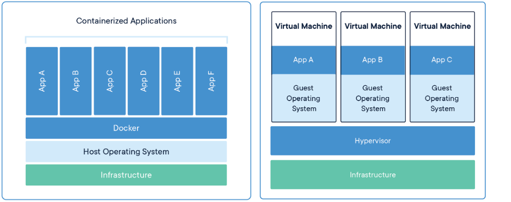
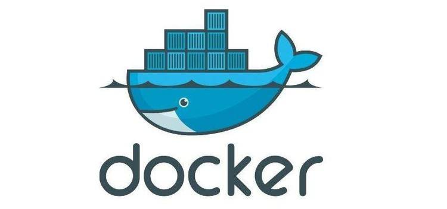
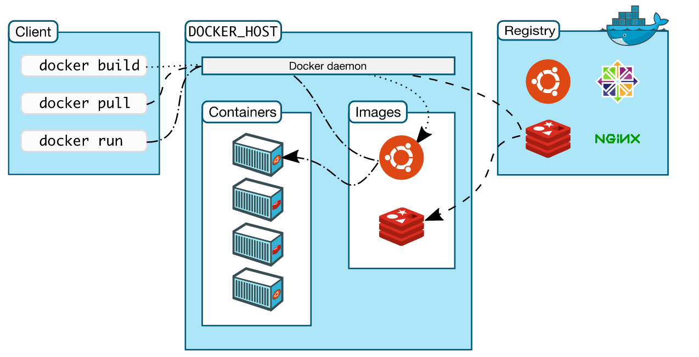
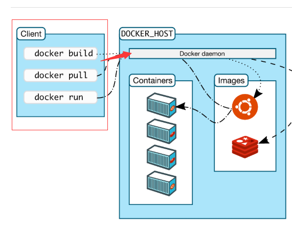
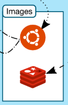
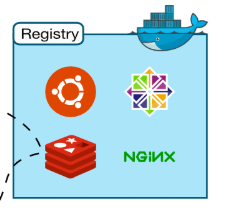
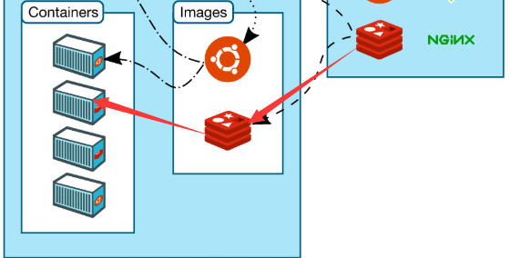
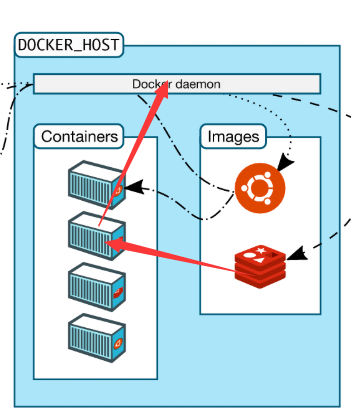

# 笔记一 Docker 入门

## 1. 什么是容器 ?

### 专业术语：将软件打包到标准化单元中，以进行开发，运输和部署 。

> - 打包代码及其所有依赖项的软件的标准单元，因此应用程序可从一个计算环境快速可靠地运行到另一个计算环境。
> - 容器将软件与其环境隔离开来，并确保尽管开发和后台之间存在差异，但软件仍可以均匀运行。

### 生活比喻：相当于我们把商品打包、寄送快递，然后到客户手里。

## 2. 为什么要使用容器而不使用虚拟机？

容器和虚拟机具有相似的资源隔离和分配优势。但不同的是，因为容器虚拟化了操作系统，而不是硬件。容器更加便携和高效。

### 容器

- 容器是应用程序层的抽象，将代码和依赖项打包在一起。
- 多个容器可以在同一台计算机上运行，并与其他容器共享OS内核，每个容器在用户空间中作为隔离的进程运行。
- 容器占用的空间少于VM（容器映像的大小通常为几十MB），可以处理更多的应用程序，并且需要的VM和操作系统更少。

### 虚拟机

- 虚拟机（VM）是将一台服务器转变为多台服务器的物理硬件的抽象。

- 系统管理程序允许多个VM在单台计算机上运行。每个VM包含操作系统，应用程序，必要的二进制文件和库的完整副本-占用数十GB。

- VM 也可能启动缓慢。

  

## 3.  为什么选择 Docker 容器？

### 业界领先的容器

Docker Engine为全球数百万个应用程序提供动力，为各种应用程序提供了标准化的打包格式。

Docker Engine是业界事实上的容器运行时，可在各种Linux（[CentOS](https://hub.docker.com/editions/community/docker-ce-server-centos)，[Debian](https://hub.docker.com/editions/community/docker-ce-server-debian)，[Fedora](https://hub.docker.com/editions/community/docker-ce-server-fedora)，[Oracle Linux](https://hub.docker.com/editions/enterprise/docker-ee-server-oraclelinux)，[RHEL](https://hub.docker.com/editions/enterprise/docker-ee-server-rhel)，[SUSE](https://hub.docker.com/editions/enterprise/docker-ee-server-sles)和[Ubuntu](https://hub.docker.com/editions/community/docker-ce-server-ubuntu)）和[Windows Server](https://hub.docker.com/editions/enterprise/docker-ee-server-windows)操作系统上运行。Docker创建了简单的工具和通用打包方法，将所有应用程序依赖项捆绑在一个容器中，然后在Docker Engine上运行。Docker Engine使容器化的应用程序可以在任何基础架构上一致地运行，解决了开发人员和运营团队的“依赖地狱”，并消除了“它可以在我的笔记本电脑上工作！” 问题。

### 节省开支

> 虚拟化容器体积小，占用率低。

### 简化程序

> 启动速度快, 启动和停止可以在**秒级实现**，这相比传统的虚拟机方式要快得多。

### 避免选择恐惧症

> 系统隔离级别高，可以作为一台虚拟电脑系统。

### 简化应用安装

> 运维人员：方便安装软件，方便部署（像使用yum一样）,  应为隔离级别高，所以一个容器一个应用软件，方便管理和维护。

### 提高效率

> 开发人员：使应用程序的生命周期从开发、测试、打包、发布、管理减少了手动操作，提高了工作效率，同时还对系统应用管理，减少了虚拟机到处存放文件的问题。

### 迎接云计算

> **Docker** 容器引擎，让我们技术人员，为**云计算时代**做好相应的准备。

## 4. 什么是 Docker ？

- **Docker** 是基于**Go**语言实现的云开源项目，诞生于2013年初，最初发起者是**dotClouw**公司。
- **Docke** 自开源后受到广泛的关注和讨论，目前已有多个相关项目，逐断形成了围**Docker**的生态体系。**dotCloud** 公司后来也改名为**Docker Ine**。
  
> Docker官方网址 https://docs.docker.com 
>
> Docker中文网址 http://www.docker.org.cn

&nbsp;

## 5. Docker 架构

### 1. DOCKER_HOST（宿主机）

宿主机意识就是依赖于 docker 依赖于操作系统，需要在操作系统上运行，相当于docker 安装在操作系统中进行运行才可以实现自己网络，但是它同时依赖外部操作系统网络。

-  **Docker daemon**（ Docker守护进程）是一个运行在**宿主机**（ **DOCKER-HOST**）的后台进程。

  > - 作用：可通过 **Docker客户端与之通信**。
  > - 例子：当一个应用在docker 中运行时，它也具有对应的PID 进行号，docker 进行了管理维护，相当于我们的后台进程运行。

  

-  **Containers**  就是相当于一个应用程序或多个应用程序在这个容器里进行运行。

  > - 容器是镜像的**可运行实例**。
  >
  > - 镜像和容器的关系有点类似于面向对象中，类和对象的关系。
  >
  > - 可通过 Docker API或者 CLI命令来启停、移动、删除容器。

  

- **images** 是一个只读模板，它包含创建 Docker容器的说明。

  > 例子：我们把一个带有版本的app打包发布到应用服务或我的应用仓库。

  

### 2. Client（客户端）

> **Docker客户端是 Docker的用户界面**，它可以接受用户命令和配置标识，并与 Docker daemon通信。

### 3. Register (远程注册表)

> **Register** 就是远程仓库。

### 4. 运行原理 ,如图所示

#### 例子： 当我们想部署一个 Redis 应用程序在 Docker 宿主机上运行。

1. 我们通过 **Client （客户端）**执行相应的docker 命令进行运行**Redis **应用程序。

   

   

2. 指令发送到 **Docker_HOST (服务器宿主机)**接受到后。先查看本地**images（镜像）** 是否存在该版本的**Redis **应用程序；

   

3. 如果没有该应用程序的版本，Docker 服务器宿主机会向远处 **Register (远程注册表)** 查询该版本应用程序。

   

4. 如果有相应的版本，会先下载到本地 **images（镜像）**，然后通过相应的命令执行创建 **Container（容器）**里面主要包含了**Redis** 应用程序和相应OS环境。

   

5. 最后通过**Docker daemon**运行容器， 通过端口就可以访问了。

​    

​    
