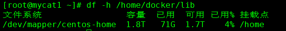

# 笔记四 Docker 其他功能

## 一、Docker 开启远程访问

 Docker 远程访问，后期在上传镜像时需要用到和访问的Docker 服务器端口，才能保证端口上传到该服务器 Docker 中。

#### 1. 修改宿主机的docker配置，让其可以远程访问（默认宿主机不允许远程访问）

#### 方法一

```bash
$ vi /lib/systemd/system/docker.service

-----------------------在ExecStart=后添加配置-----------------------
-H tcp://0.0.0.0:2375 -H unix:///var/run/docker.sock
------------------------------------------------------------------
```

#### 方法二

```bash
$ vim /etc/docker/daemon.json

-----------------------添加以下配置------------------------------------
{
"hosts": ["unix:///var/run/docker.sock", "tcp://192.168.2.98:2375"]
}
---------------------------------------------------------------------
```

#### 2. 刷新配置，重启服务

```bash
$ systemctl daemon-reload
$ systemctl restart docker 
```

#### 3. 查看是否配置成功

```bash
$ sudo netstat -lntp | grep dockerd


-----------------------输出如下信息------------------------------------
tcp        0      0 172.20.30.7:2375        0.0.0.0:*               LISTEN      2205/dockerd     
---------------------------------------------------------------------
```

> **官网文档参考配置:***https://docs.docker.com/install/linux/linux-postinstall/*

## 二、Docker 私有仓库 

​    Docker 私有仓库主要用于上传自己构建好的镜像，有利于存储各个版本镜像，让自己镜像得到安全保护，相当于 maven 私服。

#### 1. 获取启动私有仓库镜像，默认端口为5000

```bash
$ docker run -d --name=registry --restart=always -p 5000:5000 registry
```

#### 2. 访问私有仓库

```bash
$ curl http://localhost:5000/v2/_catalog 

# 表示私有仓库搭建成功，并且里面没有镜像。
-----------------------输出如下信息------------------------------------
{
  "repositories":[]
}
---------------------------------------------------------------------
```

#### 3. 给dokcer 授权私有仓库地址，作用是将本地的镜像上传到私有仓库

``` bash
$ vim /etc/docker/daemon.json

# “insecure-registries": 添加私有仓库地址到docker注册表中去。
--------------------------添加如下内容--------------------------------
{
  "registry-mirrors": ["https://m0p90m3l.mirror.aliyuncs.com"],
  "insecure-registries":["192.168.2.98:5000"]                  
}
---------------------------------------------------------------------
```

#### 4. 刷新配置，重启docker服务，使其生效。

```bash
$ systemctl daemon-reload && systemctl restart docker
```

#### 5. 将镜像上传到私有仓库

```bash
# tag 指定镜像名 私服ip地址
$ docker tag jdk1.8 192.168.2.98:5000/jdk1.8 

# 上传
$ docker push 192.168.2.98:5000/jdk1.8
```

#### 6. 验证是否上传镜像成功

```bash
$ curl http://localhost:5000/v2/_catalog

-----------------------输出如下信息------------------------------------
{
  "repositories":[
       "jdk1.8"
  ]
}
---------------------------------------------------------------------
```

## 三、Docker 磁盘空间占满,迁移/var/lib/docker目录

### <font color=red><b>问题：no space left on device</b></font>

#### 1. 查看磁盘使用情况

```bash
$ df -hl
```


#### 2. 查看docker 的存储根目录

```bash
$ docker info | grep -i "docker root dir"
```


#### 3. 查看目录剩余空间

```bash
$ df -hl /docker-root
```


#### 4. 停止Docker服务

```bash
$ systemctl stop docker
```

#### 5. 创建一个存储空间较大的docker目录

```bash
# 找一个大的磁盘
$ df -h 
# 创建一个大磁盘docker目录
$ mkdir -p /home/docker/lib
```

#### 6. 迁移到新目录下面的文件

```bash
$ rsync -avz /docker-root /home/docker/lib
```

> *ps： 未安装rsync， 输入 yum install rsync -y*

#### 7. 配置 /etc/systemd/system/docker.service.d/devicemapper.conf

```bash
# 如果存在该目录，创建该目录
$ mkdir -p /etc/systemd/system/docker.service.d/

# 修改devicemapper.conf
$ vi /etc/systemd/system/docker.service.d/devicemapper.conf

# 同步的时候把父文件夹一并同步过来，实际上的目录应在 /home/docker/lib/docker 
[Service]
ExecStart=
ExecStart=/usr/bin/dockerd  --graph=/home/docker/lib/docker
```

#### 8. 重新加载 docker

```bash
$ systemctl daemon-reload
$ systemctl restart docker
$ systemctl enable  docker
```

#### 9. 查看docker信息

```bash
$ docker info 
```


#### 10. 查看挂载大目录后信息

```bash
$ df -h /home/docker/lib
```

