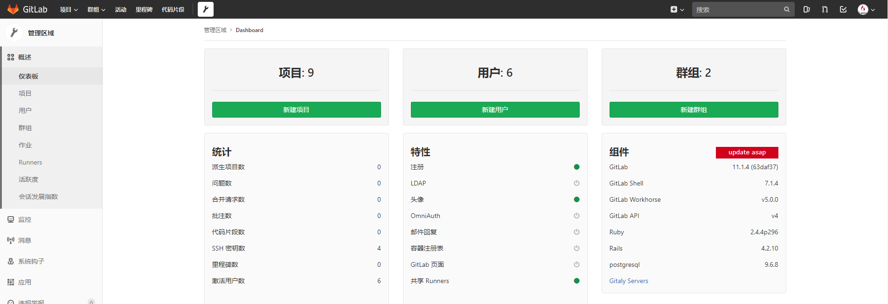
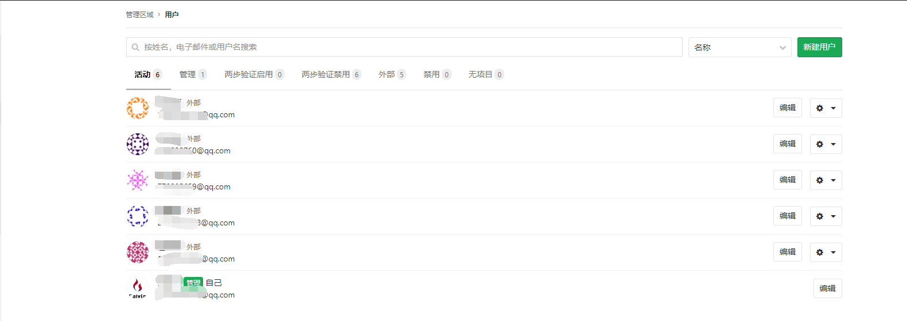
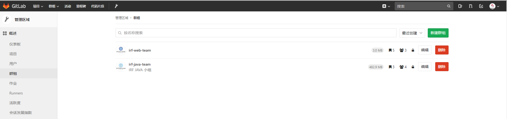
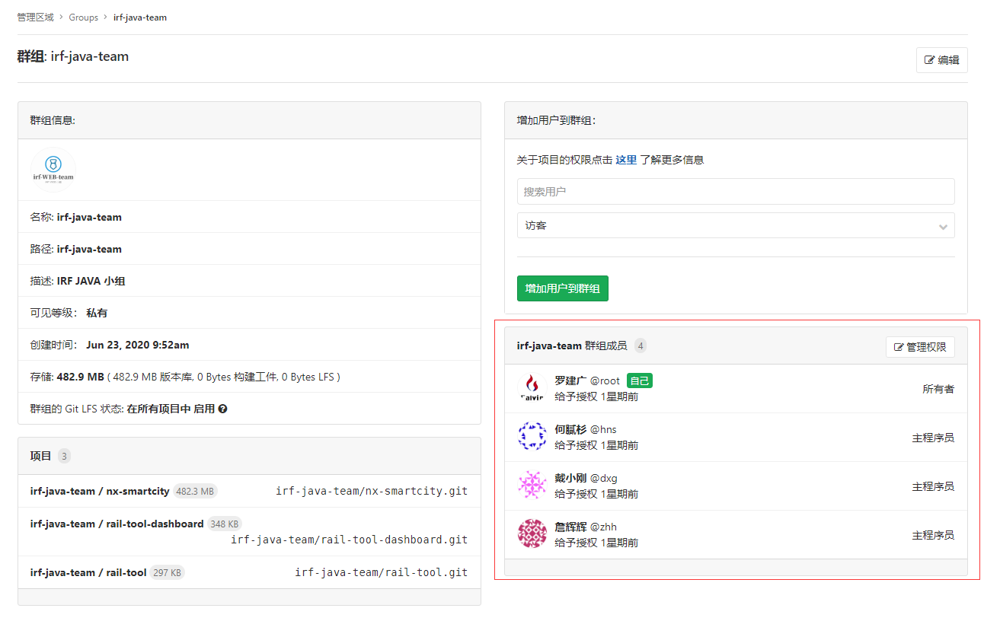

# 笔记二 GitLab 基于 Docker 安装

## 一、GitLab中文版 安装 

### 1. 前置条件

- 安装 Docker 
- 安装 Docker-Compose
- 硬件配置要求
  - 内存至少4GB
  - CPU至少2核 

### 2. 安装 Gitlab

#### 2.1 创建一个 gitlab 目录，用于存放 docker-compose 文件。

```bash
# 创建一个gitlab 目录
$ mkdir -p /home/docker/gitlab

# 创建一个docker-compose.yml 配置文件
$ touch /home/docker/gitlab/docker-compose.yaml
```

#### 2. 2 创建一个 gitlab 所需要挂着目录。

```bash
# 创建一个 gitlab 挂着目录
$ mkdir -p /home/docker/mnt/gitlab
$ cd /home/docker/mnt/gitlab
# 创建 gitlab 挂着的重要目录文件夹
$ mkdir config data logs
```

#### 2.3 编写 gitlab  在 docker-compose 文件中，用于运行启动。

```bash
version: '3.1'
services:
    web:
      # 中文版触发钩子有问题
      # image: 'twang2218/gitlab-ce-zh:11.1.4'
      # 修改为官方版本
      image: 'gitlab/gitlab-ce:latest'
      restart: always
      hostname: '192.168.2.163'
      container_name: 'gitlab'
      environment:
        TZ: 'Asia/Shanghai'
        GITLAB_OMNIBUS_CONFIG: |
          # gitlab 中创建项目的拉取地址
          external_url 'http://192.168.2.163'
          unicorn['port'] = 8888
          nginx['listen_port'] = 80
          ################# 配置邮件 ########################
          gitlab_rails['smtp_enable'] = true
          # 这里使用的是stmp.qq邮箱服务地址
          gitlab_rails['smtp_address'] = "smtp.qq.com"
          # 该stmp.qq 邮箱服务地址的端口465
          gitlab_rails['smtp_port'] = 465
          gitlab_rails['smtp_user_name'] = "xxxxxx@qq.com"
          # 邮箱中的邮件授权码
          gitlab_rails['smtp_password'] = "iibzvfbprrxkbfhf"
          gitlab_rails['smtp_authentication'] = "login"
          gitlab_rails['smtp_enable_starttls_auto'] = true
          gitlab_rails['smtp_tls'] = true
          gitlab_rails['gitlab_email_from'] = 'xxxxxx@qq.com'
      ports:
        - '80:80'
        - '443:443'
        - '22:22'
      volumes:
        - /home/docker/mnt/gitlab/config:/etc/gitlab
        - /home/docker/mnt/gitlab/data:/var/opt/gitlab
        - /home/docker/mnt/gitlab/logs:/var/log/gitlab
```

> 注意：
>
> - GitLab中文版镜像网站：https://hub.docker.com/r/twang2218/gitlab-ce-zh
> - GitLab原官方镜像：**`gitlab/gitlab-ce`**, 但是是英文版，上面配置并不适合，可以查看官方安装方式地址：https://hub.docker.com/r/gitlab/gitlab-ce

#### 2.4 修改服务器中远程连接的默认端口号22，因为22需要被 gitlab 用到。

```bash
# 修改 SSHD 配置文件
$ vim /etc/ssh/sshd_config

------------------------- 修改内容如下 -----------------------------------------------
# 修改远程连接端口为
port 22222
-------------------------------------------------------------------------------------

# 重启远程ssh
$ service sshd restart
```

#### 2.5 启动 Gitlab

- up 启动 
- -d 后台运行 

```bash
# 进入该docker-compose.yml 文件目录
$ cd /home/docker/gitlab/  

# 启动并查看日志
$ docker-compose up -d && docker logs -f gitlab
```

> 注意：运行需要一段时间报 502 是正常的。

#### 2.6 成功后的界面

由于我已设置密码，刚开始界面不是以下界面，是默认可以设置密码的。

- 默认用户名：**`root`**
- 密码：**`自定义`**


#### 2.7  进入首页



- 创建用户

  

-  创建群组

  

- 给群组添加人员，分配权限

  

- 创建项目

  