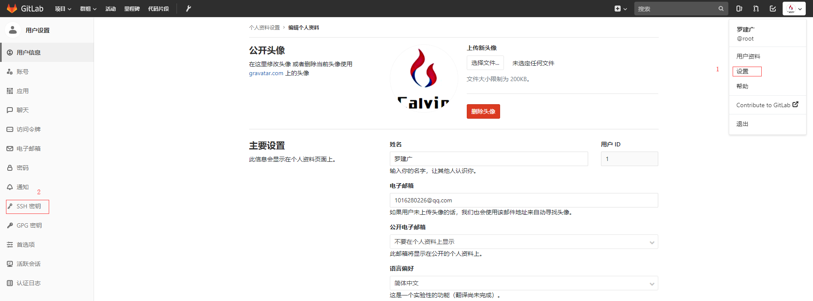
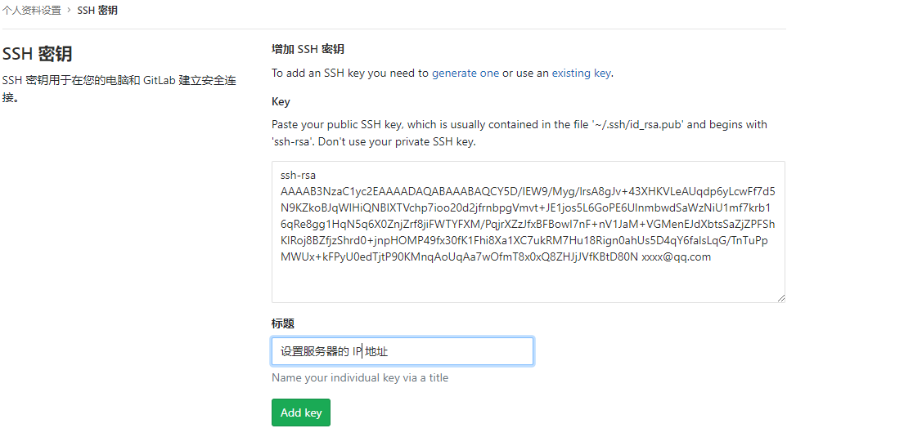

# 笔记三 GitLab 配置SSH访问协议

## 一、GitLab 访问项目方式

- http 协议访问方式
- SSH 协议访问方式

本章主要讲解如何配置 SSH 协议访问方式 GitLab中项目，让操作人员进行拉取、提交上传代码。（**`作用是免密`**）

## 二、操作步骤

登录 **Gitlab** 后， 右上角鼠标选中用户头像点击**`设置`**选项，然后跳转到个人**`用户设置`**。在左下角菜单栏中，点击 “**`SSH 密钥`**”。



### 1. 生成 SSH 秘钥

- 前期需要安装 **Git**。（安装后，可以配置**Git** 环境变量）

#### 1. 1 使用 **ssh-keygen** 工具生成，位置在 **Git** 安装目录下。

```bash
# 注意：这里的邮件地址必须在Gitlab 上对应的用户
$ ssh-keygen -t rsa -C "xxxx@qq.com"

--------------------------------- 输出如下信息 -----------------------------------------------
Generating public/private rsa key pair.
Enter file in which to save the key (C:\Users\ASUS/.ssh/id_rsa):
C:\Users\ASUS/.ssh/id_rsa already exists.
Enter passphrase (empty for no passphrase): # enter 回车
Enter same passphrase again: # enter 回车
Your identification has been saved in C:\Users\ASUS/.ssh/id_rsa.
Your public key has been saved in C:\Users\ASUS/.ssh/id_rsa.pub.
The key fingerprint is:
SHA256:23YGOtMjrS8iQRUzD2R7tKeeMz7temh44rjoopN+sHU 1016280226@qq.com
The key's randomart image is:
+---[RSA 2048]----+
|     .B..        |
|     ..B .       |
|     .. + .      |
|    .  . o       |
|   .    S .      |
| . ..E . B .     |
| .+ .. .@o* o    |
|+. o..+.*Oo+     |
|+=+ o+.=+Bo      |
+----[SHA256]-----+
---------------------------------------------------------------------------------------------
```

#### 1.2 将生成 SSH 公钥，复制粘贴到 GitLab 中。

```bash
$ cat C:/Users/ASUS/.ssh/id_rsa.pub

----------------------------- 输出如下信息,拷贝一下信息 -------------------------------------------
ssh-rsa AAAAB3NzaC1yc2EAAAADAQABAAABAQCY5D/IEW9/Myg/lrsA8gJv+43XHKVLeAUqdp6yLcwFf7d5N9KZkoBJqWlHiQNBIXTVchp7ioo20d2jfrnbpgVmvt+JE1jos5L6GoPE6UlnmbwdSaWzNiU1mf7krb16qRe8gg1HqN5q6X0ZnjZrf8jiFWTYFXM/PqjrXZzJfxBFBowI7nF+nV1JaM+VGMenEJdXbtsSaZjZPFShKIRoj8BZfjzShrd0+jnpHOMP49fx30fK1Fhi8Xa1XC7ukRM7Hu18Rign0ahUs5D4qY6falsLqG/TnTuPpMWUx+kFPyU0edTjtP90KMnqAoUqAa7wOfmT8x0xQ8ZHJjJVfKBtD80N xxxx@qq.com
-----------------------------------------------------------------------------------------------
```



#### 1.3 通过拉取GitLab 项目代码，验证SSH 配置是否成功。

```bash
$ git clone ssh://git@gitlab—host/项目.git

-------------------------------------- 输出以下信息代表成功 --------------------------------------
Cloning into '项目'...
remote: Counting objects: 24949, done.
remote: Compressing objects: 100% (9684/9684), done.
remote: Total 24949 (delta 12021), reused 23985 (delta 11146)
Receiving objects: 100% (24949/24949), 479.94 MiB | 11.07 MiB/s, done.
Resolving deltas: 100% (12021/12021), done.
Checking out files: 100% (3756/3756), done.
warning: the following paths have collided (e.g. case-sensitive paths
on a case-insensitive filesystem) and only one from the same
-----------------------------------------------------------------------------------------------
```

<font color=red><b>问题一：SSH 端口22 冲突，报错信息如下 </b></font>

```bash
@@@@@@@@@@@@@@@@@@@@@@@@@@@@@@@@@@@@@@@@@@@@@@@@@@@@@@@@@@@
@    WARNING: REMOTE HOST IDENTIFICATION HAS CHANGED!     @
@@@@@@@@@@@@@@@@@@@@@@@@@@@@@@@@@@@@@@@@@@@@@@@@@@@@@@@@@@@
IT IS POSSIBLE THAT SOMEONE IS DOING SOMETHING NASTY!
Someone could be eavesdropping on you right now (man-in-the-middle attack)!
It is also possible that a host key has just been changed.
The fingerprint for the ECDSA key sent by the remote host is
SHA256:o/WLSVFz7IPHtjHVrIr+nxtMVo+uZlgk2uO+wRe2ItA.
Please contact your system administrator.
Add correct host key in /c/Users/ASUS/.ssh/known_hosts to get rid of this message.
Offending ECDSA key in /c/Users/ASUS/.ssh/known_hosts:1
ECDSA host key for 192.168.2.163 has changed and you have requested strict checking.
Host key verification failed.
fatal: Could not read from remote repository.
```

<font color=gree><b>解决方法：删除 ~/.ssh/known_hosts, 命令如下</b></font>

```bash
# linux
$ rm -f ~/.ssh/known_hosts
# window
$ del /s ~/.ssh/known_hosts
```

### 三、操作演示

