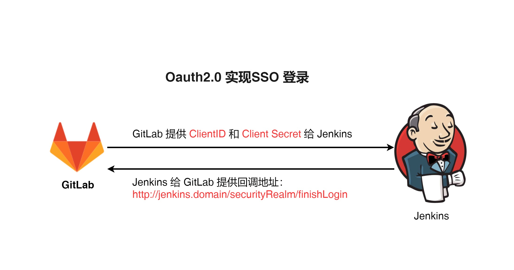
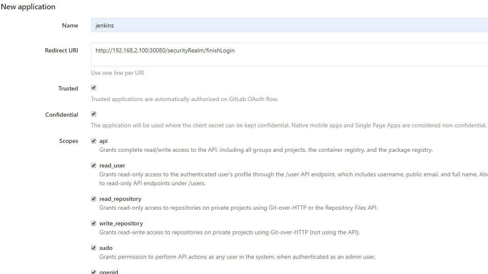
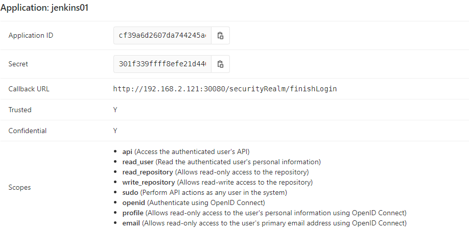
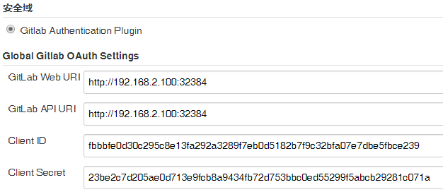

# 笔记一 Jenkins 集成 GitLab - 实现SSO登录


## 1. 为什么要实现集成GitLab SSO 登录 ？



实现 **GitLab** 进行 **SSO** 单点登录：

- 方便我们**快速登录**，无需记住多个账号系统，减少重复多次登录不同系统。
- 有效**提高部署**和**查看系统信息**，做到一个账号进入多个系统。

## 2. 前提

> 1. 安装正常启动 GitLab，有GitLab 管理员账号。
>
> 2. 安装正常启动 Jenkins，有Jenkins 管理员账号。

## 3. 步骤

### GitLab 配置 应用程序 ClientID 和 Client Secret

- 在 **GitLab** 首页 -> 点击 “**AdminArea**” , 跳转页面后， 点击 选择 “**Applications**”, 添加一个  “**New applicaton**”。

- 在 **GitLab** 中配置 **Jenkins 回调地址**和拥有**Jenkins 的权限配置**。（*全部勾选*）

  

- 点击 “**提交**”  

- 可以看到生成 **ClientID** 和 **Client Secret**、**Jenkins 回调地址**。

  

### Jenkins 安装插件 Gitlab Authentication plugin

- 在 **Jenkins** 首页打开 “**系统管理**”  -> 点击 "**插件管理**" -> 选择"**可选插件**" -> 搜索 "**Gitlab Authentication plugin**"

  

- 安装后，必须重启 **Jenkins**

### Jenkins 设置配置

- 进入 **Jenkins** 安装目录：<font color="red"> /var/jenkins_home/config.xml </font >文件进行备份。（因为，使用了OSS 登录后，如果删除了或更改了 **ClientID** 导致出现登录问题）	

  ```bash
  cd /var/jenkins_home/
  cp config.xml config-backup.xml
  ```
  
- 找到 **Jenkins** 全局安全配置，看到 “**安全域**” 下点击 “**Gitlab Authentication Plugin**”，填写 **GitLab** 访问**IP**、生成的 **ClientID** 、**Client Secret**。

  
  
- 点击 “**保存**” 或 “**应用**”

##   4. 演示 OSS 登录功能

