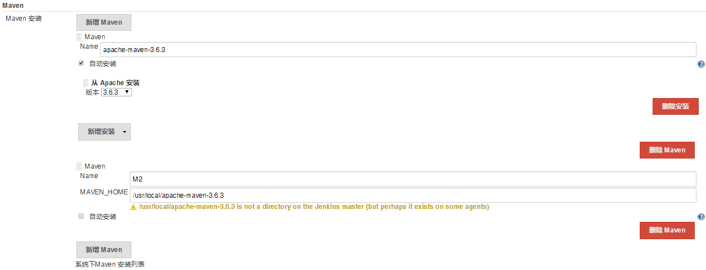
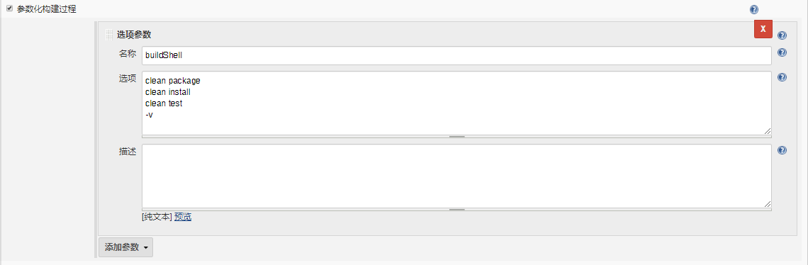
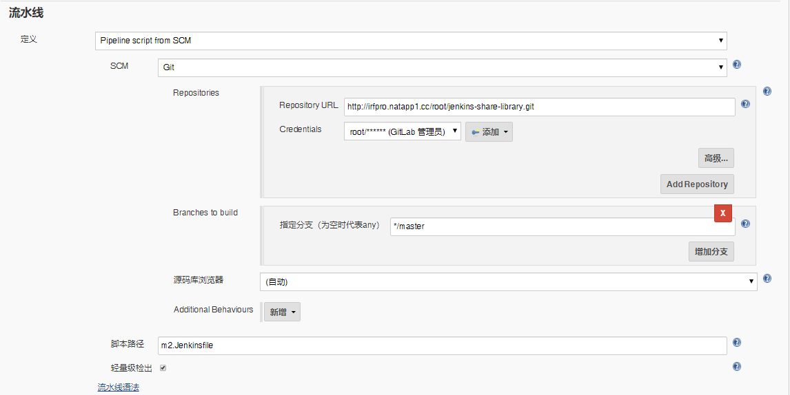
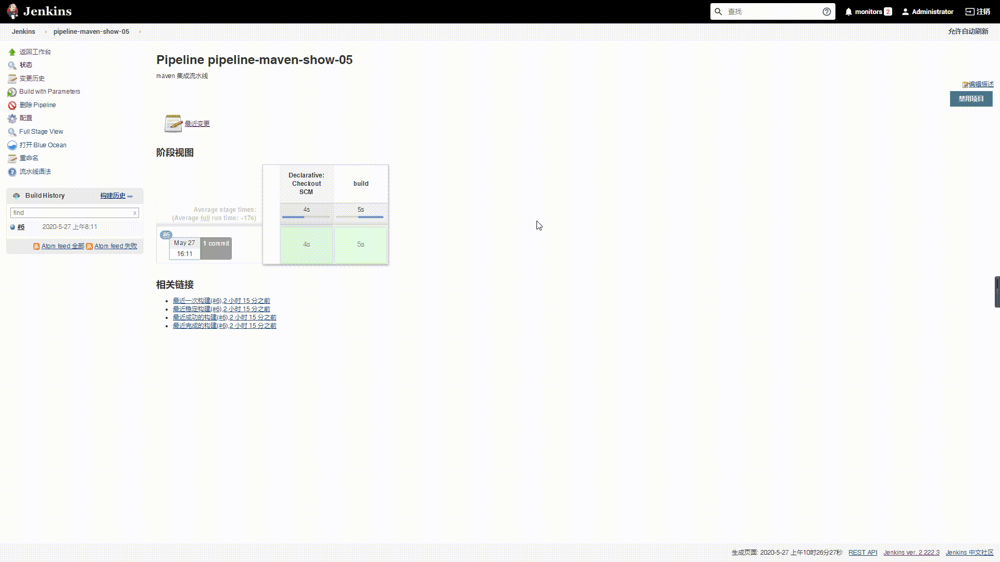

# 笔记二 Jenkins 集成 Maven 构建工具

## 1. 为什么集成 Maven 构建工具 ？


在大多数 **JAVA** 开发项目中，通常使用的项目依赖管理工具 **`Maven`**, 为了让我们 JAVA 项目开发和部署更加**方便、高效、快速迭代升级** ，所以 **Jenkins** 提供了 **Maven** 插件进行集成有关联的 **Maven** 项目。


## 2. Maven 下载安装

> **maven**官网下载地址：http://maven.apache.org/download.cgi

1. 下载 apache-maven-3.6.3 安装包。

```bash
$ wget https://mirror.bit.edu.cn/apache/maven/maven-3/3.6.3/binaries/apache-maven-3.6.3-bin.tar.gz
```

2. 解压 apache-maven-3.6.3 安装包。

```bash
$ tar -zxvf apache-maven-3.6.3-bin.tar.gz
```

3. 将解压后的 apache-maven-3.6.3 文件夹放入到指定目录下。

```bash
$ mv apache-maven-3.6.3 /usr/local/
```

4. 添加环境变量到系统文件。

```bash
$ vim /etc/profile

################################### 添加以下内容 ################################################
export M2_HOME=/usr/local/apache-maven-3.6.3
export PATH=$PATH:M2_HOME/bin
###############################################################################################
```

5. 执行**`source`** 让环境变量生效。

```bash
$ source /etc/profile
```

6.  使用 **`mvn`** 命令 查看是否生效。

```bash
$ mvn -v 

------------------------------输出以下内容，代码 MAVEN 安装成功------------------------------------
Apache Maven 3.6.3 (cecedd343002696d0abb50b32b541b8a6ba2883f)
Maven home: /usr/local/apache-maven-3.6.3
-----------------------------------------------------------------------------------------------
```

## 3. Jenkins 配置 Maven 构建工具

1. 在“**系统管理**"， 点击“**全局工具配置**”。

2. 配置 **Maven** 构建工具
   - Name : 定义 **Maven** 在 **Jenkins** 名称。
   - MAVEN_HOME: **Maven** 安装地址。



3. 点击“**保存**”或者“**应用**”。

>***Warning 注意：***
>
>1. 由于图上面有2个**Maven** 配置，一个是自动安装，一个装在手动安装，自动安装的原因是因为我的 **Jenkins** 使用的安装方式是 **K8S**, 所以使用<font color="red"><b>手动安装 MAVEN_HOME 是不生效的</b></font>。
>2. 使用 **K8S** 安装 **Jenkins**,  在容器中 **MAVEN_HOME** 安装目录在 <font color="green">/var/jenkins_home/tools/hudson.tasks.Maven_MavenInstallation/apache-maven-3.6.3/</font>


## 4. 使用 Pipeline 实现 Maven 构建 


- 在 **GitLab** 中 **jenkins-share-library** 项目，创建一个 **m2.Jenkinsfile** 文件, 添加以下代码：

```groovy
#!groovy

String buildShell = "${env.buildShell}"

pipeline {
    agent { 
        node { 
            label "master"
        } 
    }
    stages {
        stage("build") {
            steps {
                script {
                    mvnHome = tool "apache-maven-3.6.3"
                    sh "${mvnHome}/bin/mvn ${buildShell}"
                }
            }
        }
    }
}
```

- 在 **Jenkins** 创建一个流水线项目为 **pipeline-maven-show-05**
  - 添加描述:  **Maven** 集成流水线
  - 参数化构建过程（**选项参数**）， 添加以下 **Maven** 命令 :
    - maven 打包命令：**clean package**
    - maven 安装命令：**install**
    - maven 测试命令：**test**
    - maven 版本命令：**-v**



- 流水线配置
  - 定义：**Pipeline script from SCM**
  - SCM ：**Git**
  - Repositories：http://irfpro.natapp1.cc/root/jenkins-share-library.git
  - Credentials：添加 gitlab 凭据。
  - 脚本路径(项目执行流水线的Jenkinsfile)：**m2.Jenkinsfile**



- “**保存**”或者“**应用**”。

## 5. Maven 集成 Pipeline 流水线演示效果

