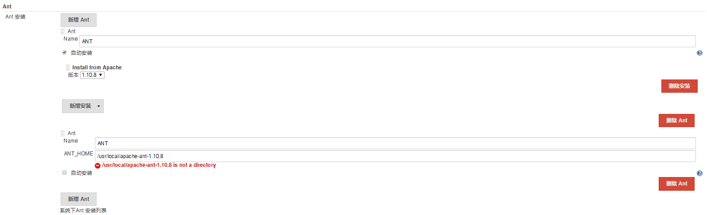
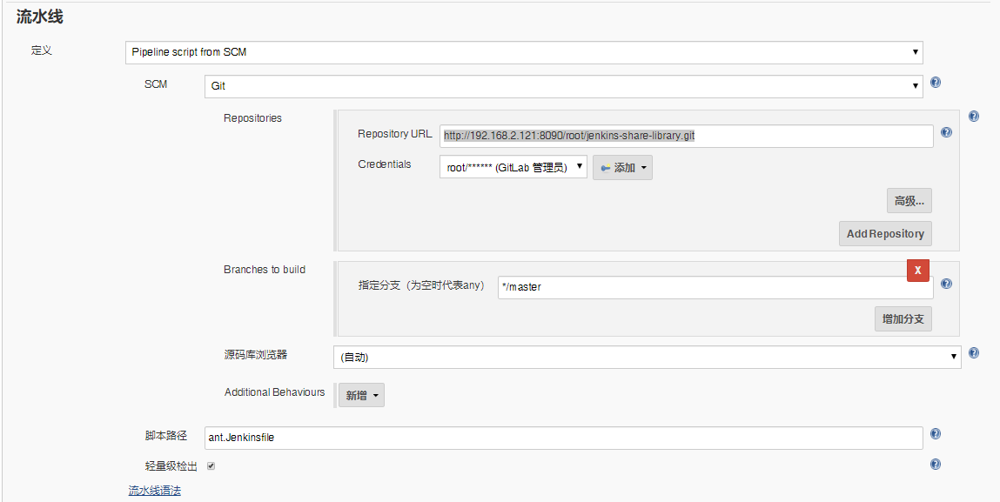
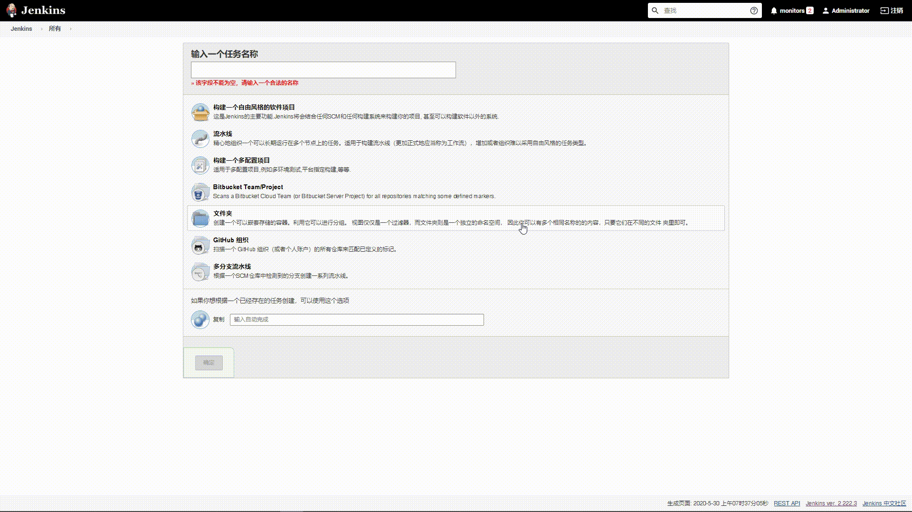

# 笔记三 Jenkins 集成 Ant 构建工具

## 1. 为什么集成 Ant 构建工具 ？


由于有些项目使用到 Ant 所以这里实现集成。

**`Ant`**是跨平台的构建工具，它可以实现项目的自动构建和部署等功能。

**`Ant`**的构建文件是基于 **XML** 编写的，默认名称为 **build.xml**。

**`Ant`**缺点不能像 Maven 做到模块化，它所有的依赖包都在 **build.xml** 中，所以导致了 **`Ant`**  逐渐被 **maven** 取代。

## 2. Ant 下载安装

> **ant**官网下载地址：https://ant.apache.org/bindownload.cgi

1. 下载 apache-ant-1.10.8 安装包。

```bash
$ wget https://mirrors.tuna.tsinghua.edu.cn/apache//ant/binaries/apache-ant-1.10.8-bin.tar.gz
```

2. 解压 apache-ant-1.10.8 安装包。

```bash
$ tar -zxvf apache-ant-1.10.8-bin.tar.gz
```

3. 将解压后的 apache-ant-1.10.8 文件夹放入到指定目录下。

```bash
$ mv apache-ant-1.10.8 /usr/local/
```

4. 添加环境变量到系统文件。

```bash
$ vim /etc/profile

################################### 添加以下内容 ################################################
export ANT_HOME=/usr/local/apache-ant-1.10.8
export PATH=$PATH:ANT_HOME/bin
###############################################################################################
```

5. 执行**`source`** 让环境变量生效。

```bash
$ source /etc/profile
```

6.  使用 **`ant`** 命令 查看是否生效。

```bash
$ ant -v 

------------------------------输出以下内容，代码 ANT 安装成功------------------------------------
Unable to locate tools.jar. Expected to find it in /usr/lib/jvm/java-1.8.0-openjdk-1.8.0.222.b03-1.el7.x86_64/lib/tools.jar
Apache Ant(TM) version 1.10.8 compiled on May 10 2020
Trying the default build file: build.xml
Buildfile: build.xml does not exist!
Build failed
-----------------------------------------------------------------------------------------------
```


## 3. Jenkins 配置 ANT 构建工具

1. 在“**系统管理**"， 点击“**全局工具配置**”。
2. 配置 **ANT** 构建工具
   - Name : 定义 **ANT** 在 **Jenkins** 名称。
   - ANT_HOME: **ANT** 安装地址。




3. 点击“**保存**”或者“**应用**”。

>***Warning 注意：***
>
>1. 由于图上面有2个**ANT** 配置，一个是自动安装，一个装在手动安装，自动安装的原因是因为我的 **Jenkins** 使用的安装方式是 **K8S**, 所以使用<font color="red"><b>手动安装 MAVEN_HOME 是不生效的</b></font>。
>2. 使用 **K8S** 安装 **Jenkins**,  在容器中 **ANT_HOME** 安装目录在 <font color="green">/var/jenkins_home/tools/hudson.tasks.Maven_MavenInstallation/ANT/</font>


## 4. 使用 Pipeline 实现 Ant 构建 

- 在 **GitLab** 中 **jenkins-share-library** 项目，创建一个 **ant.Jenkinsfile** 文件, 添加以下代码：

```groovy
#!groovy

String buildShell = "${env.buildShell}"

pipeline {
    agent {
        node {
            label "master"
        }
    }
    stages {
        stage("build") {
            steps {
                script {
                    antHome = tool "ANT"
                    try {
                        sh "${antHome}/bin/mvn ${buildShell}"
                    } catch (Exception e) {
                        println(e)
                    }
                }
            }
        }
    }
}
```


- 在 **Jenkins** 创建一个流水线项目为 **pipeline-ant-show-06**
  - 添加描述:  **ant** 集成流水线
  - 参数化构建过程（**选项参数**）， 添加以下 **ant** 命令 :
    - ant 版本命令：**-v**

- 流水线配置
  - 定义：**Pipeline script from SCM**
  - SCM ：**Git**
  - Repositories：http://192.168.2.121:8090/root/jenkins-share-library.git
  - Credentials：添加 gitlab 凭据。
  - 脚本路径(项目执行流水线的Jenkinsfile)：**ant.Jenkinsfile**




- “**保存**”或者“**应用**”。


## 5. Ant 集成 Pipeline 流水线演示效果

