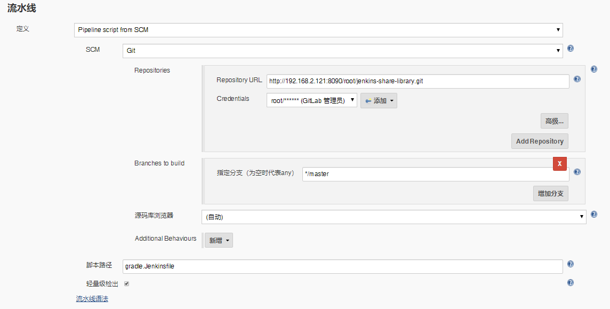

# 笔记四 Jenkins 集成 Gradle 构建工具

## 1. 为什么集成 Gradle 构建工具 ？


**`Gradle`**是一个基于Apache Ant和Apache Maven概念的项目自动化构建开源工具。它使用一种基于Groovy的特定领域语言(DSL)来声明项目设置，目前也增加了基于Kotlin语言的kotlin-based DSL，抛弃了基于XML的各种繁琐配置。

**`Gradle`**面向**Java**应用为主。当前其支持的语言限于**Java**、**Groovy**、**Kotlin**和**Scala**，计划未来将支持更多的语言。

**`Gradle`**一款最新的，功能最强大的构建工具，用它逼格更高，比 **Maven** 构建打包速度快。

> **Gradle VS Maven** 视频：https://gradle.org/maven-vs-gradle/

## 2. Gradle 下载安装

> **Gradle**官网下载地址：https://gradle.org/releases

1. 下载 gradle-5.3.1 安装包。

```bash
$ wget https://downloads.gradle.org/distributions/gradle-5.3.1-bin.zip
```

2. 解压 gradle-5.3.1 安装包。

```bash
$ unzip gradle-5.3.1-bin.zip
```

3. 将解压后的 gradle-5.3.1 文件夹放入到指定目录下。

```bash
$ mv gradle-5.3.1 /usr/local/
```

4. 添加环境变量到系统文件。

```bash
$ vim /etc/profile

################################### 添加以下内容 ################################################
export GRADLE_HOME=/usr/local/gradle-5.3.1
export PATH=$PATH:GRADLE_HOME/bin
###############################################################################################
```

5. 执行**`source`** 让环境变量生效。

```bash
$ source /etc/profile
```

6.  使用 **`Gradle`** 命令 查看是否生效。

```bash
$ gradle -v

------------------------------输出以下内容，代码 Gradle 安装成功 ----------------------------------

Welcome to Gradle 5.3.1!

Here are the highlights of this release:
 - Feature variants AKA "optional dependencies"
 - Type-safe accessors in Kotlin precompiled script plugins
 - Gradle Module Metadata 1.0

For more details see https://docs.gradle.org/5.3.1/release-notes.html

------------------------------------------------------------
Gradle 5.3.1
------------------------------------------------------------

Build time:   2019-03-28 09:09:23 UTC
Revision:     f2fae6ba563cfb772c8bc35d31e43c59a5b620c3

Kotlin:       1.3.21
Groovy:       2.5.4
Ant:          Apache Ant(TM) version 1.9.13 compiled on July 10 2018
JVM:          1.8.0_252 (Oracle Corporation 25.252-b09)
OS:           Linux 3.10.0-1062.el7.x86_64 amd64

-----------------------------------------------------------------------------------------------
```


## 3. Jenkins 配置 Gradle 构建工具

1. 在“**系统管理**"， 点击“**全局工具配置**”。
2. 配置 **Gradle** 构建工具
   - Name : **`Grade`**
   - GRADLE_HOME: **`/usr/local/gradle-5.3.1`**


3. 点击“**保存**”或者“**应用**”。

>***Warning 注意：***
>
>1. 由于图上面有2个**Gradle** 配置，一个是自动安装，一个装在手动安装，自动安装的原因是因为我的 **Jenkins** 使用的安装方式是 **K8S**, 所以使用<font color="red"><b>手动安装 MAVEN_HOME 是不生效的</b></font>。
>2. 使用 **K8S** 安装 **Jenkins**,  在容器中 **GRADLE_HOME** 安装目录在 <font color="green">/var/jenkins_home/tools/hudson.tasks.Maven_MavenInstallation/GRADLE/</font>


## 4. 使用 Pipeline 实现 Gradle 构建 

- 在 **GitLab** 中 **jenkins-share-library** 项目，创建一个 **Gradle.Jenkinsfile** 文件, 添加以下代码：

```groovy
#!groovy

String buildShell = "${env.buildShell}"

pipeline {
    agent {
        node {
            label "master"
        }
    }
    stages {
        stage("build") {
            steps {
                script {
                    gradleHome = tool "GRADLE"
                    sh "${gradleHome}/bin/gradle ${buildShell}"
                }
            }
        }
    }
}
```


- 在 **Jenkins** 创建一个流水线项目为 **pipeline-gradle-show-07**
  - 添加描述:  **Gradle** 集成流水线
  - 参数化构建过程（**选项参数**）， 添加以下 **Gradle** 命令 :
    - Gradle 版本命令：**-v**

- 流水线配置
  - 定义：**Pipeline script from SCM**
  - SCM ：**Git**
  - Repositories：http://192.168.2.121:8090/root/jenkins-share-library.git
  - Credentials：添加 gitlab 凭据。
  - 脚本路径(项目执行流水线的Jenkinsfile)：**gradle.Jenkinsfile**




- “**保存**”或者“**应用**”。


## 5. Gradle 集成 Pipeline 流水线演示效果

