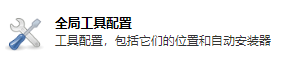
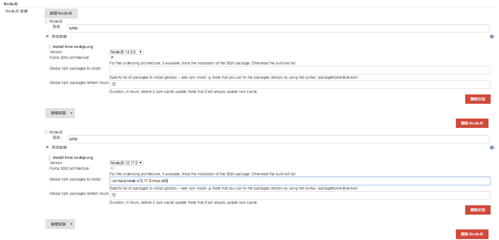
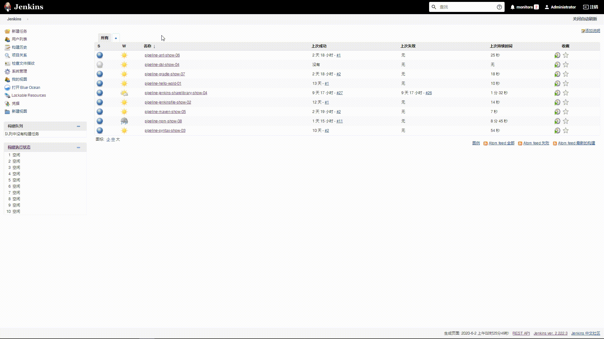

# 笔记五 Jenkins 集成 NodeJS 构建工具

## 1. 为什么集成 NodeJS 构建工具 ？


**`NodeJS`**是一个基于 **Chrome V8** 引擎的 **JavaScript** 运行环境。

**`NodeJS`**使用了一个事件驱动、非阻塞式 I/O 的模型，使其轻量又高效。

**`NodeJS`** 的包管理器 **npm**。

**`NodeJS`**是运行在服务端的 JavaScript，如果你熟悉Javascript，那么你将会很容易的学会Node.js。

- 如果你是一个**前端程序员**，你不懂得像PHP、Python或Ruby等动态编程语言，然后你想创建自己的服务，那么Node.js是一个非常好的选择。
- 如果你是**后端程序员**，想部署一些高性能的服务，那么学习Node.js也是一个非常好的选择。

> **NodeJS**官网下载地址: https://nodejs.org/en/

## 2. NodeJS 下载安装

> **NodeJS**官网下载地址：https://nodejs.org/en/download/

1. 下载 node-v12.17.0-linux-x64 安装包。

```bash
$ wget https://nodejs.org/dist/v12.17.0/node-v12.17.0-linux-x64.tar.xz
```

2. 解压 node-v12.17.0-linux-x64 安装包。

```bash
$ tar -zxvf node-v12.17.0-linux-x64.tar.xz
```

3. 将解压后的 node-v12.17.0-linux-x64 文件夹放入到指定目录下。

```bash
$ mv node-v12.17.0-linux-x64 /usr/local/
```

4. 添加环境变量到系统文件。

```bash
$ vim /etc/profile

################################### 添加以下内容 ################################################
export NODEJS_HOME=/usr/local/node-v12.17.0-linux-x64
export PATH=$PATH:NODEJS_HOME/bin
###############################################################################################
```

5. 执行**`source`** 让环境变量生效。

```bash
$ source /etc/profile
```

6.  使用 **`Node`** 命令 查看是否生效。

```bash
$ node -v 

----------------------------- 输出以下内容，代码 NodeJS 安装成功 ----------------------------------
v12.17.0
-----------------------------------------------------------------------------------------------
```

7. 使用 **`NPM`** 命令 查看是否生效。

```bash
$ npm -v 

----------------------------- 输出以下内容，代码 NPM 安装成功 ----------------------------------
6.13.4
-----------------------------------------------------------------------------------------------
```

## 3. Jenkins 配置 NodeJS 构建工具

1. 在“**系统管理**"， 点击“**全局工具配置**”。
2. 配置 **NodeJS** 构建工具
   - Name : 定义 **NodeJS** 在 **Jenkins** 名称。
   - NODEJS_HOME: **NodeJS** 安装地址。




3. 点击“**保存**”或者“**应用**”。

>***Warning 注意：***
>
>1. 由于图上面有2个**NodeJS** 配置，一个是自动安装，一个装在手动安装，自动安装的原因是因为我的 **Jenkins** 使用的安装方式是 **K8S**, 所以使用<font color="red"><b>手动安装 MAVEN_HOME 是不生效的</b></font>。
>2. 使用 **K8S** 安装 **Jenkins**,  在容器中 **NODEJS_HOME** 安装目录在 <font color="green">/var/jenkins_home/tools/hudson.tasks.Maven_MavenInstallation/NODEJS/</font>


## 4. 使用 Pipeline 实现 NodeJS 构建 

- 在 **GitLab** 中 **jenkins-share-library** 项目，创建一个 **npm.Jenkinsfile** 文件, 添加以下代码：

```groovy
#!groovy

String buildShell = "${env.buildShell}"

pipeline {
    agent {
        node {
            label "master"
        }
    }
    stages {
        stage("build") {
            steps {
                script {
                    npmHome = tool "NPM"
                    sh """
                                export NODE_HOME=${npmHome}
                                export PATH=\$NODE_HOME/bin:\$PATH
                                ${npmHome}/bin/npm ${buildShell}"""
                }
            }
        }
    }
}
```


- 在 **Jenkins** 创建一个流水线项目为 **pipeline-nodejs-show-08**
  - 添加描述:  **NodeJS** 集成流水线
  - 参数化构建过程（**选项参数**）， 添加以下 **NodeJS** 命令 :
    - NodeJS 版本命令：**-v**

- 流水线配置
  - 定义：**Pipeline script from SCM**
  - SCM ：**Git**
  - Repositories：http://192.168.2.121:8090/root/jenkins-share-library.git
  - Credentials：添加 gitlab 凭据。
  - 脚本路径(项目执行流水线的Jenkinsfile)：**npm.Jenkinsfile**


- “**保存**”或者“**应用**”。


## 5. NodeJS 集成 Pipeline 流水线演示效果

