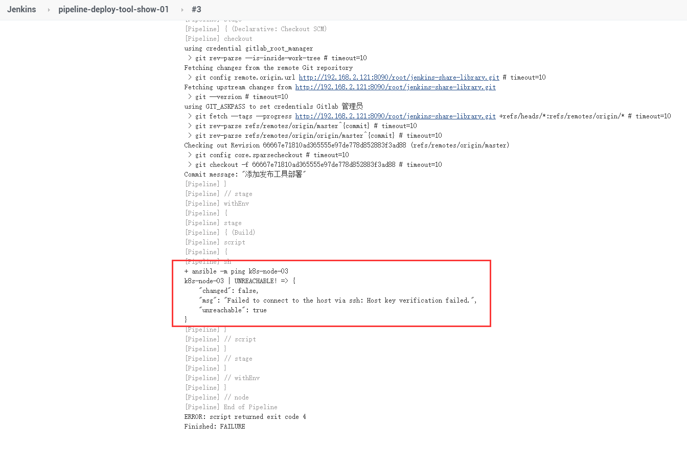
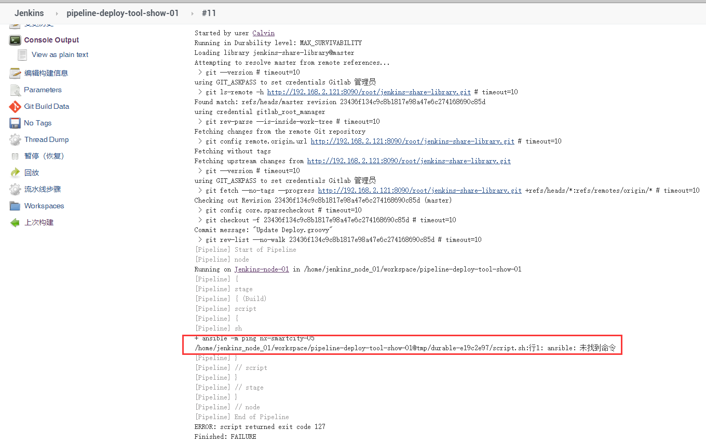

# 笔记六 Jenkins 集成 Ansible 发布工具

## 1. 什么是 Ansible ？


### Ansible 的命名由来？

此名取自 Ansible 作者最喜爱的[《安德的游戏》](https://zh.wikipedia.org/zh-tw/安德的游戏)小说，而这部小说更被后人改编成电影 -《战争游戏》。

大家或许早在电影中就已看过[**安塞波 (Ansible)**](http://enderverse.wikia.com/wiki/Ansible)，它是虚构的超光速通讯装置。片中主角安德 (Ender) 和他的伙伴们透过 Ansible 跨越时空指挥无数的战舰，就好比我们操控海量的远端服务器一样。

### Ansible介绍

- **`Ansible`** 是个与 [Puppet](https://www.w3cschool.cn/timlc/timlc-g7tv24yc.html), SaltStack, Chef 并驾齐驱的组态设定 (Infrastructure as Code) 工具，其简单易用的特性让人爱不释手，在 DevOps 界更佔有一席之地。
- **`Ansible`** 提供一种最简单的方式用于发布、管理和编排计算机系统的工具，你可在数分钟内搞定。
- **`Ansible`** 是一个模型驱动的配置管理器，支持多节点发布、远程任务执行。默认使用 SSH 进行远程连接。无需在被管理节点上安装附加软件，可使用各种编程语言进行扩展。

### Ansible特性：

- 拥有模块化的设计，Ansible 能够调用特定的模块来完成特定任务 ，本身是核心组件，短小精悍 ；
- Ansible是基于**Python语言**实现的，由Paramiko (python 的一个可并发连接 ssh 主机功能库 ) , PyYAML和Jinja2 ( 模板化 ) 三个关键模块实现；
- Ansible的部署比较简单，agentless 无客户端工具；
- 以主从模式工作；
- 支持自定义模块功能；
- 支持playbook剧本，连续任务按先后设置顺序完成；
- 期望每个命令具有**幂等性**；

> **Ansible**中文文档地址: http://www.ansible.com.cn/

## 2. 配置服务器之间免密访问

### 1. 在Jenkins 服务器中配置**ssh-keygen** 进行服务器之间免密访问。

```bash
$ sudo ssh-keygen

# 一直按 enter 键
----------------------------------- 输入以下内容 -------------------------------------------
Generating public/private rsa key pair.
Enter file in which to save the key (/root/.ssh/id_rsa):  
Enter passphrase (empty for no passphrase): 
Enter same passphrase again: 
Your identification has been saved in /root/.ssh/id_rsa.
Your public key has been saved in /root/.ssh/id_rsa.pub.
The key fingerprint is:
SHA256:hdkdP4b0Elq05+xU7BOVPDjlkCW7NBS5Oa4ywOJhFCY root@kubernetes-node-04
The key's randomart image is:
+---[RSA 2048]----+
|           .*=Ooo|
|   E o   + =.%==.|
|    o . o + =+Xo+|
|     .   .  .Xo+.|
|    . . S   ..=..|
|     + o     +  .|
|    o o .   . .  |
|     .   o .     |
|          o      |
+----[SHA256]-----+
------------------------------------------------------------------------------------------
```

### 2. 将自己服务器公钥拷贝到 其他服务器上。

```bash
$ ssh-copy-id -p 端口号 root@服务器地址

----------------------------------- 输入以下内容 -------------------------------------------
/usr/bin/ssh-copy-id: INFO: Source of key(s) to be installed: "/root/.ssh/id_rsa.pub"
The authenticity of host '[183.239.218.130]:50010 ([183.239.218.130]:50010)' can't be established.
ECDSA key fingerprint is SHA256:prCykUIV3wFFCEMD5H0m3lpgKT8omsv8e+NLVYxDGQU.
ECDSA key fingerprint is MD5:2f:3c:43:be:6f:cb:3a:73:73:a2:45:0b:77:41:ee:58.
Are you sure you want to continue connecting (yes/no)? yes
/usr/bin/ssh-copy-id: INFO: attempting to log in with the new key(s), to filter out any that are already installed
/usr/bin/ssh-copy-id: INFO: 1 key(s) remain to be installed -- if you are prompted now it is to install the new keys
root@183.239.218.130's password: 

Number of key(s) added: 1

```

### 3. 执行访问其他服务器

```bash
$ ssh -p 端口号 root@服务器地址
```

## 3. Ansible 安装与使用

### 1. 在 **Jenkins** 服务器上，执行命令安装 **Ansible**

```bash 
$ sudo yum install epel-release -y && yum install ansible -y
```

### 2. 添加免密后服务器的到 **Ansible** 的清单文件中去。

```bash
$ vim /etc/ansible/hosts

----------------------------- 输入免密后服务器地址和定义名称 ----------------------------------
[servers]
nx-smartcity-05 ansible_ssh_host=项目远程服务器ip地址 ansible_ssh_port=50005
nx-smartcity-06 ansible_ssh_host=项目远程服务器ip地址 ansible_ssh_port=50006
nx-smartcity-07 ansible_ssh_host=项目远程服务器ip地址 ansible_ssh_port=50007
nx-smartcity-08 ansible_ssh_host=项目远程服务器ip地址 ansible_ssh_port=50008
nx-smartcity-09 ansible_ssh_host=项目远程服务器ip地址 ansible_ssh_port=50009
nx-smartcity-10 ansible_ssh_host=项目远程服务器ip地址 ansible_ssh_port=50010
nx-smartcity-11 ansible_ssh_host=项目远程服务器ip地址 ansible_ssh_port=50011
nx-smartcity-12 ansible_ssh_host=项目远程服务器ip地址 ansible_ssh_port=50012

k8s-node-01 ansible_ssh_host=192.168.2.110 ansible_ssh_port=22
k8s-node-02 ansible_ssh_host=192.168.2.121 ansible_ssh_port=22
k8s-node-03 ansible_ssh_host=192.168.2.130 ansible_ssh_port=22
-------------------------------------------------------------------------------------------
```

### 3. 验证是否可以访问成功

```bash
$ ansible -m ping servers

--------------------------------- 成功输出，以下信息  -------------------------------------------
nx-smartcity-07 | SUCCESS => {
    "ansible_facts": {
        "discovered_interpreter_python": "/usr/bin/python"
    }, 
    "changed": false, 
    "ping": "pong"
}
nx-smartcity-08 | SUCCESS => {
    "ansible_facts": {
        "discovered_interpreter_python": "/usr/bin/python"
    }, 
    "changed": false, 
    "ping": "pong"
}
nx-smartcity-05 | SUCCESS => {
    "ansible_facts": {
        "discovered_interpreter_python": "/usr/bin/python"
    }, 
    "changed": false, 
    "ping": "pong"
}
nx-smartcity-06 | SUCCESS => {
    "ansible_facts": {
        "discovered_interpreter_python": "/usr/bin/python"
    }, 
    "changed": false, 
    "ping": "pong"
}
k8s-node-01 | SUCCESS => {
    "ansible_facts": {
        "discovered_interpreter_python": "/usr/bin/python"
    }, 
    "changed": false, 
    "ping": "pong"
}
nx-smartcity-09 | SUCCESS => {
    "ansible_facts": {
        "discovered_interpreter_python": "/usr/bin/python"
    }, 
    "changed": false, 
    "ping": "pong"
}
nx-smartcity-11 | SUCCESS => {
    "ansible_facts": {
        "discovered_interpreter_python": "/usr/bin/python"
    }, 
    "changed": false, 
    "ping": "pong"
}
k8s-node-02 | SUCCESS => {
    "ansible_facts": {
        "discovered_interpreter_python": "/usr/bin/python"
    }, 
    "changed": false, 
    "ping": "pong"
}
k8s-node-03 | SUCCESS => {
    "ansible_facts": {
        "discovered_interpreter_python": "/usr/bin/python"
    }, 
    "changed": false, 
    "ping": "pong"
}
nx-smartcity-10 | SUCCESS => {
    "ansible_facts": {
        "discovered_interpreter_python": "/usr/bin/python"
    }, 
    "changed": false, 
    "ping": "pong"
}
-----------------------------------------------------------------------------------------------
```


## 4. 编写发布工具流水线

在 **GitLab** 中 **jenkins-share-library** 项目目录 <font color=red><b>src/org/devops</b></font> 创建 **`Deploy.groovy`** 文件作为**共享的发布工具方法**，编写以下代码。

```groovy
package org.devops

// ansible
def ansibleDeploy(hosts, func) {
    sh " ansible ${func} ${hosts}"
}
```


## 5. 使用 Jenkins 编写测试流水线

在 **GitLab** 中 **jenkins-share-library** 项目创建 **`deploy.Jenkinsfile`** 文件进行测试。

代码示例，如下：

```groovy
#!groovy

@Library('jenkins-share-library') _

String deployHosts = "${env.deployHosts}"
String deployShell = "${env.deployShell}"

def deploy = new org.devops.Deploy()

pipeline {

    agent { node { label "master" } }

    stages {
        stage("Build") {
            steps {
                script {
                    deploy.ansibleDeploy("${deployHosts}","${deployShell}")
                }
            }
        }
    }
}
```


## 6. Ansible 集成 Pipeline 流水线演示效果


## 7. 扩展-遇到问题与解决

### <font color=red>问题1：在服务器中执行 Ansible 命令可以正常执行访问加入免密服务器，但在 Jenkins 中执行 Ansible 流水线出现访问连接失败 ？</font>

如下图：



#### <font color=green>解决方法: 修改 Jenkins 默认的 “jenkins” 用户为系统管理员“root”用户</font>

```bash
# 找的jenkins 系统配置，修改为 root 用户
$ vim /etc/sysconfig/jenkins 

---------------------------------- 修改以下信息 -------------------------------------------------
## Type:        string
## Default:     "jenkins"
## ServiceRestart: jenkins
#
# Unix user account that runs the Jenkins daemon
# Be careful when you change this, as you need to update
# permissions of $JENKINS_HOME and /var/log/jenkins.
# 默认: JENKINS_USER="jenkins"
# 修改后：（由于jenkins 权限不够，修改为root 用户）
JENKINS_USER="root"

-----------------------------------------------------------------------------------------------

# 重启jenkins
$ systemctl restart jenkins
```


### <font color=red>问题2：Jenkins Slave 节点为什么执行 Ansible 流水线报错？</font>

如下图：



#### <font color=green>解决方法: 在 Slave 节点中安装 Ansible 和给服务器配置免密。</font>