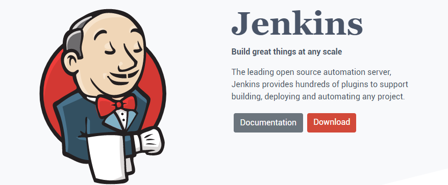
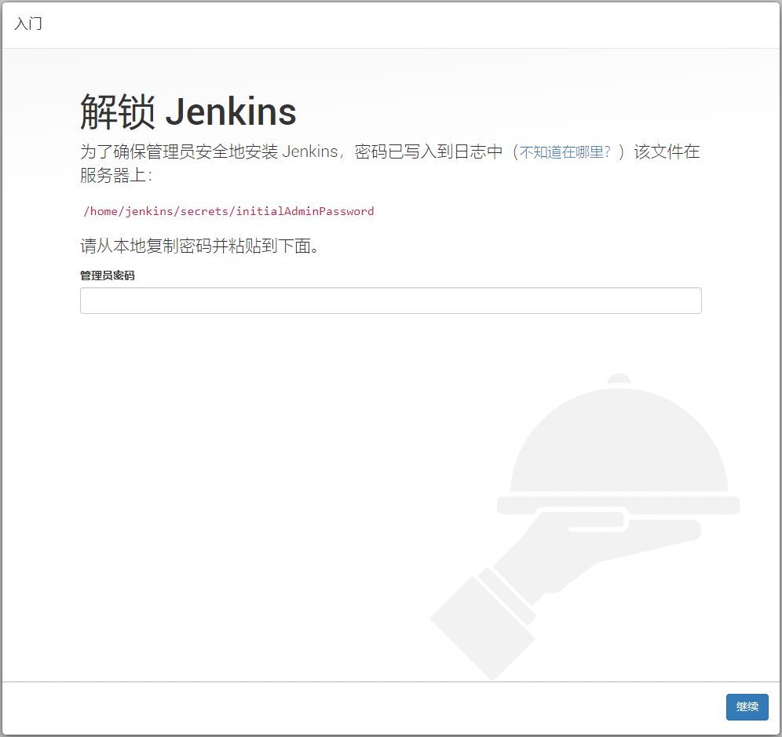
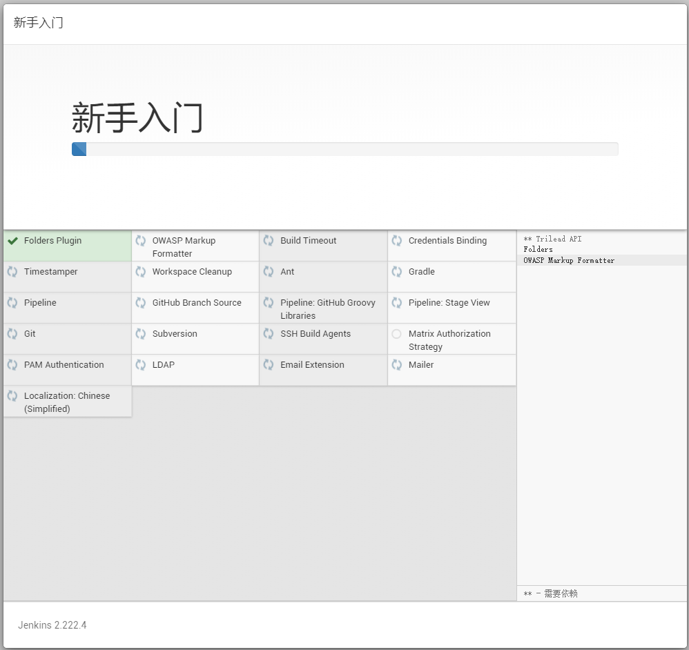
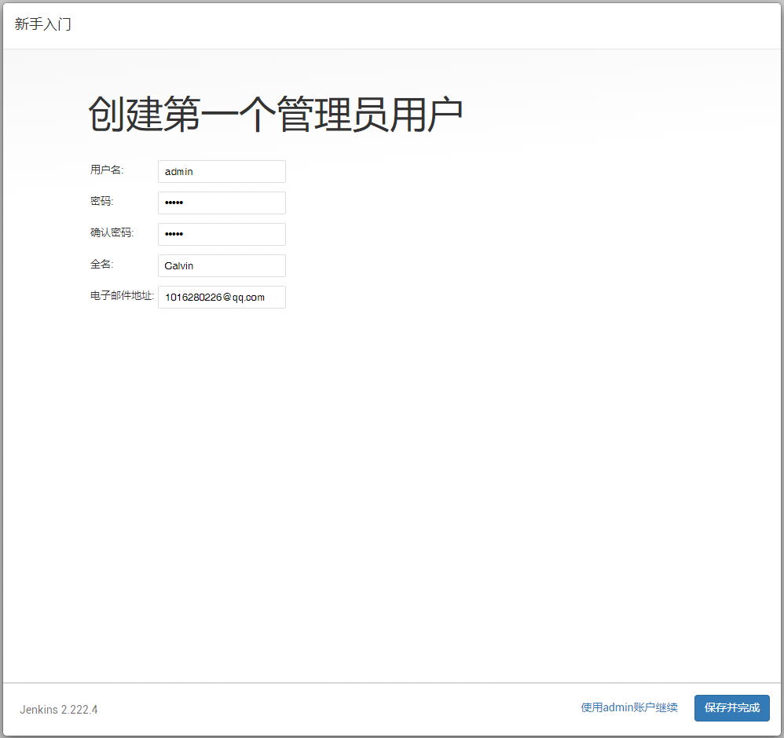
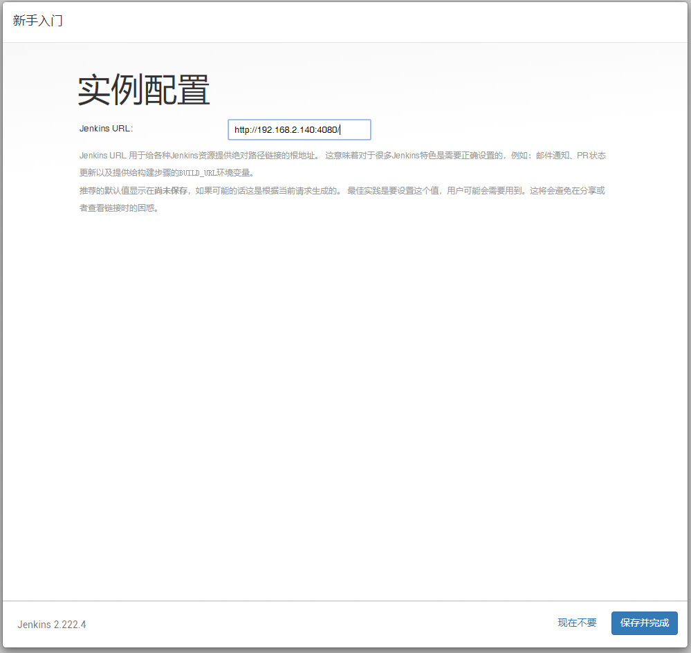
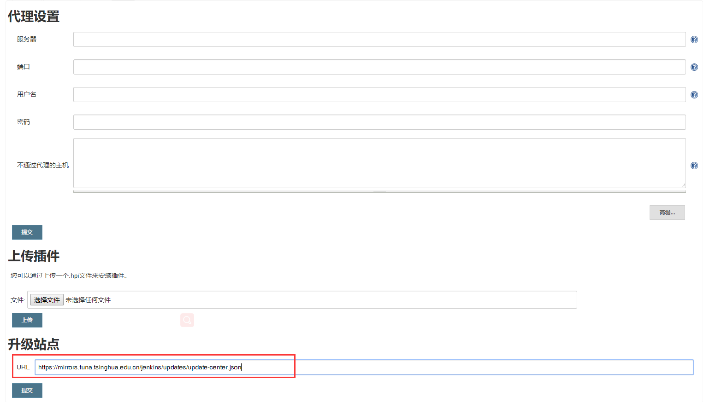
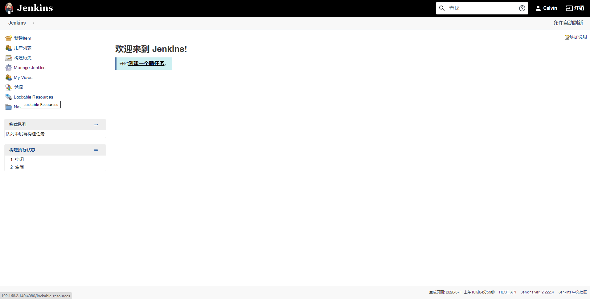

# 笔记一 Jenkins 简介与安装

## 一、Jenkins 简介与应用

<a href="https://www.jenkins.io/">




</a>


### 简介

- **`Jenkins`** 是一个自动化服务器，目前发展已超过15年，比较成熟的CI工具，能够实现自动化集成发布。建立好流水线后，期间无需专业运维人员介入，开发人员随时发布部署，任性！。
- 官网地址：https://www.jenkins.io/

### 应用场景

- 集成 **SVN/Git** 客户端实现源代码下载检出。
- 集成 **maven/ant/gradle/npm** 等构建工具实现源代码编译打包单元测试。
- 集成 **snoarqube** 对源代码进行质量检查 （坏味道、复杂度、新增bug 等）。
- 集成 **saltStack / ansible** 实现自动化部署发布。
- 可以自定义插件或者脚本通过 **jenkins** 传参运行。
- 可以说 **Jenkins** 比较灵活插件资源丰富，日常运维工作都可以自动化。

### 准备前工作

- 机器要求：
  - **256 MB 内存，建议大于 512 MB**
  - **10 GB** 的硬盘空间（用于 Jenkins 和 Docker 镜像）
- 需要安装以下软件：
  - **Java 8** ( JRE 或者 JDK 都可以)
  - [Docker](https://www.docker.com/) （导航到网站顶部的Get Docker链接以访问适合您平台的Docker下载）

## 二、Jenkins 安装

> - **Jenkins 官网下载安装包**：  http://mirrors.jenkins-ci.org/redhat/
> - **清华大学开源下载安装包**：https://mirrors.tuna.tsinghua.edu.cn/jenkins/

### 1. 下载 Jenkins 安装包

```bash
$ wget https://mirrors.tuna.tsinghua.edu.cn/jenkins/redhat-stable/jenkins-2.222.4-1.1.noarch.rpm
```


### 2. 使用 rpm -ivh 命令安装

```bash
$ rpm -ivh jenkins-2.222.4-1.1.noarch.rpm

------------------------------------ 输出以下信息 -----------------------------------------------
警告：jenkins-2.222.4-1.1.noarch.rpm: 头V4 DSA/SHA1 Signature, 密钥 ID d50582e6: NOKEY
准备中...                          ################################# [100%]
正在升级/安装...
   1:jenkins-2.222.4-1.1              ################################# [100%]
```


### 3. 启动 Jenkins 

```bash
$ service jenkins start

------------------------------------ 输出以下信息 -----------------------------------------------
Starting jenkins (via systemctl):                          [  确定  ]
```


### 4. 修改 Jenkins 配置文件，重新启动

```bash
$ vim /etc/sysconfig/jenkins
```

```bash
## Path:        Development/Jenkins
## Description: Jenkins Automation Server
## Type:        string
## Default:     "/var/lib/jenkins"
## ServiceRestart: jenkins
#
# Directory where Jenkins store its configuration and working
# files (checkouts, build reports, artifacts, ...).
# 配置 JENKINS_HOME
# 默认: JENKINS_HOME="/var/lib/jenkins"
# 修改后：(由于我的/var/lib/jenkins 目录只有50GiB, 所以修改为 /home/jenkins)
JENKINS_HOME="/home/jenkins"

## Type:        string
## Default:     ""
## ServiceRestart: jenkins
#
# Java executable to run Jenkins
# When left empty, we'll try to find the suitable Java.
#
JENKINS_JAVA_CMD=""

## Type:        string
## Default:     "jenkins"
## ServiceRestart: jenkins
#
# Unix user account that runs the Jenkins daemon
# Be careful when you change this, as you need to update
# permissions of $JENKINS_HOME and /var/log/jenkins.
JENKINS_USER="jenkins"

## Type:        string
## Default: "false"
## ServiceRestart: jenkins
#
# Whether to skip potentially long-running chown at the
# $JENKINS_HOME location. Do not enable this, "true", unless
# you know what you're doing. See JENKINS-23273.
#
#JENKINS_INSTALL_SKIP_CHOWN="false"

## Type: string
## Default:     "-Djava.awt.headless=true"
## ServiceRestart: jenkins
#
# Options to pass to java when running Jenkins.
#
JENKINS_JAVA_OPTIONS="-Djava.awt.headless=true"

## Type:        integer(0:65535)
## Default:     8080
## ServiceRestart: jenkins
#
# Port Jenkins is listening on.
# Set to -1 to disable
# 配置访问端口
# 默认：JENKINS_PORT="8080"
# 修改后:(由于我的8080端口被占用，所以修改为4080）
JENKINS_PORT="4080"

## Type:        string
## Default:     ""
## ServiceRestart: jenkins
#
# IP address Jenkins listens on for HTTP requests.
# Default is all interfaces (0.0.0.0).
#
JENKINS_LISTEN_ADDRESS=""

## Type:        integer(0:65535)
## Default:     ""
## ServiceRestart: jenkins
#
# HTTPS port Jenkins is listening on.
# Default is disabled.
#
JENKINS_HTTPS_PORT=""

## Type:        string
## Default:     ""
## ServiceRestart: jenkins
#
# Path to the keystore in JKS format (as created by the JDK 'keytool').
# Default is disabled.
#
JENKINS_HTTPS_KEYSTORE=""

## Type:        string
## Default:     ""
## ServiceRestart: jenkins
#
# Password to access the keystore defined in JENKINS_HTTPS_KEYSTORE.
# Default is disabled.
#
JENKINS_HTTPS_KEYSTORE_PASSWORD=""

## Type:        string
## Default:     ""
## ServiceRestart: jenkins
#
# IP address Jenkins listens on for HTTPS requests.
# Default is disabled.
#
JENKINS_HTTPS_LISTEN_ADDRESS=""

## Type:        integer(0:65535)
## Default:     ""
## ServiceRestart: jenkins
#
# HTTP2 port Jenkins is listening on.
# Default is disabled.
#
# Notice: HTTP2 support may require additional configuration, see Winstone
# documentation for more information.
#
JENKINS_HTTP2_PORT=""

## Type:        string
## Default:     ""
## ServiceRestart: jenkins
#
# IP address Jenkins listens on for HTTP2 requests.
# Default is disabled.
#
# Notice: HTTP2 support may require additional configuration, see Winstone
# documentation for more information.
#
JENKINS_HTTP2_LISTEN_ADDRESS=""

## Type:        integer(1:9)
## Default:     5
## ServiceRestart: jenkins
#
# Debug level for logs -- the higher the value, the more verbose.
# 5 is INFO.
#
JENKINS_DEBUG_LEVEL="5"

## Type:        yesno
## Default:     no
## ServiceRestart: jenkins
#
# Whether to enable access logging or not.
#
JENKINS_ENABLE_ACCESS_LOG="no"

## Type:        integer
## Default:     100
## ServiceRestart: jenkins
#
# Maximum number of HTTP worker threads.
#
JENKINS_HANDLER_MAX="100"

## Type:        integer
## Default:     20
## ServiceRestart: jenkins
#
# Maximum number of idle HTTP worker threads.
#
JENKINS_HANDLER_IDLE="20"

## Type:        string
## Default:     ""
## ServiceRestart: jenkins
#
# Folder for additional jar files to add to the Jetty class loader.
# See Winstone documentation for more information.
# Default is disabled.
#
JENKINS_EXTRA_LIB_FOLDER=""

## Type:        string
## Default:     ""
## ServiceRestart: jenkins
#
# Pass arbitrary arguments to Jenkins.
# Full option list: java -jar jenkins.war --help
#
JENKINS_ARGS=""
```

```bash
# 创建目录并且授权
$ mkdir -p /home/jenkins && chmod 777 /home/jenkins

# 重新启动
$ service jenkins restart
```


### 5. 浏览器访问，输入初始密码

如下图：




- 根据上图路径查询初始密码。

```bash
$ cat /home/jenkins/secrets/initialAdminPassword

------------------------------------ 输出以下信息 -----------------------------------------------
9d2423b74df14c58b0e83ab9285ca9ae
```


### 6. 选择  <font color= red> “安装推荐插件”</font>，大概需要10~20分钟




### 7. 创建第一个管理员用户




### 8. 实力配置




### 9. 配置插件更新源 

- 默认为官方源 -> 修改为 **清华/Jenkins 中文社区源**
- 操作步骤：
  - 点击 “Manage Jenkins” -> “Manage Plugins” -> “Advanced”
  - 将升级站点修改为：https://mirrors.tuna.tsinghua.edu.cn/jenkins/updates/update-center.json




### 10. Jenkins 安装成功

