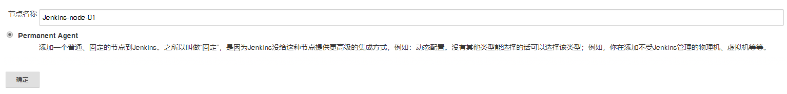
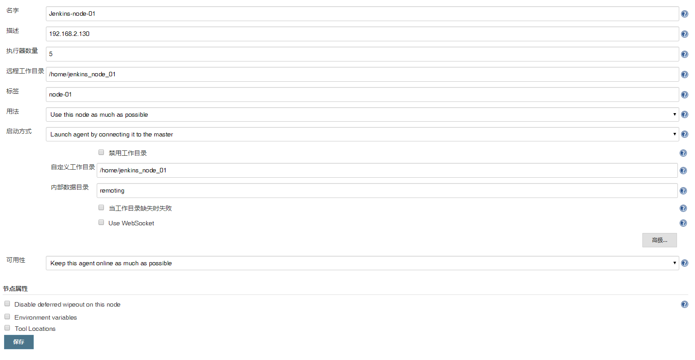
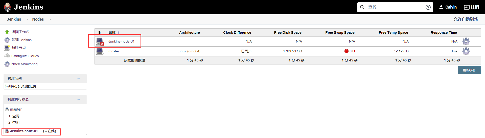
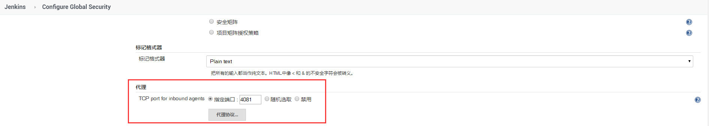
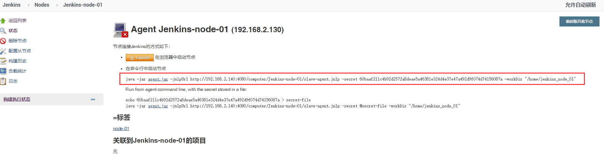
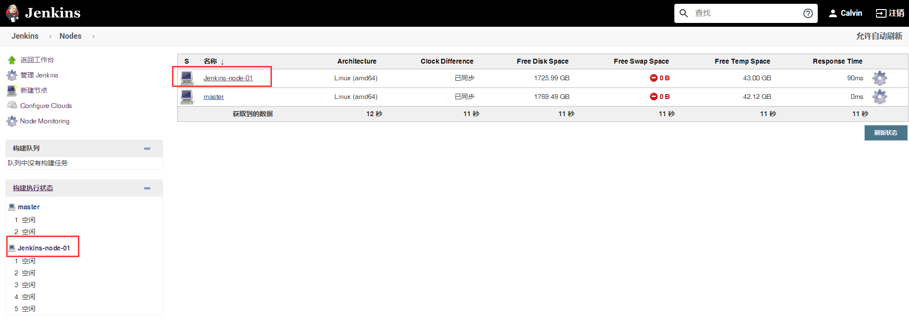

# 笔记二 Jenkins 添加 Agent 节点


## 一、Jenkins Master/Slave 是什么？


### Jenkins Master/Slave 作用

- Jenkins 的 Master/Slave 机制除了可以并发的执行构建任务，加速构建以外。

- 还可以用于分布式自动化测试，当自动化测试代码非常多或者是需要在多个浏览器上并行的时候，可以把测试代码划分到不同节点上运行，从而加速自动化测试的执行。

### Jenkins Master/Slave  各自职责

- **Master：**Jenkins 服务器，主要是处理调度构建作业，把构建分发到 Slave节点实际执行，监视Slave节点的状态。当然，也并不是说Master节点不能跑任务。构建结果和构建产物最后还是传回到Master节点，
  - 比如说在jenkins工作目录下面的workspace内的内容，在Master节点照样是有一份的。

- **Slave：**执行机(奴隶机)。执行Master分配的任务，并返回任务的进度和结果。

### Jenkins Master/Slave 原理

- Master 提供 web 接口 让用户来管理Job和Slave，Job可以运行在Master本机或者被分配到Slave上运行。

- 一个Master可以关联多个Slave用来为不同的Job或相同的Job的不同配置来服务。

  

## 二、添加 Agent 节点

### 1. 添加 Agent 节点

- 点击选择 “**Manage Jenkins**” ->“**Manage Nodes and Clouds**”


- 点击 “**新建节点**”
- 填写节点名称 “**`Jenkins-node-01`**”，然后勾选为 “**固定节点**”。
- 点击“**确定**”。



- 填写以下信息, 点击“**保存**”，如下图：

  

- 可以看到当前 **`Jenkins-node-01`** 节点是“**未在线**”。

  


### 2.  固定 Mater 节点代理端口，让 Agent 节点加入进来。

- 点击选择“**Manage Jenkins**” , 进入 **“Configure Clobal Security” 全局安全配置**
  - 代理：设置TCP 端口固定为 **4081**




### 3. 配置和启动新添加的节点

- 点击上图 红色框中 “**`Jenkins-node-01`**”，复制以下命令到新增节点的服务器(**`192.168.2.130`**)中。

  

- 在 “**`Jenkins-node-01`**”节点(**`192.168.2.130`**)服务中，创建工作目录“**`/home/jenkins_node_01`**”。

  ```bash
  # 创建工作目录
  $ mkdir -p /home/jenkins_node_01
  
  # 给该目录授权
  $ chmod 777 /home/jenkins_node_01
  
  # 创建一个存放安装包目录
  $ mkdir -p /home/install_package
  
  # 下载master 中 agent.jar 包, 放入到 install_package 下
  $ cd /home/install_package && wget http://192.168.2.140:4080/jnlpJars/agent.jar
  
  # 创建 init_start.sh 脚本在/home/jenkins_node_01 目录
  $ touch init_start.sh && mv init_start.sh /home/jenkins_node_01
  
  # 编写脚本
  $ vim /home/jenkins_node_01/init_start.sh
  
  ---------------------------------- 编写脚本内容，如下： --------------------------------------
  # !/bin/bash
  nohup java -jar /home/install_package/agent.jar -jnlpUrl http://192.168.2.140:4080/computer/Jenkins-node-01/slave-agent.jnlp -secret 60baaf211c4b92d2572a8deae5a46381e324d4e37e47a492d9f074d74156087a -workDir "/home/jenkins_node_01" &                                           
  -------------------------------------------------------------------------------------------
  
  # 启动脚本
  $ sh /home/jenkins_node_01/init_start.sh
  ```

  

  > **Warning 功能描述：**
  >
  > - **使用 JNLP 协议添加 SLAVE**
  > - **Jenkins 配置股东SLAVE 通信端口**

  ### <font color="gree"><b>4. 验证是否成功</b></font>

- 成功后，如下图所示：




