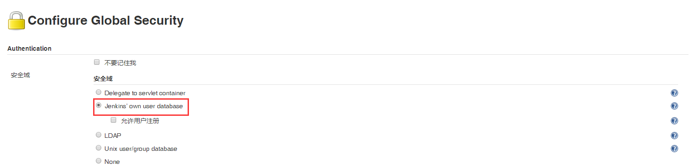

# 笔记三 Jenkins 用户与权限管理

## 一、为什么使用用户权限管理 

### 1. 安全性

> **预防用户在 Jenkins 上操作不当和删除项目任务，导致项目发生致命错误。**

### 2. 阅读性

> **当 Jenkins 项目任务数量过多，区分不同项目对应不同用户角色，提高了用户只了解自己项目任务，而不会收到其他项目视觉干扰。**

### 3. 明确性

> **不同用户角色，所看到自己项目任务。**

## 二、新增用户

### 1. 创建用户

#### 1.1 点击选择 “**Manage Jenkins**” ->“**Manage Users**” -> “**新建用户**”

#### 1.2 创建后的用户列表

### 2. Jenkins 用户是默认是以数据库方式保存用户信息

## 三、权限配置

### 1. 安装授权插件 Role-Based Strategy 用户项目授权

#### 1.1  点击选择 “**Manage Jenkins**” ->“**Manage Plugins**” -> “**可选插件**” 

#### 1.2  安装后，点击选择“**Manage Jenkins**” ->“**Configure Global Security**” -> “<b>Role-Based Strategy</b>”

#### 1.3 保存后，点击选择“**Manage Jenkins**” ->  “**Manage and Assign Roles**” 

- 管理角色
- 分配角色
- 角色策略宏

### 2. 授权方式： 项目授权 

#### 2.1 根据上面选择 “**管理角色**”， 创建 **2 个用户角色**，项目授权完后，点击“**保存**”

- Role to add :` back-end`、`front-end`
- 勾选权限：
  - Overall：<input type="checkbox" name="vehicle" value="Car" checked="checked">  Read </input>
  - 凭据： <input type="checkbox" name="vehicle" value="Car" checked="checked" > Create </input>
  - Job：<input type="checkbox" name="vehicle" value="Car" checked="checked" >  Create </input>
  - View：<input type="checkbox" name="vehicle" value="Car" checked="checked" >  Read </input>

#### 2.2 创建匹配**项目权限**

- 后台开发人员项目权限
  - Pattern :  `springboot-smartcity.*`
  - Role to add :` back-end`
  
- 前端开发人员项目权限
  - Pattern : ` web-smartcity.*`
  - Role to add : `front-end`

- 勾选权限如下图，所示：

  - 
  
    	<input type="checkbox" checked="checked"/>View   
      	<input type="checkbox" checked="checked"/>Build 
      	<input type="checkbox" checked="checked"/>Cancel
      	<input type="checkbox" checked="checked"/>Configure 
      	<input type="checkbox" checked="checked"/>Create
      	<input type="checkbox" checked="checked"/>Discover
      	<input type="checkbox" checked="checked"/>ExtendedRead
      	<input type="checkbox" checked="checked"/> Move
      	<input type="checkbox" checked="checked"/> Read
    

  

### 3. 给人员分配权限角色

#### 3.1 根据上面选择 “**分配角色**”，分配完后，点击 “**保存**”

- User/group to add :  添加用户名

- 一个是**全局配置**，一个是**项目配置**

- 勾选所属角色：

  - 
  
    	<input type="checkbox" checked="checked"/>back-end   
      	<input type="checkbox" checked="checked"/>front-end 
    

## 四、创建项目

### 1. 创建新任务

#### 1.1 后台项目-任务名称: <b>springboot-smartcity-test-01</b>

#### 1.2 前端项目-任务名称: <b> web-smartcity-test-01</b>

## 五、演示控权效果

> - **管理员账号：`admin`** 
> - **前端人员账号：`lqc`** 
> - **后端人员账号：`zhh`**

