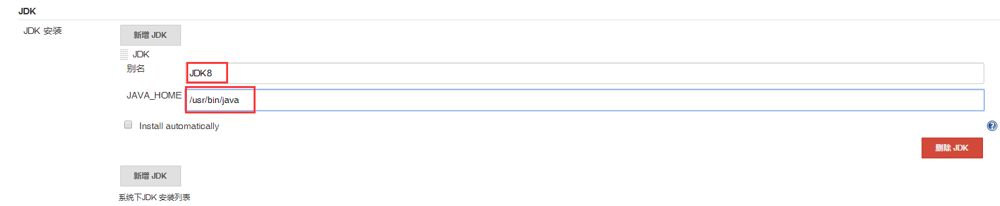

# 笔记四 Jenkins 项目准备基本配置

## 一、Jenkins 基本配置

### 为什么要设置 Jenkins 配置 ？

**Jenkins** 是一个 **CI** **持续构建**做的比较好的工具。它很多实现构建的方式是**通过插件来实现**，所以 **Jenkins** 构建项目或者说打包项目需要**很多构建工具插件**和**相应项目需要用到相关配置**，才能实现**自动化构建**。同时，也支持 **CD** 持续部署，但在 **CD** 部署方面相对没有 **CI** 全面。

### Jenkins 有哪些基本配置 ？

####  🛠Java 项目需要用到哪些配置和构建工具，进行自动构建 ？

- **`JDK`**
- **`Maven、Gradle、Ant`**
- **`Git、SVN`** 
- **`Docker`**

#### 🌈🌐 Web 项目需要用哪些配置和构建工具，进行自动构建  ？

- **`NodeJS`**
- **`Git、SVN`** 
- **`Docker`**

### 📊项目前期准备构建工具和配置有哪些 ？

- **构建工具** **`JDK、Maven、Gradle、NodeJS`**。
- **发布工具** **`Ansible`**

## 二、构建工具配置

在系统管理页面中，选择 “**`全局工具配置`**”

### JDK 

- 配置 **JDK** 构建工具

  - 别名：**`JDK8`**
  - 自动安装，勾选协议，填写Orale 账号和密码。

  

### Gradle

> ➡ [**Jenkins 集成 Gradle 构建工具**](./docs/ops/jenkins/integration/4-Jenkins集成Gradle构建工具.md) 

### Maven

> ➡ [**Jenkins 集成 Maven 构建工具**](./docs/ops/jenkins/integration/2-Jenkins集成Maven构建工具.md) 

### NodeJS

> ➡ [**Jenkins 集成 NodeJS 构建工具**](./docs/ops/jenkins/integration/5-Jenkins集成NodeJS构建工具.md) 

## 三、安装发布工具

### Ansible

> ➡ [**Jenkins 集成 Ansible 构建工具**](./docs/ops/jenkins/integration/6-Jenkins集成Ansible发布工具.md) 