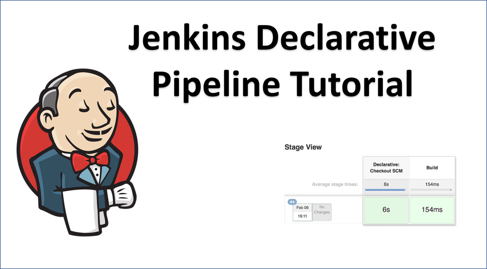
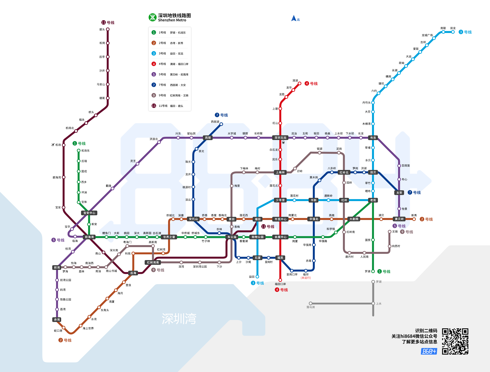
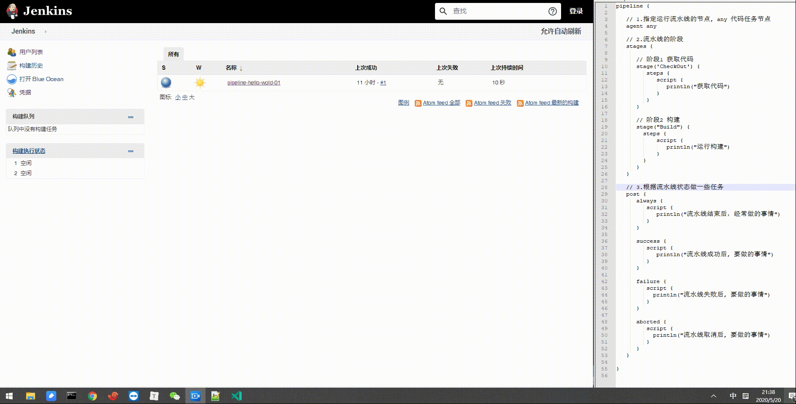

# 笔记一 Pipeline 流水线


## 1. 为什么使用 Pipeline ?

**Jenkins** 支持许多模式的任务方式。使用 **Pipeline** 流水线 是因为它具有强大的功能，例如: 支持多个功能自动化用例聚合, 逐步完善自动化应用用例，做到 **“小步快跑，快速迭代**”循序渐进的过程，从而实现**持续集成到全面交付流水线过程**。



- 核心： 模板构建，组件化应用，面向对象思维。
- 主要特性：
  - **代码化** : 流水线是在代码中实现的，通常会存放到源代码控制，使团队**具有编辑**、**审查**和**更新**他们项目的交付流水线的能力。
  - **耐用性**：流水线可以从**Jenkins**的**master**节点重启后继续运行。
  - **可暂停的**：流水线可以由人功输入或**批准**继续执行流水线。
  - **解决复杂发布**： 支持**复杂的交付流程**。例如循环、并行执行。
  - **可扩展性**： 支持**扩展DSL**和**其他插件集成**。


## 2. Pipline 定义

关于**Jenkins**流水线的运行我们可以**抽象化**，如图：




> - 把流水线(**pipeline**)想象成**深圳地铁5号线**。
> - 把流水线的**阶段(stage)**想象成地铁5号线的**每一个站点**。
> - 把流水线**脚本(jenkinsfile)**想象成**地铁线路图**。

这就是流水线的多样性，每条线路都有不同的站点。

现在地铁（**Jenkins**）已经有了，我们需要设计地铁的运行线路图（**Jenkinsfile**），在线路图中指定要经过的**站点（stages）**。

这下你是否已经知道我们要运行一条流水线，需要先做什么呢？

- <font color="red">**编写 jenkinsfile** （就是设计一个地铁线路）</font>


## 3.  Jenkinsfile 两种语法

设计地铁线路 (**Jenkinsfile**) 的 两种方法

- **声明式** 
  - 功能强大，它可以包含脚本式。
  - 代码阅读性好。
- **脚本式** 
  - 实现方法多，提供更丰富的语法特性。


## 4. 了解 Jenkinsfile 组成部分

1. 使用 **agent{}** ：指定**node**节点/**workspace**，定义好此流水线在某节点运行。

2. 指定 **options{}**：运行选项，定义好此流水线运行时的一些选项，例如输出日志的时间。

3. 指定 **stages{}**：**stages**包含多个**stage**，**stage**包含**steps**，是流水线的每个步骤。

4. 指定 **post{}**：定义好此流水线运行成功或者失败后，根据状态做一些任务。

```groovy
pipeline {
   
   // 1.指定运行流水线的节点, any 代码任务节点
   agent any

   // 2.流水线的阶段
   stages {
      
	  // 阶段1 获取代码
      stage('CheckOut') {
         steps {
            script {
			   println("获取代码")
			}
         }
      }
	  
	  // 阶段2 构建
	  stage("Build") {
		steps {
			script {
			   println("运行构建")
			}
		}
	  }
   }
   
   // 3.根据流水线状态做一些任务
   post {
      always {
	     script {
			println("流水线结束后，经常做的事情")
		 }
	  }
	  
	  success {
		 script {
			println("流水线成功后, 要做的事情")
		 }
	  }
	  
	  failure {
		 script {
		   println("流水线失败后, 要做的事情")
		 }
	  }
	  
	  aborted {
		 script {
		   println("流水线取消后, 要做的事情")
		 } 	
	  } 
   }
   
}
```


## 5. Pipeline 流水线运行效果

- **Jenkins** 演示效果  和 **Jenkins BlueOncean** 演示效果




