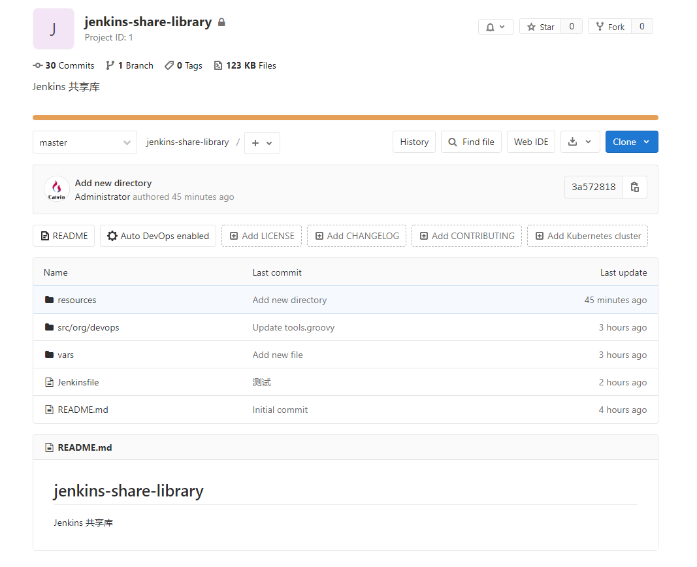
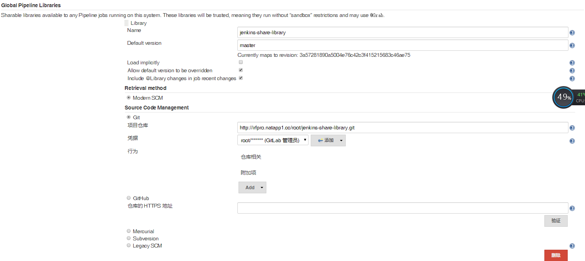
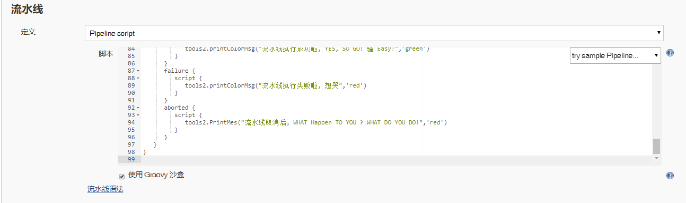
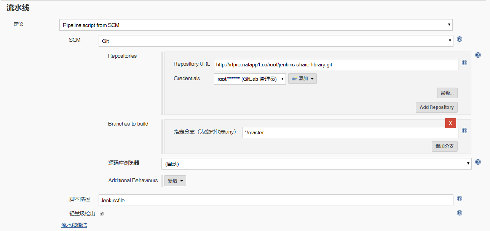

# 笔记三 Pipeline 之 Jenkins 共享库


## 1. 概述

如果你经常使用 **Jenkins Pipeline** 一定会遇到多个不同流水线中有大量重复代码的情况，

很多时候为了方便我们都是直接复制粘贴到不同的管道中去的，但是长期下去这些代码的维护就会越来越麻烦。

为了解决这个问题，**Jenkins** 中提供了**`共享库`**的概念来**`解决重复代码的问题`**。

我们只需要将公共部分提取出来，然后就可以在所有的 **Pipeline** 中引用这些共享库下面的代码了。


### <font color="#ff6702">共享库是什么？</font>

共享库（**`Jenkins Share Library`** ）, 是一些**独立的 Groovy 脚本的集合**， 共享库就是为 **`pipeline`** 流水线提供重复、公用方法或功能的共享库代码。

具有面向对象的编程思想，例如像 **Java** 模块化时使用的**公共组件或方法。** 

在  **Jenkins** 中 使用的是 **Groovy** 语法， 共享库中存储的每个文件都是一个 **groovy** 的类，每个文件（类）中包含**一个或多个方法**，每个方法包含 **groovy 语句块**。


## 2. 共享库的使用

想要使用 共享库（**`Jenkins Share Library`** ），前期我们需要先了解 **共享库目录结构**

### 2.1 目录结构

以下是我在 **GitLab** 中创建的 **`jenkins-share-library`** 项目, 来演示共享库目录结构。



使用 **`tree`** 命令，查看目录结构。

```bash
[root@kubernetes-master jenkins-share-library]# tree 
.
|-- Jenkinsfile
|-- README.md
|-- resources
|-- src
|   `-- org
|       `-- devops
|           `-- Tools.groovy
`-- vars
    `-- hello.groovy
```

> **src** 目录主要存放创建的共享 **groogy** 类，类似于标准 Java 源目录结构。执行流水线时，此目录添加到类路径中去。
>
> **vars** 目录托管脚本文件，这些脚本文件在 “**管道**” 中作为变量公开。
>
> **resources** 目录允许 **libraryResource** 从外部中使用步骤来加载相关联的非 **Groovy** 文件。


### 2.2 操作步骤

#### 1. 创建共享库-工具类

编写一个 **`Tools.groovy`**, 这个文件定义为**工具类**，主要存放些**扩展方法**, 将它存放在 <font color=#ff0066><b>jenkins-share-library/src/org/devops/ </b></font>下。

例如：在构建日志中查看流水线详细日志会很乱，我们可以在日志中将**重点步骤**通过不同的**颜色高亮显示**，便于排错。 

开始写这样的一个方法 **`printColorMsg()`** ,包含两个参数，输出内容 **`msg`** 和内容的颜色 **`color`**。

```groovy
package org.devops

// 使用输入颜色，格式化输出
def printColorMsg(msg,color){
    colors = ['red'   : "\033[40;31m >>>>>>>>>>>${msg}<<<<<<<<<<< \033[0m",
              'blue'  : "\033[47;34m ${msg} \033[0m",
              'green' : ">>>>>>>>>>${msg}>>>>>>>>>>",
              'green1' : "\033[40;32m >>>>>>>>>>>${msg}<<<<<<<<<<< \033[0m" ]
    ansiColor('xterm') {
        println(colors[color])
    }
}
```

> *Warnning :*
>
> 使用共享库-工具类前，我们需要在 **Jenkins** 安装 插件`AnsiColor`，这样才能使用`ansiColor()`方法，可以在`片段生成器`查看更多的用法。


#### 2. 使用共享库

##### 在 **Jenkins** 配置共享库。

在 **Jenkins** 中的 “**系统配置**” 找到 **`Global Pipeline Libraries`**。

- 首先，点击 “**新增**”，为共享库设置一个名称 **`jenkins-share-library`**，注意这个名称后续在 **`Jenkinsfile`** 中引用。 再设置一个默认的版本，这里的版本是分支的名称, 默认配置的是 **`master`**版本。

- 然后，配置共享库的仓库地址，这里我使用仓库在私有的 **Gitlab** 中，所以这里我填写的是 **Git** 的方式(可以使用其他仓库方式)。

  

- 最后，需要在创建 **Jenkins** 流水线项目，编写 **Jenkinsfile**, 引用**共享库-工具类** **`Tools.groovy`**，将代码拷贝到 **Jenkins** **流水线**中去。

  


**Jenkinsfile** 代码示例：

```groovy
#!groovy

// @Library('jenkins-share-library') _来加载共享库，注意后面符号_用于加载。 
@Library('jenkins-share-library') _

// 类的实例化 new org.devops.Tools()
def tools2 = new org.devops.Tools() 

pipeline {
   agent any
   environment {
	  GITLAB_ROOT_ACCESS_KEY = credentials('pipeline-gitlab-test-secret-text')
   }
   options {
	  timeout(time:1, unit: 'HOURS')
   }
   parameters {
	  string(name: 'BUILD_ENV', defaultValue: 'UAT', description: '')
   }
   tools {
	  jdk 'openjdk-8'
   }
   stages {
      stage('CheckOut GitLab Code') { 
         steps {
             // 注意: 使用Tools工具类的方法, 必须在 script{} 语句块中。
            script {
               // 使用Tools工具类中printColorMsg方法输出有颜色打印信息。 
			   tools2.printColorMsg("设置流水线超时时间为：1个小时",'green')
			   tools2.printColorMsg("阶段1：使用密钥: ${GITLAB_ROOT_ACCESS_KEY}, 获取【GitLab】代码",'green')
            }
         }
      }
      stage("Parallel Ops Build") {
		 failFast true
		 parallel {
		 	stage("Parallel Ops Println") {
		 	   steps {
		 	      script {
		 			 tools2.printColorMsg("阶段 2.0: 并行操作",'green')
		 		  }
		 	   }
		 	}
		 	stage("Scan GitLab Code") {
		 	   steps {
		 		  script {
		 		      tools2.printColorMsg("阶段 2.1: 代码扫描",'green')
		 		      hello()
		 		  }
		 	   }
		 	}
		 	stage("Maven Build") {
		 		when {
		 		   environment name: 'BUILD_ENV', value: 'UAT'
		 		}	
		 		steps {
		 		   script {
		 		      input message: "是否需要 Maven 打包构建？", ok: '是'
                      tools2.printColorMsg("阶段2.2: Maven打包构建",'green')
		 		      tools2.printColorMsg("构建环境为：${BUILD_ENV}",'green')
		 		      tools2.printColorMsg("使用Jdk 版本:", 'green')
		 		      sh 'java -version'
		 		   }
		 		}
		 	} 	
		 } 
      }
	  stage("Deployment") {
		 steps {
		    script {
			   tools2.printColorMsg("阶段3：发布部署",'green')
			}
		 }	 
	  }
   }
   post {
      always {
         script {
			tools2.printColorMsg("流水线结束后，发送邮件",'green')
         }
      }
      success {
         script {
		    tools2.printColorMsg("流水线执行成功啦, YES, SO GO! 骚 Easy!",'green')
         }
      }
      failure {
         script {
		    tools2.printColorMsg("流水线执行失败啦, 想哭",'red')
         }
      }
      aborted {
         script {
			tools2.printColorMsg("流水线取消后, WHAT Happen TO YOU ? WHAT DO YOU DO!",'red')
         }     
      } 
   }
}
```


##### 如果不想在 “`Pipeline script`” 这种方式拷贝进入代码块里面，可以选择使用“`Pipeline script from SCM`” 这种方式，重要的是 **`Jenkinsfile`** 文件，如以下步骤

- 首先，创建 **Jenkins** 流水线项目， 在**Jenkins** **流水线** 部分中选择框中选择 “**`Pipeline script from SCM`**” ，**SCM** 我这里使用 **GitLab** 所以选择 **`Git`** 填写 **`GitLab 项目URL 、凭据、指定分支`**。

  

- 最后，在 **Gitlab** 中创建 **`Jenkinsfile`** , 将上面代码示例复制到 **`Jenkinsfile`** 中去， **`Jenkinsfile`**文件放在项目的根路径中。

  

## 3. 共享库演示

### 3.1 Jenkins  `Pipeline script`  方式


### 3.2 Jenkins `Pipeline script from SCM`  GitLab 上编写Jenkinsfile 方式

