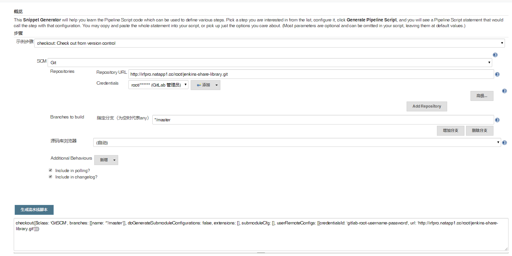
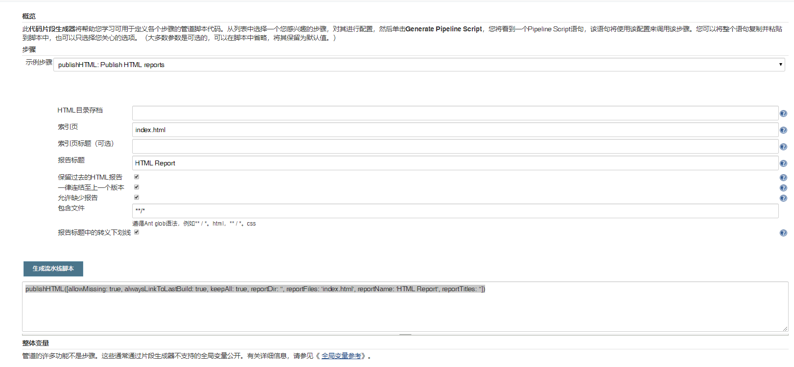
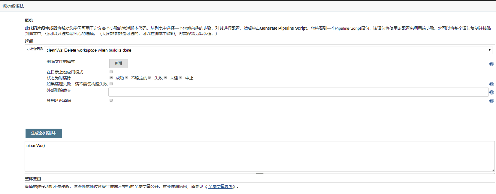
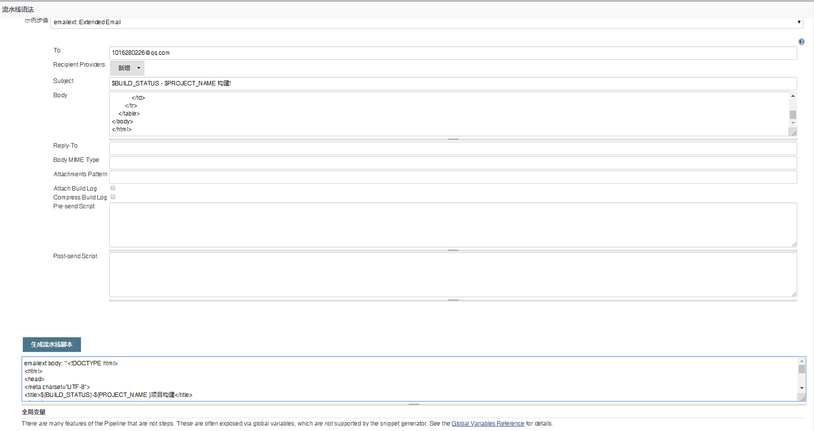
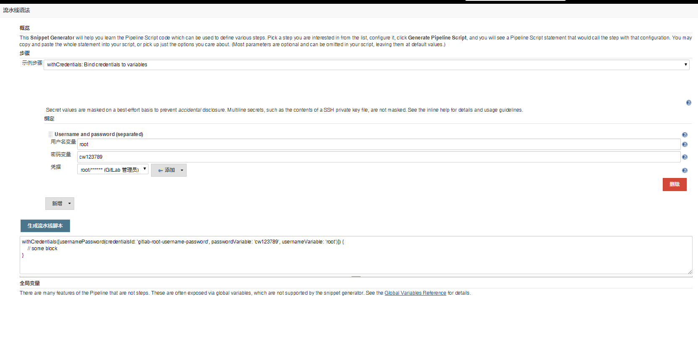

# 笔记四 Pipeline 常用的 DSL 方法

## 1. <font color="#ff6702"><b>Checkout</b></font>

- 功能：**`checkout`** 拉去 Git 项目代码
- 代码示例：

```groovy
#!groovy
checkout(
    [
        $class: 'GitSCM', 
        branches: [[name: '*/master']], 
        doGenerateSubmoduleConfigurations: false, 
        extensions: [], submoduleCfg: [], 
        userRemoteConfigs: [
            [credentialsId: 'gitlab-root-username-password', url: 'http://irfpro.natapp1.cc/root/jenkins-share-library.git']
        ]
    ]
)
```




## 2. <font color="#ff6702"><b>PublishHTML</b></font>

- 功能： **`publishHTML`** 生成HTML 报告。
- 代码示例：

```groovy
publishHTML(
    [allowMissing: true, 
     alwaysLinkToLastBuild: true, 
     keepAll: true, 
     reportDir: './report/', 
     reportFiles: 'success.html, failure.html', 
     reportName: 'Interface-Test-Report', 
     reportTitles: 'HTML'
    ]
)
```




## 3. <font color="#ff6702"><b>CleanWs</b></font>

- 功能：**`cleanWs`** 清空工作空间。
- 代码示例：

```groovy
cleanWs()
```




## 4. <font color="#ff6702"><b>Email</b></font>

- 功能：**`email`** 发送邮件模板
- 代码示例：

```groovy
emailext body: '''<!DOCTYPE html>
<html>
<head>
    <meta charset="UTF-8">
    <title>${BUILD_STATUS}-${PROJECT_NAME }项目构建</title>
</head>

<body leftmargin="8" marginwidth="0" topmargin="8" marginheight="4"
      offset="0">
<table width="95%" cellpadding="0" cellspacing="0"
       style="font-size: 11pt; font-family: Tahoma, Arial, Helvetica, sans-serif">
    <tr>
        各位同事，大家好，以下为${PROJECT_NAME }项目构建信息</br>
        ${ENV, var="JOB_NAME"}-第${BUILD_NUMBER}次构建日志</br>
        <td><font color="#CC0000">构建结果 - ${BUILD_STATUS}</font></td>
        本邮件由系统自动发出，无需回复！<br/>
    </tr>
    <tr>
        <td><br/>
            <b><font color="#0B610B">构建信息</font></b>
            <hr size="2" width="100%" align="center"/>
        </td>
    </tr>
    <tr>
        <td>
            <ul>
                <li>项目名称 ： ${PROJECT_NAME}</li>
                <li>构建编号 ： 第${BUILD_NUMBER}次构建</li>
                <li>触发原因： ${CAUSE}</li>
                <li>构建状态： ${BUILD_STATUS}</li>
                <li>构建日志： <a href="${BUILD_URL}console">${BUILD_URL}console</a></li>
                <li>构建 Url ： <a href="${BUILD_URL}">${BUILD_URL}</a></li>
                <li>工作目录 ： <a href="${PROJECT_URL}ws">${PROJECT_URL}ws</a></li>
                <li>项目 Url ： <a href="${PROJECT_URL}">${PROJECT_URL}</a></li>
            </ul>

            <h4><font color="#0B610B">失败用例</font></h4>
            <hr size="2" width="100%"/>
            $FAILED_TESTS<br/>

            <!-- <h4><font color="#0B610B">最近提交(#$GIT_REVISION)</font></h4> -->
            <hr size="2" width="100%"/>
            <ul>
                ${CHANGES_SINCE_LAST_SUCCESS, reverse=true, format="%c", changesFormat="
                <li>%d [%a] %m</li>
                "}
            </ul>
            详细提交: <a href="${PROJECT_URL}changes">${PROJECT_URL}changes</a><br/>

        </td>
    </tr>
</table>
</body>
</html>''', subject: '$BUILD_STATUS - $PROJECT_NAME 构建!', to: '1016280226@qq.com'
```




## 4. <font color="#ff6702"><b>WithCredentials</b></font>

- 功能：**`withCredentials`**添加凭据
- 代码示例：

```groovy
withCredentials(
    [usernamePassword(
        credentialsId: 'gitlab-root-username-password', 
        passwordVariable: 'cw123789', 
        usernameVariable: 'root')
    ]
) {
    // some block
}
```

