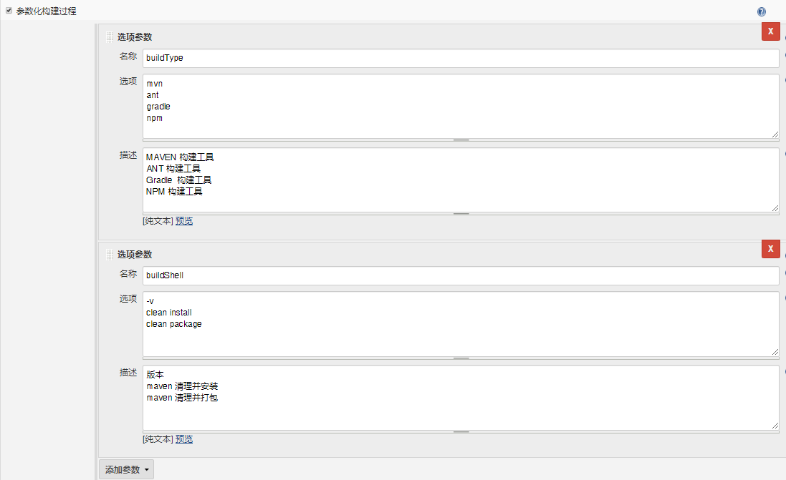
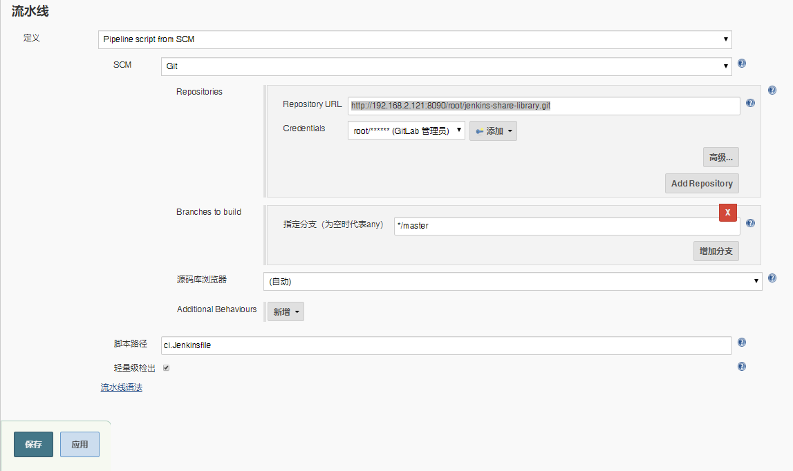

# 笔记五 Pipeline之构建工具封装为共享库


## 1. Jenkins Share Library 封装构建工具


在 **Jenkins 集成篇**中集成构建工具**Maven、Ant、Gradle、NodeJS**，如果我们每次都要使用不同的构建工具**Jenkinsfile**进行构建，这样导致了<font color=red><b>复用性不高、容易出错、构建步骤麻烦</b></font>。

> 集成构建工具篇：
>
> - [**Jenkins 集成 Maven 构建工具**](./docs/ops/jenkins/integration/2-Jenkins集成Maven构建工具.md)
>- [**Jenkins 集成 Ant 构建工具**](./docs/ops/jenkins/integration/3-Jenkins集成Ant构建工具.md)
> - [**Jenkins 集成 Gradle 构建工具**](./docs/ops/jenkins/integration/4-Jenkins集成Gradle构建工具.md)
>- [**Jenkins 集成 NodeJS 构建工具**](./docs/ops/jenkins/integration/5-Jenkins集成NodeJS构建工具.md)


## 2. 封装构建工具

1. 在 **GitLab** 中 **`jenkins-share-library`** 项目中 <font color=red><b>/src/org/devops</b></font>目录中创建一个**`Build.groovy`**统一管理构建工具类，用来判断以那种形式进行构建，以下代码主要有这4种 **Maven** 、**Ant**、**Gradle**、**NodeJS** 构建方式。

   - 示例代码：

   ```groovy
   package org.devops
   
   /**
    * 构建方法
    * 
    * @param buildType 构建类型 MAVEN、ANT、GRADLE、NPM
    * @param buildShell 执行命令
    */
   def buildByTypeAndShell(buildType, buildShell) {
       def buildTools = ["mvn": "MAVEN", "ant": "ANT", "gradle":   "GRADLE", "npm": "NPM"]
       println("当前选择的构建类型为 ${buildType}")
       buildHome = tool buildTools[buildType]
   
       if ("${buildType}" == "npm"){
           sh  """ 
               export NODE_HOME=${buildHome} 
               export PATH=\$NODE_HOME/bin:\$PATH 
               ${buildHome}/bin/${buildType} ${buildShell}"""
       } else {
           sh "${buildHome}/bin/${buildType}  ${buildShell}"
       }
   }
   ```


## 3. 编写Jenkinsfile 实现构建工具调用

1. 在 **GitLab** 中 **`jenkins-share-library`** 项目中 创建一个 **`ci.Jenkinsfile`**文件进行调用共享库构建工具

   **`Build.groovy`**类，实现版本输出命令。

   代码示例：

   

   ```groovy
   #!groovy
   
   // 引入共享库
   @Library('jenkins-share-library') _
   
   // 实例构建工具
   def build = new org.devops.Build()
   
   // 构建工具类型
   String buildType = "${env.buildType}"
   // 构建命令
   String buildShell = "${env.buildShell}"
   
   pipeline {
   		
       agent { node { label "master" } }
   
       stages {
           stage("Build") {
               steps {
                   script {
                       // 执行构建工具调用方法进行构建命令
                       build.buildByTypeAndShell(buildType, buildShell)
                   }
               }
           }
       }
   }
   ```


2. 在**Jenkins** 中创建一个流水线 **`pipeline-share-buildtool-show-09`** 任务。
   - 添加2个选项参数：
     - 名称：buildType
     - 选项：mvn、ant、gradle、npm
     - 名称：buildShell
     - 选项：-v
     
   - 如下图所示：
   
     


3. 流水线配置使用的是 Pipeline script from SCM 。

   - SCM：Git
   - Repository URL: http://192.168.2.121:8090/root/jenkins-share-library.git
   - Credentials: 凭据管理账号
   - 脚本路径：<font color=red><b> ci.Jenkinsfile</b></font>

   如下图所示：

   

4. 点击“**保存**”或“**应用**”。


## 4. Jenkins Share Library 封装构建工具演示效果

