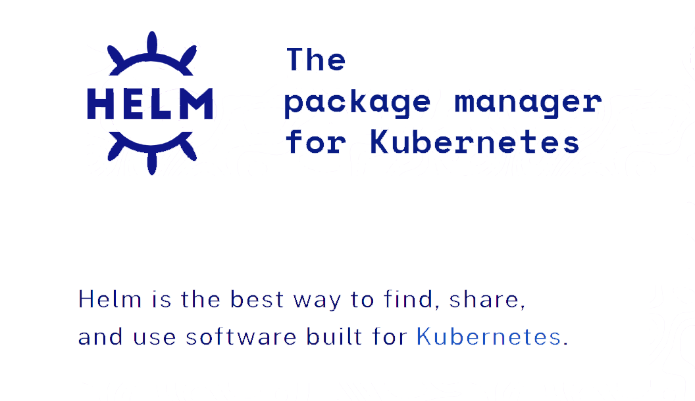

# 笔记一 Helm

## 一、概述

<p> </p>



**`Helm`** 是 Kubernetes 生态系统中的一个**软件包管理工具**。

**`Helm`** 是用于管理 Kubernetes 软件包的工具，称为***图表***。

- **`Helm Charts`** 帮助您定义，安装和升级最复杂的 **Kubernetes**应用程序。

- 图表易于创建，版本控制，共享和发布-因此开始使用Helm并停止复制和粘贴。

**`Helm`** 是[CNCF的](https://cncf.io/)一个毕业项目，由[Helm社区](https://github.com/helm/community)维护。

> **官方 GitHub** : https://github.com/helm/helm


## 二、Kubernetes 的应用部署

**`Kubernetes`** 是一个提供了基于容器的应用集群管理解决方案。

**`Kubernetes`** 为容器化应用提供了**部署运行、资源调度、服务发现和动态伸缩**等一系列完整功能。

**`Kubernetes`** 的核心设计理念是：**用户定义要部署的应用程序**的规则，而 Kubernetes 则负责按**照定义的规则部署并运行应用程序**。

- 如果应用程序出现问题导致偏离了定义的规格，**Kubernetes** 负责对其进行自动修正。
- 例如：定义的应用规则要求部署两个实例（**Pod**），其中一个实例异常终止了，Kubernetes 会检查到并重新启动一个新的实例。

- 用户通过使用 **Kubernetes** **API** 对象来描述应用程序规则，包括 **Pod**、**Service**、**Volume**、**Namespace**、**ReplicaSet**、**Deployment**、**Job** 等等。一般这些资源对象的定义需要写入一系列的 YAML 文件中，然后通过 **Kubernetes** 命令行工具 **Kubectl** 调 **Kubernetes** **API** 进行部署。

以一个典型的三层应用 Wordpress 为例，该应用程序就涉及到多个 Kubernetes API 对象，而要描述这些 Kubernetes API 对象就可能要同时维护多个 YAML 文件。


从上图可以看到，在进行 **Kubernetes** 软件部署时，我们<font color=red><b>面临下述几个问题</b></font><font color=gree><b>（Helm 的出现就是为了很好地解决下面这些问题）：</b></font>

- <font color=red>如何**管理、编辑**和**更新**这些这些分散的 Kubernetes 应用**配置文件** ？</font>
- <font color=red>如何把**一套相关的配置文件**作为**一个应用**进行管理 ？</font>
- <font color=red>如何**分发和重用** **Kubernetes** 的**应用配置**？</font>


## 三、什么是 Helm

**`Helm`** 是 Deis 开发的一个用于 **Kubernetes** 应用的包管理工具，主要用来管理 Charts。(**有点类似于 Ubuntu 中的 APT 或 CentOS 中的 YUM**。)

**`Helm Chart`** 是用来封装 Kubernetes 原生应用程序的**一系列 YAML 文件**。可以在你部署应用的时候自定义应用程序的一些 Metadata，以便于应用程序的分发。

对于**应用发布者**而言，可以通过 **`Helm` 打包应用、管理应用依赖关系、管理应用版本并发布应用**到软件仓库。

对于**使用者**而言，使用 **`Helm`** 后不用需要编写复杂的应用部署文件，**可以以简单的方式在 Kubernetes 上查找、安装、升级、回滚、卸载应用程序**。


## 四、组件及相关术语

- **`Helm`**： 是一个命令行下的客户端工具。

  > 主要用于 Kubernetes 应用程序 Chart 的创建、打包、发布以及创建和管理本地和远程的 Chart 仓库

- **`Tiller`**： 是 Helm 的服务端，部署在 Kubernetes 集群中。

  > Tiller 用于接收 Helm 的请求，并根据 Chart 生成 Kubernetes 的部署文件（ Helm 称为 Release ），然后提交给 Kubernetes 创建应用。Tiller 还提供了 Release 的升级、删除、回滚等一系列功能

- **`Chart`：** Helm 的软件包，采用 TAR 格式。

  > 类似于 APT 的 DEB 包或者 YUM 的 RPM 包，其包含了一组定义 Kubernetes 资源相关的 YAML 文件

- **`Repoistory`：** Helm 的软件仓库。

  > Repository 本质上是一个 Web 服务器，该服务器保存了一系列的 Chart 软件包以供用户下载，并且提供了一个该 Repository 的 Chart 包的清单文件以供查询。Helm 可以同时管理多个不同的 Repository

- **`Release`：** 使用 `helm install` 命令在 Kubernetes 集群中部署的 Chart 称为 Release。

  > **注意：** Helm 中提到的 Release 和我们通常概念中的版本有所不同，这里的 Release 可以理解为 Helm 使用 Chart 包部署的一个应用实例。


## 五、工作原理

下图描述了 **`Helm`** 的几个关键组件 **`Helm`（客户端）**、**`Tiller`（服务器）**、**`Repository`（Chart 软件仓库）**、**`Chart`（软件包）**之间的关系。


### Chart Install 安装过程

- Helm 从指定的目录或者 TAR 文件中解析出 Chart 结构信息
- Helm 将指定的 Chart 结构和 Values 信息通过 gRPC 传递给 Tiller
- Tiller 根据 Chart 和 Values 生成一个 Release
- Tiller 将 Release 发送给 Kubernetes 用于生成 Release

### Chart Update 更新过程

- Helm 从指定的目录或者 TAR 文件中解析出 Chart 结构信息
- Helm 将需要更新的 Release 的名称、Chart 结构和 Values 信息传递给 Tiller
- Tiller 生成 Release 并更新指定名称的 Release 的 History
- Tiller 将 Release 发送给 Kubernetes 用于更新 Release

### Chart Rollback 回滚过程

- Helm 将要回滚的 Release 的名称传递给 Tiller
- Tiller 根据 Release 的名称查找 History
- Tiller 从 History 中获取上一个 Release
- Tiller 将上一个 Release 发送给 Kubernetes 用于替换当前 Release

## Chart 处理依赖

Tiller 在处理 Chart 时，直接将 Chart 以及其依赖的所有 Charts 合并为一个 Release，同时传递给 Kubernetes。因此 Tiller 并不负责管理依赖之间的启动顺序。Chart 中的应用需要能够自行处理依赖关系。


## 六、安装 Helm

### 1. 安装-客户端 Helm

**`Helm`** 的安装方式很多，这里采用**二进制**的方式安装。

```bash
# 下载
$ wget https://get.helm.sh/helm-v2.16.7-linux-amd64.tar.gz
# 解压
$ tar -zxvf helm-v2.16.7-linux-amd64.tar.gz
# 复制客户端执行文件到 bin 目录下
$ cp linux-amd64/helm /usr/local/bin/
```

> 更多安装方法可以参考 Helm 的 [官方帮助文档](https://docs.helm.sh/using_helm/#installing-helm)

### 2. 安装-服务端 Tiller

**`Tiller`** 是以 Deployment 方式部署在 Kubernetes 集群中的，只需使用以下指令便可简单的完成安装

```bash
$ helm init --upgrade --tiller-image registry.cn-hangzhou.aliyuncs.com/google_containers/tiller:v2.16.7 --stable-repo-url https://kubernetes.oss-cn-hangzhou.aliyuncs.com/charts
```

这个 Pod 使用的镜像是 `gcr.io/kubernetes-helm/tiller:v2.16.7`，如果无法访问 gcr.io，以下操作修改镜像源

```bash
$ kubectl edit deployment tiller-deploy -n kube-system
```

```yaml
# Please edit the object below. Lines beginning with a '#' will be ignored,
# and an empty file will abort the edit. If an error occurs while saving this file will be
# reopened with the relevant failures.
#
apiVersion: apps/v1
kind: Deployment
metadata:
  annotations:
    deployment.kubernetes.io/revision: "3"
  creationTimestamp: "2020-06-14T09:51:13Z"
  generation: 3
  labels:
    app: helm
    name: tiller
  name: tiller-deploy
  namespace: kube-system
  resourceVersion: "15458103"
  selfLink: /apis/apps/v1/namespaces/kube-system/deployments/tiller-deploy
  uid: eba8d530-97e4-4318-b4af-9393b996cb27
spec:
  progressDeadlineSeconds: 600
  replicas: 1
  revisionHistoryLimit: 10
  selector:
    matchLabels:
      app: helm
      name: tiller
  strategy:
    rollingUpdate:
      maxSurge: 25%
      maxUnavailable: 25%
    type: RollingUpdate
  template:
    metadata:
      creationTimestamp: null
      labels:
        app: helm
        name: tiller
    spec:
      automountServiceAccountToken: true
      containers:
      - env:
        - name: TILLER_NAMESPACE
          value: kube-system
        - name: TILLER_HISTORY_MAX
                  value: "0"
        # 修改：gcr.io/kubernetes-helm/tiller:v2.16.7 修改为 sapcc/tiller:v2.16.7
        image: sapcc/tiller:v2.16.7
        imagePullPolicy: IfNotPresent
        livenessProbe:
          failureThreshold: 3
          httpGet:
            path: /liveness
            port: 44135
            scheme: HTTP
          initialDelaySeconds: 1
          periodSeconds: 10
          successThreshold: 1
          timeoutSeconds: 1
        name: tiller
        ports:
        - containerPort: 44134
          name: tiller
          protocol: TCP
        - containerPort: 44135
          name: http
          protocol: TCP
        readinessProbe:
          failureThreshold: 3
          httpGet:
            path: /readiness
            port: 44135
            scheme: HTTP
          initialDelaySeconds: 1
          periodSeconds: 10
          successThreshold: 1
          timeoutSeconds: 1
        resources: {}
        terminationMessagePath: /dev/termination-log
        terminationMessagePolicy: File
      dnsPolicy: ClusterFirst
      restartPolicy: Always
      schedulerName: default-scheduler
      securityContext: {}
      serviceAccount: tiller
      serviceAccountName: tiller
      terminationGracePeriodSeconds: 30
status:
  availableReplicas: 1
  conditions:
   - lastTransitionTime: "2020-06-15T02:00:27Z"
    lastUpdateTime: "2020-06-15T02:00:27Z"
    message: Deployment has minimum availability.
    reason: MinimumReplicasAvailable
    status: "True"
    type: Available
  - lastTransitionTime: "2020-06-15T02:00:10Z"
    lastUpdateTime: "2020-06-15T02:00:27Z"
    message: ReplicaSet "tiller-deploy-5d7f7cb9c7" has successfully progressed.
    reason: NewReplicaSetAvailable
    status: "True"
    type: Progressing
  observedGeneration: 3
  readyReplicas: 1
  replicas: 1
  updatedReplicas: 1
```

```bash
# 修改后，保存退出
$ wq 
```

### 3. 给 Tiller 授权

**`Helm`** 的服务端 Tiller 是一个部署在 Kubernetes 中 `Kube-system` Namespace 下的 Deployment，它会去连接 `kube-api` 在 Kubernetes 里创建和删除应用。

从 Kubernetes 1.6 版本开始，API Server 启用了 RBAC 授权。目前的 Tiller 部署时默认没有定义授权的 ServiceAccount，这会导致访问 API Server 时被拒绝。所以我们需要明确为 Tiller 部署添加授权

- 创建一个名为 `tiller-adminuser.yaml` 的配置文件，为 Tiller 创建服务帐号和绑定角色

```yaml
apiVersion: v1
kind: ServiceAccount
metadata:
  name: tiller
  namespace: kube-system
---
apiVersion: rbac.authorization.k8s.io/v1
kind: ClusterRoleBinding
metadata:
  name: tiller-cluster-rule
roleRef:
  apiGroup: rbac.authorization.k8s.io
  kind: ClusterRole
  name: cluster-admin
subjects:
- kind: ServiceAccount
  name: tiller
  namespace: kube-system
```

```bash
# 修改配置文件后，创建tiller-adminuser 权限
$ kubectl apply -f tiller-adminuser.yaml
```

- 为 Tiller 设置帐号

```bash
# 使用 kubectl patch 更新 API 对象
$ kubectl patch deploy --namespace kube-system tiller-deploy -p '{"spec":{"template":{"spec":{"serviceAccount":"tiller"}}}}'

-------------------------------------- 输出如下 ------------------------------------------------
deployment.extensions/tiller-deploy patched
-----------------------------------------------------------------------------------------------
```

- 查看是否授权成功

```bash
$ kubectl get deploy --namespace kube-system tiller-deploy --output yaml|grep  serviceAccount

-------------------------------------- 输出如下 ------------------------------------------------
serviceAccount: tiller
serviceAccountName: tiller
-----------------------------------------------------------------------------------------------
```

### 4. 验证安装是否成功

```bash
$ kubectl -n kube-system get pods|grep tiller
-------------------------------------- 输出如下 ------------------------------------------------
tiller-deploy-5d7f7cb9c7-cm4qx              1/1     Running   0          3h29m
----------------------------------------------------------------------------------------------
```

```bash
$ helm version
-------------------------------------- 输出如下 ------------------------------------------------
Client: &version.Version{SemVer:"v2.16.7", GitCommit:"5f2584fd3d35552c4af26036f0c464191287986b", GitTreeState:"clean"}
Server: &version.Version{SemVer:"v2.16.7", GitCommit:"5f2584fd3d35552c4af26036f0c464191287986b", GitTreeState:"clean"}
----------------------------------------------------------------------------------------------
```

### 5. 扩展-卸载 Tiller （可选）

如果你需要在 Kubernetes 中卸载已部署的 Tiller，可使用以下命令完成卸载

```bash
$ helm reset
```