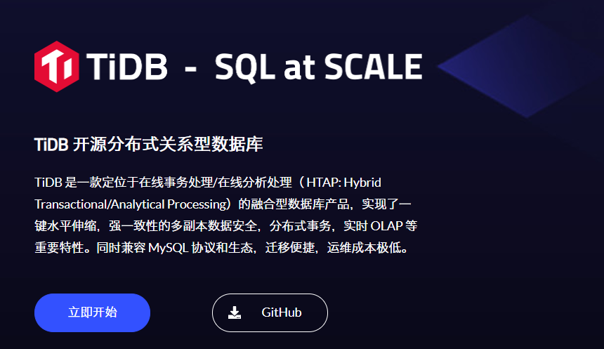

# 笔记一 TiDB 简介

## 一、什么是 TiDB

**`TiDB`** 是 PingCAP 公司受 Google Spanner / F1 论文启发自主设计、研发的开源分布式关系型数据库，是一款同时支持**在线事务处理**与**在线分析处理 (Hybrid Transactional and Analytical Processing, HTAP）的融合型分布式数据库产品**。

- 具备**水平扩容**或者**缩容**、**金融级高可用**、**实时 HTAP**、**云原生的分布式数据库**、兼容 **MySQL 5.7 协议**和 **MySQL 生态**等重要特性。
- 目标是为用户提供一站式 **OLTP (Online Transactional Processing)**、**OLAP (Online Analytical Processing)**、**HTAP** 解决方案。
- TiDB 适合**高可用**、**强一致**要求较高、**数据规模较大**等各种应用场景。

> **TiDB 官方网站**：https://pingcap.com/

## 二、五大核心特性

### 1. 兼容 MySQL 5.7 协议和 MySQL 生态

大多数情况下，无需修改代码即可从 MySQL 轻松迁移至 TiDB，分库分表后的 MySQL 集群亦可通过 TiDB 工具进行实时迁移

> 兼容 MySQL 5.7 协议、MySQL 常用的功能、MySQL 生态，应用无需或者修改少量代码即可从 MySQL 迁移到 TiDB。提供丰富的数据迁移工具帮助应用便捷完成数据迁移。

### 2. 一键水平扩容或者缩容

通过简单地增加新节点即可实现 TiDB 的水平扩展，按需扩展吞吐或存储，轻松应对高并发、海量数据场景。

> 得益于 TiDB 存储计算分离的架构的设计，可按需对计算、存储分别进行在线扩容或者缩容，扩容或者缩容过程中对应用、运维人员透明。

### 3. 金融级高可用

相比于传统主从 (M-S) 复制方案，基于 Raft 的多数派选举协议可以提供金融级的 100% 数据强一致性保证，且在不丢失大多数副本的前提下，可以实现故障的自动恢复 (auto-failover)，无需人工介入 。

> 数据采用多副本存储，数据副本通过 Multi-Raft 协议同步事务日志，多数派写入成功事务才能提交，确保数据强一致性且少数副本发生故障时不影响数据的可用性。可按需配置副本地理位置、副本数量等策略满足不同容灾级别的要求。

### 4. 一站式 HTAP 解决方案

TiDB 作为典型的 OLTP 行存数据库，同时兼具强大的 OLAP 性能，配合 TiSpark，可提供一站式 HTAP 解决方案，一份存储同时处理 OLTP & OLAP 无需传统繁琐的 ETL 过程

> 提供行存储引擎 TiKV、列存储引擎 TiFlash 两款存储引擎，TiFlash 通过 Multi-Raft Learner 协议实时从 TiKV 复制数据，确保行存储引擎 TiKV 和列存储引擎 TiFlash 之间的数据强一致。TiKV、TiFlash 可按需部署在不同的机器，解决 HTAP 资源隔离的问题。

### 5. 云原生 SQL 数据库

TiDB 是为云而设计的数据库，同 Kubernetes 深度耦合，支持公有云、私有云和混合云，使部署、配置和维护变得十分简单。TiDB 的设计目标是 100% 的 OLTP 场景和 80% 的 OLAP 场景，更复杂的 OLAP 分析可以通过 TiSpark 项目来完成。 TiDB 对业务没有任何侵入性，能优雅的替换传统的数据库中间件、数据库分库分表等 Sharding 方案。同时它也让开发运维人员不用关注数据库 Scale 的细节问题，专注于业务开发，极大的提升研发的生产力。

> 专为云而设计的分布式数据库，通过 [TiDB Operator](https://pingcap.com/docs-cn/tidb-in-kubernetes/stable/tidb-operator-overview/) 可在公有云、私有云、混合云中实现部署工具化、自动化。

## 三、四大核心应用场景

### 1. 要求较高的金融行业

-  对数据一致性及高可靠、系统高可用、可扩展性、容灾

> **案例：**
>
> 众所周知，金融行业对数据一致性及高可靠、系统高可用、可扩展性、容灾要求较高，传统的解决方案是**同城两个机房提供服务**、**异地一个机房提供数据容灾能务但不提供服务**。
>
> - <b> 此解决方案存在资源利用率低、维扩成本高、RTO 及 PRO 无法真实达到企业所期望的值。</b>

**`TiDB`** 采用多副本 + Mutli Raft 协议的方式将数据调度到不同的机房、机架、机器，当部分机器故障时系统可自动进行切换，确保系统的 **RTO <= 30s 及 RPO = 0** 。

### 2. 海量数量及高并的 OLTP 场景

- 对存储容量、可扩展性、并发要求较高的 OLTP 场景

> **案例：**
>
> 随着业务的高速发展，**数据呈现爆炸性的增长**。
>
> - <b> 传统的**单机数据库**无法满足因数据爆炸性的增长对数据的容量要求。</b>
>
> 现阶段解决手段
>
> -  <b>可行方案是采用分库分表的中间件产品或者 NewSQL 数据库替代、采用高端的存储设备等。</b>
>
> -  <b>其中性价比最大的是 **NewSQL 数据库**。例如：**TiDB**。</b>

**`TiDB`** 采用**计算、存储分离的架构**，可对计算、存储分别进行扩容和缩容，计算节点最大支持 512 节点，每个节点最大支持 1000 并发，集群容量最大**支持 PB 级别**。

### 3. Real-time HTAP 场景 

> **案例：**
>
> 随着 5G、物联网、人工智能的高速发展，企业所生产的数据会越来越多，其规模可能达到数百 TB 甚至 PB 级别。
>
> - <b> 传统的解决方案是通过 OLTP 型数据库处理在线联机交易业务，通过 ETL 工具将数据同步到 OLAP 型数据库进行数据分析，这种处理方案存在存储成本高、实际性差等多方面的问题。</b>

**`TiDB`** 在 4.0 版本中引入列存储引擎 **`TiFlash`** 结合行存储引擎 TiKV 构建真正的 HTAP 数据库，在增加少量存储成本的情况下，可以同一个系统中**做联机交易处理、实时数据分析，极大的节省企业的成本**。

### 4. 数据汇聚、二次加工处理的场景 

> **案例：**
>
> 当前绝大部分企业的业务数据都分散在不同的系统中，没有一个统一的汇总，随着业务的发展，企业的决策层需要了解整个公司的业务状况方便即时的做出决策，故需要将分散在各个系统的数据汇聚在同一个系统并进行二次加工处理生成 T + 0/1 的报表。
>
> - <b> 传统常见的解决方案是采用 ETL + Hadoop 来完成，但 Hadoop 体系统太复杂，运维、存储成本太高无法满度用户的需求。</b>

**`TiDB`**与 Hadoop 相比就会简单得多，业务通过 ETL 工具或者 TiDB 的同步工具将数据同步到 TiDB，在 TiDB 中可通过 SQL 直接生成报表。

## 四、TiDB 与传统的单机数据库相比

优势在于：

- 纯分布式架构，拥有良好的扩展性，支持弹性的扩缩容。

- 支持 SQL，对外暴露 MySQL 的网络协议，并兼容大多数 MySQL 的语法，在大多数场景下可以直接替换 MySQL 。

- 默认支持高可用，在少数副本失效的情况下，数据库本身能够自动进行数据修复和故障转移，对业务透明。

-  支持 ACID 事务，对于一些有强一致需求的场景友好，例如：银行转账。

- 具有丰富的工具链生态，覆盖数据迁移、同步、备份等多种场景 。

## 五、TiDB 整体架构

在内核设计上，TiDB 分布式数据库将整体架构拆分成了多个模块，各模块之间互相通信，组成完整的 TiDB 系统。对应的架构图如下：

### TiDB Server

> - SQL 层，对外暴露 MySQL 协议的连接 endpoint，负责接受客户端的连接，执行 SQL 解析和优化，最终生成分布式执行计划。
> - TiDB 层本身是无状态的，实践中可以启动多个 TiDB 实例，通过负载均衡组件（如 LVS、HAProxy 或 F5）对外提供统一的接入地址，客户端的连接可以均匀地分摊在多个 TiDB 实例上以达到负载均衡的效果。
> - TiDB Server 本身并不存储数据，只是解析 SQL，将实际的数据读取请求转发给底层的存储节点 TiKV（或 TiFlash）。

### PD Server

> - 整个 TiDB 集群的元信息管理模块，负责存储每个 TiKV 节点实时的数据分布情况和集群的整体拓扑结构，提供 Dashboard 管控界面，并为分布式事务分配事务 ID。
> - PD 不仅存储元信息，同时还会根据 TiKV 节点实时上报的数据分布状态，下发数据调度命令给具体的 TiKV 节点，可以说是整个集群的“大脑”。
> - 此外，PD 本身也是由至少 3 个节点构成，拥有高可用的能力。建议部署奇数个 PD 节点。

### 存储节点

#### TiKV Server

> - 负责存储数据，从外部看 TiKV 是一个分布式的提供事务的 Key-Value 存储引擎。
> - 存储数据的基本单位是 Region，每个 Region 负责存储一个 Key Range（从 StartKey 到 EndKey 的左闭右开区间）的数据，每个 TiKV 节点会负责多个 Region。
> - TiKV 的 API 在 KV 键值对层面提供对分布式事务的原生支持，默认提供了 SI (Snapshot Isolation) 的隔离级别，这也是 TiDB 在 SQL 层面支持分布式事务的核心。
> - TiDB 的 SQL 层做完 SQL 解析后，会将 SQL 的执行计划转换为对 TiKV API 的实际调用。所以，数据都存储在 TiKV 中。
> - 另外，TiKV 中的数据都会自动维护多副本（默认为三副本），天然支持高可用和自动故障转移。

#### TiFlash：

> TiFlash 是一类特殊的存储节点。和普通 TiKV 节点不一样的是，在 TiFlash 内部，数据是以列式的形式进行存储，主要的功能是为分析型的场景加速。

## 六、技术内幕

- [保存数据](https://pingcap.com/blog-cn/tidb-internal-1/)
- [计算-如何做 SQL 运算](https://pingcap.com/blog-cn/tidb-internal-2/)
- [调度-TiDB 集群管理](https://pingcap.com/blog-cn/tidb-internal-3/)

## 七、附：扩展阅读

### OLTP

- **基本含义：** OLTP(Online Transactional Processing)，OLTP 是传统的关系型数据库的主要应用，主要是基本的、日常的事务处理，记录即时的增、删、改、查，比如在银行存取一笔款，就是一个事务交易
- **实时性：** OLTP 实时性要求高，OLTP 数据库旨在使事务应用程序仅写入所需的数据，以便尽快处理单个事务
- **数据量：** OLTP 数据量不是很大，一般只读 / 写数十条记录，处理简单的事务
- **用户和系统的面向性：** OLTP 是面向顾客的，用于事务和查询处理
- **数据库设计：** OLTP 采用实体 - 联系 ER 模型和面向应用的数据库设计

### OLAP

- **基本含义：** OLAP(Online Analytical Processing) 即联机分析处理，是数据仓库的核心部心，支持复杂的分析操作，侧重决策支持，并且提供直观易懂的查询结果。典型的应用就是复杂的动态报表系统
- **实时性：** OLAP 的实时性要求不是很高，很多应用顶多是每天更新一下数据
- **数据量：** OLAP 数据量大，因为 OLAP 支持的是动态查询，所以用户也许要通过将很多数据的统计后才能得到想要知道的信息，例如时间序列分析等等，所以处理的数据量很大
- **用户和系统的面向性：** OLAP 是面向市场的，用于数据分析
- **数据库设计：** OLAP 采用星型或雪花模型和面向主题的数据库设计

|          | OLTP                               | OLAP                               |
| -------- | ---------------------------------- | ---------------------------------- |
| 用户     | 操作人员，低层管理人员             | 决策人员，高级管理人员             |
| 功能     | 日常操作处理                       | 分析决策                           |
| DB 设计  | 面向应用                           | 面向主题                           |
| 数据     | 当前的，最新的细节，二维的，分立的 | 历史的，聚集的，多维集成的，统一的 |
| 存取     | 读/写数十条记录                    | 读上百万条记录                     |
| 工作单位 | 简单的事务                         | 复杂的查询                         |
| 用户数   | 上千个                             | 上百个                             |
| DB 大小  | 100MB-GB                           | 100GB-TB                           |