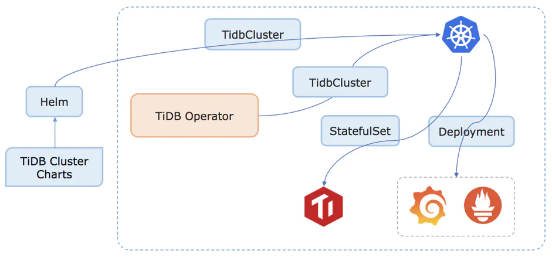

# 笔记二 TiDB Operator


## <font color=red>1. TiDB Operator  是什么 ?</font>

**`TiDB Operator`** 是 TiDB 在 Kubernetes 平台上的**`自动化部署运维工具`**，提供包括**`部署、升级、扩缩容、备份恢复、配置变更`**的 TiDB 全生命周期管理。

- 目前，TiDB Operator 已正式开源（[pingcap/tidb-operator](https://github.com/pingcap/tidb-operator/)）。
- 借助 TiDB Operator，TiDB 可以无缝运行在公有云厂商提供的 Kubernetes 平台上，让 TiDB 成为真正的 Cloud-Native 数据库。


## <font color=red>2. 为什么选择使用 TiDB Operator ？</font>

### 1. 运维成本高

使用传统的自动化工具带来了很高的部署和运维成本。TiDB 的分层架构对于分布式系统是比较常见的，各个组件都可以根据业务需求独立水平伸缩，并且 TiKV 和 TiDB 都可以独立使用。比如，在 TiKV 之上可以构建兼容 Redis 协议的 KV 数据库，而 TiDB 也可以对接 LevelDB 这样的 KV 存储引擎。

但是，这种多组件的分布式系统增加了手工部署和运维的成本。一些传统的自动化部署和运维工具如 Puppet/Chef/SaltStack/Ansible，由于缺乏全局状态管理，不能及时对各种异常情况做自动故障转移，并且很难发挥分布式系统的弹性伸缩能力。其中有些还需要写大量的 DSL 甚至与 Shell 脚本一起混合使用，可移植性较差，维护成本比较高。

### 2. 为云而生

在云时代，容器成为应用分发部署的基本单位，而谷歌基于内部使用数十年的容器编排系统 Borg 经验推出的开源容器编排系统 Kubernetes 成为当前容器编排技术事实上的标准。如今各大云厂商都开始提供托管的 Kubernetes 集群，部署在 Kubernetes 平台的应用可以不用绑定在特定云平台，轻松实现在各种云平台之间的迁移，其容器化打包和发布方式也解决了对操作系统环境的依赖。

### 3. 有状态的

Kubernetes 项目最早期只支持无状态服务（Stateless Service）的管理。无状态服务通过 ReplicationController 定义多个副本，由 Kubernetes 调度器来决定在不同节点上启动多个 Pod，实现负载均衡和故障转移。对于无状态服务，多个副本对应的 Pod 是等价的，所以在节点出现故障时，在新节点上启动一个 Pod 与失效的 Pod 是等价的，不会涉及状态迁移问题，因而管理非常简单。

但是对于有状态服务（Stateful Service），由于需要将数据持久化到磁盘，使得不同 Pod 之间不能再认为成等价，也就不能再像无状态服务那样随意进行调度迁移。

Kubernetes v1.3 版本提出 PetSet 的概念，用来管理有状态服务并于 v1.5 将其更名为 StatefulSet。StatefulSet 明确定义一组 Pod 中每个的身份，启动和升级都按特定顺序来操作。另外使用持久化卷存储（PersistentVolume）来作为存储数据的载体，当节点失效 Pod 需要迁移时，对应的 PV 也会重新挂载，而 PV 的底层依托于分布式文件系统，所以 Pod 仍然能访问到之前的数据。同时 Pod 在发生迁移时，其网络身份例如 IP 地址是会发生变化的，很多分布式系统不能接受这种情况。所以 StatefulSet 在迁移 Pod 时可以通过绑定域名的方式来保证 Pod 在集群中网络身份不发生变化。

但是由于有状态服务的特殊性，当节点出现异常时，出于数据安全性考虑，Kubernetes 并不会像无状态服务那样自动做故障转移。尽管网络存储能挂载到不同的节点上供其上的 Pod 使用，但是如果出现节点故障时，简单粗暴地将网络 PV 挂载到其它节点上是比较危险的。

Kubernetes 判断节点故障是基于部署在每个节点上的 Kubelet 服务是否能正常上报节点状态，Kubelet 能否正常工作与用户应用并没有必然联系，在一些特殊情况下，Kubelet 服务进程可能无法正常启动，但是节点上的业务容器还在运行，将 PV 再挂载到其它节点可能会出现双写问题。

为了在 Kubernetes 上部署和管理 TiDB 这种有状态的服务，我们需要扩展 StatefulSet 的功能。TiDB Operator 正是基于 Kubernetes 内置的 StatefulSet 开发的 TiDB 集群管理和运维工具。

Kubernetes 直到 v1.7 才试验性引入本地 PV，在这之前只有网络 PV，TiKV 自身在存储数据时就是多副本的，网络 PV 的多副本会增加数据冗余，降低 TiDB 的性能。在这之前我们基于 Kubernetes 内置的 hostPath volume 实现了本地 PV 满足 TiKV 对磁盘 IO 的要求。官方本地 PV 方案直到最近的 Kubernetes v1.10 才相对稳定地支持调度功能，满足用户对本地 PV 的需求。为了降低用户的使用和管理成本并且拥抱 Kubernetes 开源社区，我们又重新基于官方的本地 PV 方案实现了对数据的管理。

## <font color=gree>3.   TiDB Operator 流程原理 </font>

**`Operator`** 本质上是 Kubernetes 的**控制器（Controller）**，其核心思想是用户给定一个 **Spec** 描述文件，**Controller** 根据 **Spec** 的变化，在 **Kubernetes** 集群中创建对应资源，并且不断调整资源使其状态满足用户预期的 **Spec**。




上图是 **`TiDB Operator`** 工作流程原理图，其中 **`TidbCluster`** 是通过 **`CRD（Custom Resource Definition`**）扩展的内置资源类型：

- 用户通过 **Helm** 往 **Kubernetes API Server** 创建或更新 **`TidbCluster`** 对象
- **`TiDB Operator`** 通过 **Watch API Server** 中的 **`TidbCluster`** 对象创建更新或删除，维护 **`PD/TiKV/TiDB StatefulSet`,` Service`** 和 **`Deployment`** 对象更新
- **Kubernetes** 根据 **StatefulSet**, **Service** 和 **Deployment** 对象创建更新或删除对应的容器和服务

在第 2 步中，**`TiDB Operator`** 在更新 **StatefulSet** 等对象时会参考 **`PD API`** 给出的**集群状态**来做出 **`TiDB 集群`**的运维处理。通过 **`TiDB Operator`** 和 **Kubernetes** 的**动态调度处理**，创建出符合**用户预期的** **`TiDB 集群`**。

## <font color=gree>4. 安装 TiDB Operator</font>

- **`TiDB Operator`** 需要运行在 **Kubernetes v1.10** 及以上版本。

- **`TiDB Operator`** 和 **`TiDB 集群`**的部署和管理是通过 **Kubernetes** 平台上的包管理工具 **Helm** 实现的。

- 运行 **`TiDB Operator`** 前请确保 **`Helm`** 已经正确安装在 **Kubernetes** 集群里

**`TiDB Operator`** 与适用的 **`TiDB 版本`**的对应关系如下：

| TiDB Operator 版本 | 适用的 TiDB 版本      |
| ------------------ | --------------------- |
| v1.0               | v2.1, v3.0            |
| v1.1               | v3.0, v3.1, v4.0      |
| dev                | v3.0, v3.1, v4.0, dev |

### 4.1 准备环境

- TiDB Operator 部署前，请确认以下软件需求：
  - Kubernetes v1.12 或者更高版本
  - [DNS 插件](https://kubernetes.io/docs/tasks/access-application-cluster/configure-dns-cluster/)
  - [PersistentVolume](https://kubernetes.io/docs/concepts/storage/persistent-volumes/)
  - [RBAC](https://kubernetes.io/docs/admin/authorization/rbac) 启用（可选）
  - [Helm](https://helm.sh/) 版本 >= 2.11.0 && < 3.0.0 && != [2.16.4](https://github.com/helm/helm/issues/7797)

> **注意：**
>
> - 每个 Kubernetes 集群中只能部署一个 TiDB Operator。
>
> - TiDB 可以使用网络卷存储 TiDB 数据，但存在冗余复制操作，导致性能降低。强烈建议设置本地卷获得更好的性能。
>
> * 网络卷做备份设置需要 Kubernetes v1.12 或更高版本

### 4.2  克隆 tidb-operator 项目到本地

```bash
#创建一个tidb 目录
$ mkdir -p /home/kubernetes/tidb && cd /home/kubernetes/tidb

# 克隆 tidb-operator
$ git clone https://github.com/pingcap/tidb-operator.git

# 进入tidb-oprator 项目目录 
$ cd tidb-operator
```

### 4.3 部署本地卷

```bash
# 创建本地卷
$ kubectl apply -f manifests/local-dind/local-volume-provisioner.yaml

# 查看本地卷是否 running
$ kubectl get po -n kube-system -l app=local-volume-provisioner -o wide

--------------------------------- 我的k8s有5个节点，输出如下 -------------------------------------
NAME                             READY   STATUS              RESTARTS   AGE    IP               NODE                 NOMINATED NODE   READINESS GATES
local-volume-provisioner-d5dgx   1/1     Running             0          3m3s   10.100.212.133   kubernetes-node-04   <none>           <none>
local-volume-provisioner-dcps2   1/1     Running             0          3m3s   10.100.140.66    kubernetes-node-02   <none>           <none>
local-volume-provisioner-nrv96   1/1     Running             0          3m3s   10.100.211.9    kubernetes-node-05   <none>           <none>
local-volume-provisioner-t7756   1/1     Running             0          3m3s   10.100.2.13      kubernetes-node-03   <none>           <none>
local-volume-provisioner-wkgwx   1/1     Running             0          3m3s   10.100.141.195   kubernetes-node-01   <none>           <none>
-----------------------------------------------------------------------------------------------

# 查看 PV
$ kubectl get pv | grep local-storage

--------------------------------------- 输出如下 -----------------------------------------------
local-pv-13fcf976   461Gi      RWO            Delete           Available           local-storage            13m
local-pv-1f9192f    461Gi      RWO            Delete           Available           local-storage            13m
local-pv-23ace7a3   461Gi      RWO            Delete           Available           local-storage            13m
local-pv-29c64039   461Gi      RWO            Delete           Available           local-storage            13m
local-pv-42084527   461Gi      RWO            Delete           Available           local-storage            13m
local-pv-43ef2059   461Gi      RWO            Delete           Available           local-storage            13m
local-pv-97057ba0   461Gi      RWO            Delete           Available           local-storage            13m
local-pv-9aa84eaa   461Gi      RWO            Delete           Available           local-storage            13m
local-pv-eb0c7e5c   461Gi      RWO            Delete           Available           local-storage            13m
local-pv-f7165005   461Gi      RWO            Delete           Available           local-storage            13m
-----------------------------------------------------------------------------------------------
```

### 4.4 安装  CRD

```bash
# 安装 crd
$ kubectl apply -f manifests/crd.yaml

# 查看 tidb集群 crd 
$ kubectl get crd tidbclusters.pingcap.com
--------------------------------------- 输出如下 -----------------------------------------------
NAME                       CREATED AT
tidbclusters.pingcap.com   2020-07-06T07:13:26Z
-----------------------------------------------------------------------------------------------
```

### 4.5 安装完 TidbCluster 后, 再在 Kubernetes 集群中安装 Operator.

```bash
# 修改 tidb-operator/charts/tidb-operator/values.yaml 配置
kubeSchedulerImageName: registry.aliyuncs.com/google_containers/kube-scheduler
```
```bash
# 安装 tidb-operator
$ helm install charts/tidb-operator --name=tidb-operator --namespace=tidb-admin

--------------------------------------- 输出如下 -----------------------------------------------
NAME:   tidb-operator
LAST DEPLOYED: Mon Jul  6 15:18:18 2020
NAMESPACE: tidb-admin
STATUS: DEPLOYED

RESOURCES:
==> v1/ConfigMap
NAME                   DATA  AGE
tidb-scheduler-policy  1     0s

==> v1/Deployment
NAME                     READY  UP-TO-DATE  AVAILABLE  AGE
tidb-controller-manager  0/1    1           0          1s
tidb-scheduler           0/1    1           0          1s

==> v1/Pod(related)
NAME                                      READY  STATUS             RESTARTS  AGE
tidb-controller-manager-6c8b7db8d6-swlqp  0/1    ContainerCreating  0         1s
tidb-scheduler-79956697b-hpwdt            0/2    ContainerCreating  0         1s

==> v1/ServiceAccount
NAME                     SECRETS  AGE
tidb-controller-manager  1        1s
tidb-scheduler           1        1s

==> v1beta1/ClusterRole
NAME                                   AGE
tidb-operator:tidb-scheduler           1s
tidb-operator:tidb-controller-manager  1s

==> v1beta1/ClusterRoleBinding
NAME                                   AGE
tidb-operator:volume-scheduler         1s
tidb-operator:tidb-controller-manager  1s
tidb-operator:tidb-scheduler           1s
tidb-operator:kube-scheduler           1s


NOTES:
1. Make sure tidb-operator components are running
   kubectl get pods --namespace tidb-admin -l app.kubernetes.io/instance=tidb-operator
2. Install CRD
   kubectl apply -f https://raw.githubusercontent.com/pingcap/tidb-operator/master/manifests/crd.yaml
   kubectl get customresourcedefinitions
3. Modify tidb-cluster/values.yaml and create a TiDB cluster by installing tidb-cluster charts
   helm install tidb-cluster
-----------------------------------------------------------------------------------------------
```
```bash
# 查看安装的 pods
$ kubectl get po -n tidb-admin -l app.kubernetes.io/name=tidb-operator

--------------------------------------- 输出如下 -----------------------------------------------
NAME                                       READY   STATUS    RESTARTS   AGE
tidb-controller-manager-6c8b7db8d6-swlqp   1/1     Running   0          42s
tidb-scheduler-79956697b-hpwdt             2/2     Running   0          42s
-----------------------------------------------------------------------------------------------
```

## <font color=red>5. 卸载 TiDB Operator</font>

### 5.1 查看 Helm 资源

```bash
$ helm ls -a

--------------------------------------- 输出如下 -----------------------------------------------
NAME         	REVISION	UPDATED                 	STATUS  	CHART            	APP VERSION	NAMESPACE 
tidb-operator	1       	Mon Jul  6 15:18:18 2020	DEPLOYED	tidb-operator-dev	           	tidb-admin
-----------------------------------------------------------------------------------------------
```

### 5.2 卸载 Helm 资源

```
$ helm delete tidb-operator --purge

--------------------------------------- 输出如下 -----------------------------------------------
release "tidb-operator" deleted
-----------------------------------------------------------------------------------------------
```