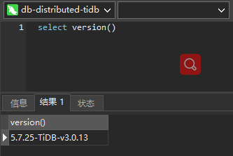

# 笔记三  TiDB Cluster

## <font color=red>1. 前置条件</font>

### 1.1 软件版本要求

| 软件名称   | 版本                                         |
| ---------- | -------------------------------------------- |
| Docker     | Docker CE 18.09.6                            |
| Kubernetes | v1.12.5+                                     |
| CentOS     | CentOS 7.6，内核要求为 3.10.0-957 或之后版本 |

### 1.2  硬件资源配置要求

- 资源需求 CPU 2+
- 内存 4G+

- 需要 `root` 权限操作 Docker 进程

## <font color=gree>2. TiDB Operator 部署 </font>

如果 K8s 集群启动并正常运行，可以通过 `helm` 添加 chart 仓库并安装 **`TiDB Operator`**。

### 2.1 添加 Helm chart 仓库

```bash
$ helm repo add pingcap http://charts.pingcap.org/ && \
helm repo list && \
helm repo update && \
helm search tidb-cluster -l && \
helm search tidb-operator -l

------------------------------------- 输出如下信息 ----------------------------------------------
"pingcap" has been added to your repositories
NAME          	URL                                                   
stable        	https://kubernetes.oss-cn-hangzhou.aliyuncs.com/charts
local         	http://127.0.0.1:8879/charts                          
harbor        	https://helm.goharbor.io                              
rancher-stable	https://releases.rancher.com/server-charts/stable     
pingcap       	http://charts.pingcap.org/                            
Hang tight while we grab the latest from your chart repositories...
...Skip local chart repository
...Successfully got an update from the "pingcap" chart repository
...Successfully got an update from the "stable" chart repository
...Successfully got an update from the "harbor" chart repository
...Successfully got an update from the "rancher-stable" chart repository
Update Complete.
# tidb-cluster 版本
NAME                	CHART VERSION	APP VERSION	DESCRIPTION                  
pingcap/tidb-cluster	v1.1.2       	           	A Helm chart for TiDB Cluster
pingcap/tidb-cluster	v1.1.1       	           	A Helm chart for TiDB Cluster
pingcap/tidb-cluster	v1.1.0       	           	A Helm chart for TiDB Cluster
pingcap/tidb-cluster	v1.0.7       	           	A Helm chart for TiDB Cluster
pingcap/tidb-cluster	v1.0.6       	           	A Helm chart for TiDB Cluster
pingcap/tidb-cluster	v1.0.5       	           	A Helm chart for TiDB Cluster
pingcap/tidb-cluster	v1.0.4       	           	A Helm chart for TiDB Cluster
pingcap/tidb-cluster	v1.0.3       	           	A Helm chart for TiDB Cluster
pingcap/tidb-cluster	v1.0.2       	           	A Helm chart for TiDB Cluster
pingcap/tidb-cluster	v1.0.1       	           	A Helm chart for TiDB Cluster
pingcap/tidb-cluster	v1.0.0       	           	A Helm chart for TiDB Cluster
pingcap/tidb-cluster	latest       	           	A Helm chart for TiDB Cluster
#  tidb-operator  版本
NAME                 	CHART VERSION	APP VERSION	DESCRIPTION                            
pingcap/tidb-operator	v1.1.2       	           	tidb-operator Helm chart for Kubernetes
pingcap/tidb-operator	v1.1.1       	           	tidb-operator Helm chart for Kubernetes
pingcap/tidb-operator	v1.1.0       	           	tidb-operator Helm chart for Kubernetes
pingcap/tidb-operator	latest       	           	tidb-operator Helm chart for Kubernetes
pingcap/tidb-operator	v1.0.7       	           	tidb-operator Helm chart for Kubernetes
pingcap/tidb-operator	v1.0.6       	           	tidb-operator Helm chart for Kubernetes
pingcap/tidb-operator	v1.0.5       	           	tidb-operator Helm chart for Kubernetes
pingcap/tidb-operator	v1.0.4       	           	tidb-operator Helm chart for Kubernetes
pingcap/tidb-operator	v1.0.3       	           	tidb-operator Helm chart for Kubernetes
pingcap/tidb-operator	v1.0.2       	           	tidb-operator Helm chart for Kubernetes
pingcap/tidb-operator	v1.0.1       	           	tidb-operator Helm chart for Kubernetes
pingcap/tidb-operator	v1.0.0       	           	tidb-operator Helm chart for Kubernetes
-----------------------------------------------------------------------------------------------
```

### 2.2 安装 TiDB Operator

```bash
# 查看安装版本
$ cat /home/kubernetes/tidb/tidb-operator-master/charts/tidb-operator/values.yaml

------------------------------------ 可以查看到版本为 v1.1.0 -------------------------------------
.......
# operatorImage is TiDB Operator image
operatorImage: pingcap/tidb-operator:v1.1.0
.......
-----------------------------------------------------------------------------------------------
```

```bash
# 进入目录
$ cd /home/kubernetes/tidb/tidb-operator-master/charts/tidb-operator/

# 通过 helm 进行 安装
$ helm install charts/tidb-operator \
--name=tidb-operator \
--namespace=tidb-admin \
--set scheduler.kubeSchedulerImageName=registry.aliyuncs.com/google_containers/kube-scheduler \ --version=v1.1.0
```

```bash
# 等待几分钟确保 TiDB Operator 正常运行
$ kubectl get pods --namespace tidb-admin -l app.kubernetes.io/instance=tidb-operator

------------------------------------- 输出如下 -------------------------------------------------
NAME                                      READY   STATUS    RESTARTS   AGE
tidb-controller-manager-97dc98b6c-hmlp5   1/1     Running   0          118s
tidb-scheduler-648f7bc6c8-qdss5           2/2     Running   0          119s
-----------------------------------------------------------------------------------------------
```


## <font color=gree>3. 部署本地卷</font>

- 由于上一章节并没有真正部署 PV，我们先卸载 TiDB `local-volume-provisioner.yaml`

```bash
$ kubectl delete -f manifests/local-dind/local-volume-provisioner.yaml
```

> **注意：** 以下步骤需要在K8S中的所有 Node 节点分别执行

### 3.1 为虚拟机添加新的磁盘


### 3.1 查看新磁盘

```bash
$ fdisk -l

---------------------------- 可以看到磁盘路径为 /dev/sdb -----------------------------------------
磁盘 /dev/sdb：42.9 GB, 42949672960 字节，83886080 个扇区
Units = 扇区 of 1 * 512 = 512 bytes
扇区大小(逻辑/物理)：512 字节 / 512 字节
I/O 大小(最小/最佳)：512 字节 / 512 字节
-----------------------------------------------------------------------------------------------

$ lsblk -f 

---------------------------- 查看文件格式为xfs --------------------------------------------------
NAME            FSTYPE      LABEL           UUID                                   MOUNTPOINT
sda                                                                                
├─sda1          xfs                         15c46b66-b26e-4e62-9ac2-851d2e8caf4e   /boot
└─sda2          LVM2_member                 89lXa3-iofN-TwI1-8CYz-TdMA-6mHW-s1Tkgm 
  ├─centos-root xfs                         5164bcf1-1512-4601-aa19-97c547b71c19   /
  ├─centos-swap swap                        0ba14f4c-dbe0-43fa-96b7-5daa0ae1dcfa   
  └─centos-home xfs                         ea96ce57-5cf4-4700-973e-4464c0251aee   /home
sdb                                                                                
sr0             iso9660     CentOS 7 x86_64 2020-04-22-00-54-00-00                 
-----------------------------------------------------------------------------------------------
```

- 参考 [operations guide in sig-storage-local-static-provisioner](https://github.com/kubernetes-sigs/sig-storage-local-static-provisioner/blob/master/docs/operations.md)，`tidb-operator` 启动会为 `pd` 和 `tikv` 绑定 `pv`，需要在 `discovery directory` 下创建多个目录


### 3.2 格式化磁盘

```bash
$ sudo mkfs.xfs /dev/sdb

-------------------------------- 输出如下 ------------------------------------------------------
meta-data=/dev/sdb               isize=512    agcount=4, agsize=2621440 blks
         =                       sectsz=512   attr=2, projid32bit=1
         =                       crc=1        finobt=0, sparse=0
data     =                       bsize=4096   blocks=10485760, imaxpct=25
         =                       sunit=0      swidth=0 blks
naming   =version 2              bsize=4096   ascii-ci=0 ftype=1
log      =internal log           bsize=4096   blocks=5120, version=2
         =                       sectsz=512   sunit=0 blks, lazy-count=1
realtime =none                   extsz=4096   blocks=0, rtextents=0
-----------------------------------------------------------------------------------------------
```

### 3.3 挂载磁盘

```bash
$ DISK_UUID=$(blkid -s UUID -o value /dev/sdb)
$ sudo mkdir -p /mnt/$DISK_UUID
$ sudo mount -t xfs /dev/sdb /mnt/$DISK_UUID
```

### 3.4 `/etc/fstab` 持久化 `mount`

```bash
$ echo UUID=`sudo blkid -s UUID -o value /dev/sdb` /mnt/$DISK_UUID xfs defaults 0 2 | sudo tee -a /etc/fstab

-------------------------------- 输出如下 ------------------------------------------------------
UUID=87b9f840-223e-4f75-b0b0-ae414c976ace /mnt/87b9f840-223e-4f75-b0b0-ae414c976ace xfs defaults 0 2
-----------------------------------------------------------------------------------------------
```

### 3.5 创建多个目录并 `mount` 到 `discovery directory`

```bash
$ for i in $(seq 1 10); do
  sudo mkdir -p /mnt/${DISK_UUID}/vol${i} /mnt/disks/${DISK_UUID}_vol${i}
  sudo mount --bind /mnt/${DISK_UUID}/vol${i} /mnt/disks/${DISK_UUID}_vol${i}
done
```

### 3.6 `/etc/fstab` 自动挂载

```bash
$ for i in $(seq 1 10); do
  echo /mnt/${DISK_UUID}/vol${i} /mnt/disks/${DISK_UUID}_vol${i} none bind 0 0 | sudo tee -a /etc/fstab
done

-------------------------------- 输出如下 ------------------------------------------------------
/mnt/87b9f840-223e-4f75-b0b0-ae414c976ace/vol1 /mnt/disks/87b9f840-223e-4f75-b0b0-ae414c976ace_vol1 none bind 0 0
/mnt/87b9f840-223e-4f75-b0b0-ae414c976ace/vol2 /mnt/disks/87b9f840-223e-4f75-b0b0-ae414c976ace_vol2 none bind 0 0
/mnt/87b9f840-223e-4f75-b0b0-ae414c976ace/vol3 /mnt/disks/87b9f840-223e-4f75-b0b0-ae414c976ace_vol3 none bind 0 0
/mnt/87b9f840-223e-4f75-b0b0-ae414c976ace/vol4 /mnt/disks/87b9f840-223e-4f75-b0b0-ae414c976ace_vol4 none bind 0 0
/mnt/87b9f840-223e-4f75-b0b0-ae414c976ace/vol5 /mnt/disks/87b9f840-223e-4f75-b0b0-ae414c976ace_vol5 none bind 0 0
/mnt/87b9f840-223e-4f75-b0b0-ae414c976ace/vol6 /mnt/disks/87b9f840-223e-4f75-b0b0-ae414c976ace_vol6 none bind 0 0
/mnt/87b9f840-223e-4f75-b0b0-ae414c976ace/vol7 /mnt/disks/87b9f840-223e-4f75-b0b0-ae414c976ace_vol7 none bind 0 0
/mnt/87b9f840-223e-4f75-b0b0-ae414c976ace/vol8 /mnt/disks/87b9f840-223e-4f75-b0b0-ae414c976ace_vol8 none bind 0 0
/mnt/87b9f840-223e-4f75-b0b0-ae414c976ace/vol9 /mnt/disks/87b9f840-223e-4f75-b0b0-ae414c976ace_vol9 none bind 0 0
/mnt/87b9f840-223e-4f75-b0b0-ae414c976ace/vol10 /mnt/disks/87b9f840-223e-4f75-b0b0-ae414c976ace_vol10 none bind 0 0
-----------------------------------------------------------------------------------------------
```


### 3.7 操作展示


### 3.8  在 k8s 主节点（Master）为 `tidb-operator` 创建 `local-volume-provisioner`

```bash
$ kubectl apply -f manifests/local-dind/local-volume-provisioner.yaml
$ kubectl get po -n kube-system -l app=local-volume-provisioner
$ kubectl get pv --all-namespaces | grep local-storage

----------------------------------- 输出如下 ---------------------------------------------------
local-pv-13fcf976   461Gi      RWO            Delete           Available           local-storage            102m
local-pv-1f9192f    461Gi      RWO            Delete           Available           local-storage            102m
local-pv-23ace7a3   461Gi      RWO            Delete           Available           local-storage            102m
local-pv-29c64039   461Gi      RWO            Delete           Available           local-storage            102m
local-pv-2ec90e96   39Gi       RWO            Delete           Available           local-storage            20s
local-pv-353eab77   39Gi       RWO            Delete           Available           local-storage            9m46s
local-pv-3587bc34   39Gi       RWO            Delete           Available           local-storage            20m
local-pv-37c93de1   39Gi       RWO            Delete           Available           local-storage            9m46s
local-pv-42084527   461Gi      RWO            Delete           Available           local-storage            102m
local-pv-43ef2059   461Gi      RWO            Delete           Available           local-storage            102m
local-pv-44bd4bc5   39Gi       RWO            Delete           Available           local-storage            20s
local-pv-4e3bd7aa   39Gi       RWO            Delete           Available           local-storage            9m46s
local-pv-505220c3   39Gi       RWO            Delete           Available           local-storage            20s
local-pv-546c830f   39Gi       RWO            Delete           Available           local-storage            20s
local-pv-57feb73a   39Gi       RWO            Delete           Available           local-storage            20m
local-pv-5cf5e222   39Gi       RWO            Delete           Available           local-storage            9m46s
local-pv-5de99e8a   39Gi       RWO            Delete           Available           local-storage            20s
local-pv-6a0e69a9   39Gi       RWO            Delete           Available           local-storage            20s
local-pv-6a31cf3c   39Gi       RWO            Delete           Available           local-storage            20s
local-pv-7cce57f7   39Gi       RWO            Delete           Available           local-storage            20s
local-pv-7e03cd50   39Gi       RWO            Delete           Available           local-storage            20s
local-pv-9210574c   39Gi       RWO            Delete           Available           local-storage            9m46s
local-pv-9290cfd3   39Gi       RWO            Delete           Available           local-storage            9m46s
local-pv-97057ba0   461Gi      RWO            Delete           Available           local-storage            102m
local-pv-9aa84eaa   461Gi      RWO            Delete           Available           local-storage            102m
local-pv-a8ff7a30   39Gi       RWO            Delete           Available           local-storage            9m46s
local-pv-a9c4e6e6   39Gi       RWO            Delete           Available           local-storage            9m46s
local-pv-ae067a00   39Gi       RWO            Delete           Available           local-storage            20m
local-pv-b047cd86   39Gi       RWO            Delete           Available           local-storage            20m
local-pv-bb3591ed   39Gi       RWO            Delete           Available           local-storage            20m
local-pv-c0b1c39f   39Gi       RWO            Delete           Available           local-storage            20m
local-pv-c365824c   39Gi       RWO            Delete           Available           local-storage            20m
local-pv-e32f418b   39Gi       RWO            Delete           Available           local-storage            20m
local-pv-e587dd74   39Gi       RWO            Delete           Available           local-storage            9m46s
local-pv-e6a81541   39Gi       RWO            Delete           Available           local-storage            20s
local-pv-e70bb315   39Gi       RWO            Delete           Available           local-storage            9m46s
local-pv-eb0c7e5c   461Gi      RWO            Delete           Available           local-storage            102m
local-pv-f4c89329   39Gi       RWO            Delete           Available           local-storage            20m
local-pv-f7165005   461Gi      RWO            Delete           Available           local-storage            102m
local-pv-f9b5af2    39Gi       RWO            Delete           Available           local-storage            20m
-----------------------------------------------------------------------------------------------
```

## <font color=gree>4. 部署 TiDB Cluster</font>

### 4.1 通过 **`helm`** 和 **`TiDB Operator`**，部署一套 **`TiDB Cluster`**。

```bash
# 进入目录
$ cd /home/kubernetes/tidb/tidb-operator-master/

# 安装
$ helm install charts/tidb-cluster --name=tidb-cluster --namespace=tidb --version=v1.1.0

------------------------------- 输出如下信息 ----------------------------------------------------
NAME:   tidb-cluster
LAST DEPLOYED: Mon Jul  6 16:46:03 2020
NAMESPACE: tidb
STATUS: DEPLOYED

RESOURCES:
==> v1/ConfigMap
NAME                        DATA  AGE
tidb-cluster-monitor        2     2s
tidb-cluster-pd-cfa0d77a    2     2s
tidb-cluster-tidb           2     2s
tidb-cluster-tidb-866b9771  2     2s
tidb-cluster-tikv-1c8d5543  2     2s

==> v1/Deployment
NAME                    READY  UP-TO-DATE  AVAILABLE  AGE
tidb-cluster-discovery  0/1    1           0          1s
tidb-cluster-monitor    0/1    1           0          1s

==> v1/Pod(related)
NAME                                     READY  STATUS       RESTARTS  AGE
tidb-cluster-discovery-795796d67f-xllbk  0/1    Terminating  0         3s
tidb-cluster-monitor-f88844f8d-6d784     0/3    Init:0/1     0         2s

==> v1/Secret
NAME                  TYPE    DATA  AGE
tidb-cluster-monitor  Opaque  2     2s

==> v1/Service
NAME                           TYPE       CLUSTER-IP     EXTERNAL-IP  PORT(S)                         AGE
tidb-cluster-discovery         ClusterIP  10.96.138.80   <none>       10261/TCP                       1s
tidb-cluster-grafana           NodePort   10.96.41.98    <none>       3000:32129/TCP                  2s
tidb-cluster-monitor-reloader  NodePort   10.96.181.176  <none>       9089:32673/TCP                  2s
tidb-cluster-prometheus        NodePort   10.96.44.21    <none>       9090:32452/TCP                  1s
tidb-cluster-tidb              NodePort   10.96.8.42     <none>       4000:32568/TCP,10080:30756/TCP  2s

==> v1/ServiceAccount
NAME                    SECRETS  AGE
tidb-cluster-discovery  1        2s
tidb-cluster-monitor    1        1s

==> v1alpha1/TidbCluster
NAME          READY  PD  STORAGE  READY  DESIRE  TIKV  STORAGE  READY  DESIRE  TIDB  READY  DESIRE  AGE
tidb-cluster  1Gi    3   10Gi     3      2       1s

==> v1beta1/Role
NAME                    AGE
tidb-cluster-monitor    4s
tidb-cluster-discovery  4s

==> v1beta1/RoleBinding
NAME                    AGE
tidb-cluster-monitor    4s
tidb-cluster-discovery  4s


NOTES:
Cluster Startup
1. Watch tidb-cluster up and running
     watch kubectl get pods --namespace tidb -l app.kubernetes.io/instance=tidb-cluster -o wide
2. List services in the tidb-cluster
     kubectl get services --namespace tidb -l app.kubernetes.io/instance=tidb-cluster

Cluster access
* Access tidb-cluster using the MySQL client
    kubectl port-forward -n tidb svc/tidb-cluster-tidb 4000:4000 &
    mysql -h 127.0.0.1 -P 4000 -u root -D test
  Set a password for your user
    SET PASSWORD FOR 'root'@'%' = 'gw3umHbSoe'; FLUSH PRIVILEGES;
* View monitor dashboard for TiDB cluster
   kubectl port-forward -n tidb svc/tidb-cluster-grafana 3000:3000
   Open browser at http://localhost:3000. The default username and password is admin/admin.
   If you are running this from a remote machine, you must specify the server's external IP address.
-----------------------------------------------------------------------------------------------
```

### 4.2  验证 **`TiDB Cluster`**所有组件是否正常运行成功

```bash
# 等待几分钟，确保 TiDB 所有组件正常创建并进入 `ready` 状态，可以通过下面命令持续观察
$ watch kubectl get pods --namespace tidb -l app.kubernetes.io/instance=tidb-cluster -o wide

------------------------------- 输出如下信息 ----------------------------------------------------
NAME                                      READY   STATUS    RESTARTS   AGE     IP               NODE                 NOMINATED NODE   READINESS GATES
tidb-cluster-discovery-6b74fb5b8c-pplfh   1/1     Running   0          3m19s   10.100.2.21      kubernetes-node-03   <none>           <none>
tidb-cluster-monitor-f88844f8d-6d784      3/3     Running   0          3m23s   10.100.2.19      kubernetes-node-03   <none>           <none>
tidb-cluster-pd-0                         1/1     Running   1          3m20s   10.100.141.196   kubernetes-node-01   <none>           <none>
tidb-cluster-pd-1                         1/1     Running   0          3m19s   10.100.212.136   kubernetes-node-04   <none>           <none>
tidb-cluster-pd-2                         1/1     Running   0          3m19s   10.100.211.12    kubernetes-node-05   <none>           <none>
tidb-cluster-tidb-0                       2/2     Running   0          94s     10.100.2.22      kubernetes-node-03   <none>           <none>
tidb-cluster-tidb-1                       2/2     Running   0          94s     10.100.141.198   kubernetes-node-01   <none>           <none>
tidb-cluster-tikv-0                       1/1     Running   0          2m21s   10.100.141.197   kubernetes-node-01   <none>           <none>
tidb-cluster-tikv-1                       1/1     Running   0          2m21s   10.100.211.13    kubernetes-node-05   <none>           <none>
tidb-cluster-tikv-2                       1/1     Running   0          2m21s   10.100.140.69    kubernetes-node-02   <none>           <none>
-----------------------------------------------------------------------------------------------
```

### 4.3 获取**`TiDB Cluster`**信息

```bash
# 查看 tidb 中的 tidbcluster
$ kubectl get tidbcluster -n tidb

------------------------------- 输出如下信息 ----------------------------------------------------
NAME           READY   PD                   STORAGE   READY   DESIRE   TIKV                   STORAGE   READY   DESIRE   TIDB                   READY   DESIRE   AGE
tidb-cluster   True    pingcap/pd:v3.0.13   1Gi       3       3        pingcap/tikv:v3.0.13   10Gi      3       3        pingcap/tidb:v3.0.13   2       2        5m21s
-----------------------------------------------------------------------------------------------

# 查看 tidb 中的 statefulset 有 pd、 tidb、tikv
$ kubectl get statefulset -n tidb

------------------------------- 输出如下信息 ----------------------------------------------------
NAME                READY   AGE
tidb-cluster-pd     3/3     5m49s
tidb-cluster-tidb   2/2     4m1s
tidb-cluster-tikv   3/3     4m49s
-----------------------------------------------------------------------------------------------

# 查看 tidb 中的 service 有 discovery、grafana、monitor-reloader、pd、pd-peer、prometheus、tikv-peer
$ kubectl get service -n tidb

------------------------------- 输出如下信息 ----------------------------------------------------
NAME                            TYPE        CLUSTER-IP      EXTERNAL-IP   PORT(S)                          AGE
tidb-cluster-discovery          ClusterIP   10.96.138.80    <none>        10261/TCP                        6m17s
tidb-cluster-grafana            NodePort    10.96.41.98     <none>        3000:32129/TCP                   6m18s
tidb-cluster-monitor-reloader   NodePort    10.96.181.176   <none>        9089:32673/TCP                   6m18s
tidb-cluster-pd                 ClusterIP   10.96.9.22      <none>        2379/TCP                         6m16s
tidb-cluster-pd-peer            ClusterIP   None            <none>        2380/TCP                         6m16s
tidb-cluster-prometheus         NodePort    10.96.44.21     <none>        9090:32452/TCP                   6m17s
tidb-cluster-tidb               NodePort    10.96.8.42      <none>        4000:32568/TCP,10080:30756/TCP   6m18s
tidb-cluster-tidb-peer          ClusterIP   None            <none>        10080/TCP                        4m28s
tidb-cluster-tikv-peer          ClusterIP   None            <none>        20160/TCP                        5m16s
-----------------------------------------------------------------------------------------------

# 查看 tidb 中的 配置
$ kubectl get configmap -n tidb

------------------------------- 输出如下信息 ----------------------------------------------------
NAME                         DATA   AGE
tidb-cluster-monitor         2      7m4s
tidb-cluster-pd-cfa0d77a     2      7m4s
tidb-cluster-tidb            2      7m4s
tidb-cluster-tidb-866b9771   2      7m4s
tidb-cluster-tikv-1c8d5543   2      7m4s
-----------------------------------------------------------------------------------------------

# 查看 tidb 中 pod 
$ kubectl get pod -n tidb

------------------------------- 输出如下信息 ----------------------------------------------------
NAME                                      READY   STATUS    RESTARTS   AGE
tidb-cluster-discovery-6b74fb5b8c-pplfh   1/1     Running   0          11m
tidb-cluster-monitor-f88844f8d-6d784      3/3     Running   0          11m
tidb-cluster-pd-0                         1/1     Running   1          11m
tidb-cluster-pd-1                         1/1     Running   0          11m
tidb-cluster-pd-2                         1/1     Running   0          11m
tidb-cluster-tidb-0                       2/2     Running   0          9m27s
tidb-cluster-tidb-1                       2/2     Running   0          9m27s
tidb-cluster-tikv-0                       1/1     Running   0          10m
tidb-cluster-tikv-1                       1/1     Running   0          10m
tidb-cluster-tikv-2                       1/1     Running   0          10m
-----------------------------------------------------------------------------------------------
```

## <font color=gree>5. 访问数据库</font>

### 5.1 使用 **`kubectl`** 暴露 MySQL 服务端口

通过**`kubectl port-forward`**暴露服务到主机，可以访问 TiDB 集群。

- 命令中的端口格式为：`<主机端口>:<k8s 服务端口>`

> **注意：** 
>
> - 如果你不是在本地 PC 而是在远程主机上部署的 DinD 环境，可能无法通过 localhost 访问远程主机的服务。
> - 如果使用 `kubectl` 1.13 或者更高版本，可以在执行 `kubectl port-forward` 命令时添加 `--address 0.0.0.0` 选项，在 `0.0.0.0` 暴露端口而不是默认的 `127.0.0.1`

```bash
$ kubectl port-forward svc/tidb-cluster-tidb 4000:4000 --namespace=tidb --address 0.0.0.0
```

### 5.2 通过 Navicat 测试连接 MySQL 服务




- 版本：MySQL 5.7.25
- 账号：root
- 密码：空

> **注意：** 目前 TiDB 只支持 MySQL5.7 版本客户端 8.0 会报 `ERROR 1105 (HY000): Unknown charset id 255`

## <font color=gree>6. 查看监控面板</font>

### 6.1 使用 **`kubectl`** 暴露 Grafana 服务端口

```bash
$ kubectl port-forward svc/tidb-cluster-grafana 3000:3000 --namespace=tidb --address 0.0.0.0
```

### 6.2 在浏览器访问  `http://192.168.2.100:3000` Grafana 监控面板

- 账号：admin
- 密码：admin


## <font color=gree>7. 销毁 TiDB Cluster</font>

测试结束后，使用如下命令销毁 TiDB 集群

```bash
$ helm delete tidb-cluster --purge
```

> **注意：** 上述命令只是删除运行的 Pod，数据仍然会保留。

如果你不再需要那些数据，可以通过下面命令清除数据（**这将永久删除数据**）

```bash
$ kubectl get pv -l app.kubernetes.io/namespace=tidb -o name | xargs -I {} kubectl patch {} -p '{"spec":{"persistentVolumeReclaimPolicy":"Delete"}}' && \
kubectl delete pvc --namespace tidb --all
```

### 7.1 <font color= red>问题 1 ：1 node(s) had taints that the pod didn't tolerate</font>

分析：默认 k8s 不允许往 master 节点装东西，强行设置下允许（下面的 `kubernetes-master` 是主节点的名称）

```bash
# 允许 Master 节点部署 Pod
$ kubectl taint nodes --all node-role.kubernetes.io/master-
# 禁止 Master 节点部署 Pod
$ kubectl taint nodes kubernetes-master node-role.kubernetes.io/master=true:NoSchedule
```

### 7.2 删除全部 PV

```bash
$ kubectl delete pv --all
```

### 7.3 卸载挂载目录

```bash
$ DISK_UUID=$(blkid -s UUID -o value /dev/sdb)

$ for i in $(seq 1 10); do
  sudo umount /mnt/disks/${DISK_UUID}_vol${i}
done

$ rm -fr /mnt
```

### 7.4 删除 `/etc/fstab` 配置中挂载的目录

```bash
$ UUID=062815c7-b202-41ef-a5fb-77c783792737 / xfs defaults 0 0
$ UUID=e8717c59-6d9b-4709-9303-b2161a57912b /boot xfs defaults 0 0
#/swap.img      none    swap    sw      0       0

---------------------------- 卸载挂载目录后需要删除如下内容 ---------------------------------------
UUID=58759186-ffab-42a3-96ce-f9d3c355d4d1 /mnt/58759186-ffab-42a3-96ce-f9d3c355d4d1 ext4 defaults 0 2
/mnt/58759186-ffab-42a3-96ce-f9d3c355d4d1/vol1 /mnt/disks/58759186-ffab-42a3-96ce-f9d3c355d4d1_vol1 none bind 0 0
/mnt/58759186-ffab-42a3-96ce-f9d3c355d4d1/vol2 /mnt/disks/58759186-ffab-42a3-96ce-f9d3c355d4d1_vol2 none bind 0 0
/mnt/58759186-ffab-42a3-96ce-f9d3c355d4d1/vol3 /mnt/disks/58759186-ffab-42a3-96ce-f9d3c355d4d1_vol3 none bind 0 0
/mnt/58759186-ffab-42a3-96ce-f9d3c355d4d1/vol4 /mnt/disks/58759186-ffab-42a3-96ce-f9d3c355d4d1_vol4 none bind 0 0
/mnt/58759186-ffab-42a3-96ce-f9d3c355d4d1/vol5 /mnt/disks/58759186-ffab-42a3-96ce-f9d3c355d4d1_vol5 none bind 0 0
/mnt/58759186-ffab-42a3-96ce-f9d3c355d4d1/vol6 /mnt/disks/58759186-ffab-42a3-96ce-f9d3c355d4d1_vol6 none bind 0 0
/mnt/58759186-ffab-42a3-96ce-f9d3c355d4d1/vol7 /mnt/disks/58759186-ffab-42a3-96ce-f9d3c355d4d1_vol7 none bind 0 0
/mnt/58759186-ffab-42a3-96ce-f9d3c355d4d1/vol8 /mnt/disks/58759186-ffab-42a3-96ce-f9d3c355d4d1_vol8 none bind 0 0
/mnt/58759186-ffab-42a3-96ce-f9d3c355d4d1/vol9 /mnt/disks/58759186-ffab-42a3-96ce-f9d3c355d4d1_vol9 none bind 0 0
/mnt/58759186-ffab-42a3-96ce-f9d3c355d4d1/vol10 /mnt/disks/58759186-ffab-42a3-96ce-f9d3c355d4d1_vol10 none bind 0 0
-----------------------------------------------------------------------------------------------
```
