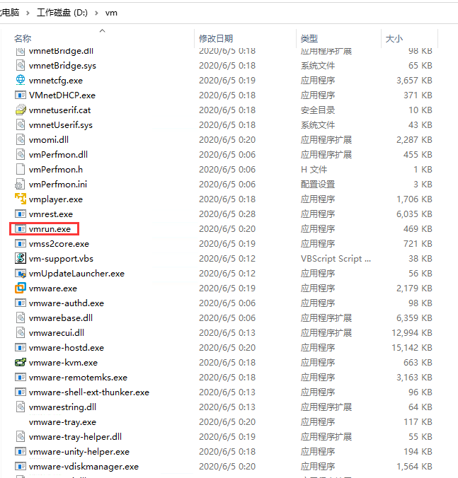
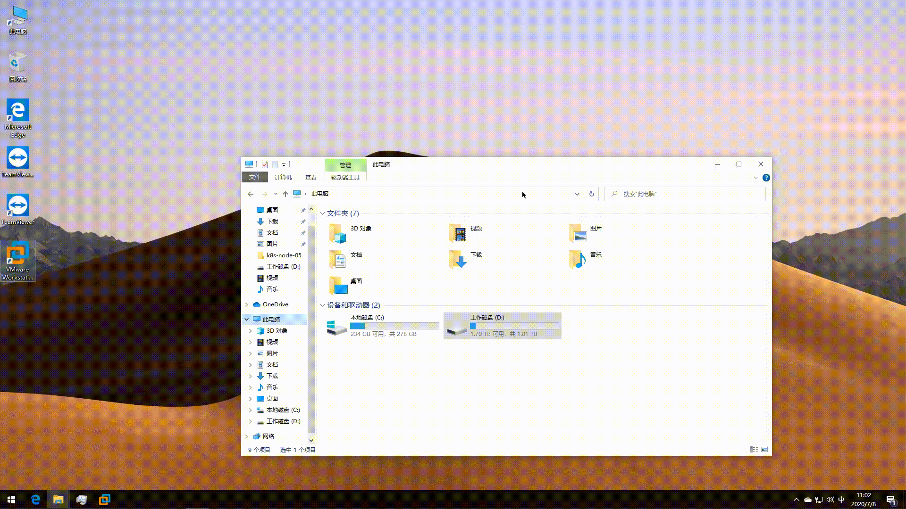
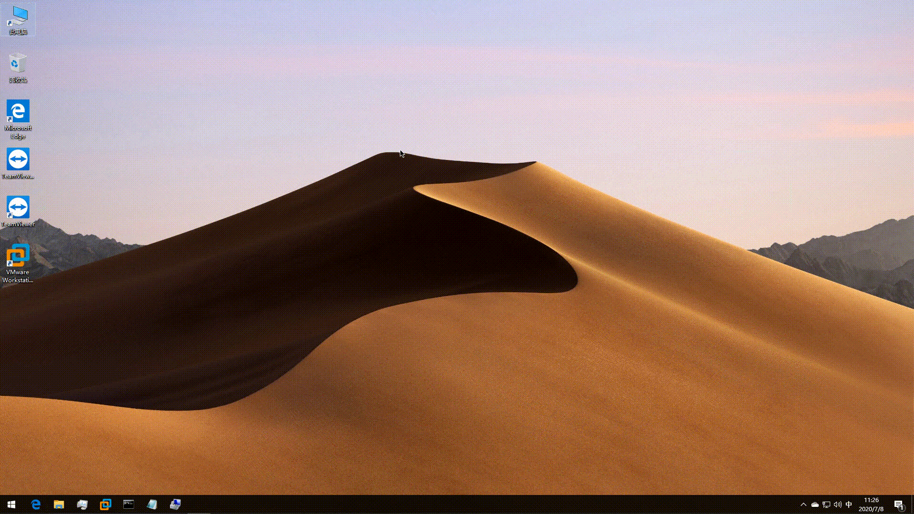

# 笔记三 Win10 设置 VM开机启动

## <font color=red>1. 为什么要使用VM?</font>

- ### 条件限制

> 日常工作中，由于条件以及成本的限制，我们会在自己本地电脑上安装虚拟机装服务器系统，来满足自己工作中对服务器的需求。

- ### 虚拟化应用

> 因为我们接触了Docker 和 容器概念之后，很多虚拟化技术都是从虚拟机技术上做了改进从而演技过来的。所以掌握VM 是必备的要求。


## <font color=gree>2. VM 虚拟机开机自启动的操作步骤</font>

- 很多时候，我们自己的电脑关机或者重启后，虚拟机并不会自行启动，需要我们手动启动虚拟机，如果我们只有一两台虚拟机，那没什么，启动很快，但是，如果我们有很多台虚拟机呢？10 台，20 台，甚至更多，难道我们还要手动一个个开机吗？那真是太让人头疼，又太浪费时间。下面，我们就讲下，如何让虚拟机在我们自己的主机开机时自动启动。

- 要说 **VMware workstation** 虚拟机开机自启动，在 **VMware workstation** 图形界面是找不到设置方法的，但是图形界面找不到设置方法，不代表它就没有设置方法。要设置开机自启动，首先，我们得了解下 **VMware workstation** 所提供的命令行工具 **`vmrun`** 。

### 1. 使用**`vmrun.exe`**提供了虚拟机的**`自启动方法`**。

-  VM 的安装目录，找一下 **`vmrun.exe`** 文件。



### 2. 将VM 的安装目录, 添加系统的环境变量。

- 系统变量 Path: 添加 **`D:\vm`**（vm 安装目录）




### 3. 使用 CMD 命令，运行 **`vmrun`** 命令，验证是否生效。

```bash
$ vmrun

------------------------------- 输出如下信息 ----------------------------------------------------
vmrun version 1.17.0 build-16341506

Usage: vmrun [AUTHENTICATION-FLAGS] COMMAND [PARAMETERS]


# 验证标志
AUTHENTICATION-FLAGS
--------------------
These must appear before the command and any command parameters.

   # -T 代表目标类型，ws 表示工作站(即 Workstation )，一般使用此参数即可，其他很少使用，就不做解释
   # 当然还有 server、esx、vc 等等，这里没有列出。
   -T <hostType> (ws|fusion||player)
   -vp <password for encrypted virtual machine>
   -gu <userName in guest OS>
   -gp <password in guest OS>


# 电源指令
POWER COMMANDS           PARAMETERS           DESCRIPTION
--------------           ----------           -----------
# 开启虚拟机
start                    Path to vmx file     Start a VM or Team
                         [gui|nogui]
# 关闭虚拟机
stop                     Path to vmx file     Stop a VM or Team
                         [hard|soft]
# 重置虚拟机
reset                    Path to vmx file     Reset a VM or Team
                         [hard|soft]
# 挂起虚拟机
suspend                  Path to vmx file     Suspend a VM or Team
                         [hard|soft]

pause                    Path to vmx file     Pause a VM

unpause                  Path to vmx file     Unpause a VM

# 快照指令
SNAPSHOT COMMANDS        PARAMETERS           DESCRIPTION
-----------------        ----------           -----------
# 列出虚拟机的快照数量及名称
listSnapshots            Path to vmx file     List all snapshots in a VM
                         [showTree]
# 为虚拟机创建快照
snapshot                 Path to vmx file     Create a snapshot of a VM
                         Snapshot name
# 删除虚拟机的快照
deleteSnapshot           Path to vmx file     Remove a snapshot from a VM
                         Snapshot name
                         [andDeleteChildren]
# 从一个快照恢复虚拟机
revertToSnapshot         Path to vmx file     Set VM state to a snapshot
                         Snapshot name


GUEST OS COMMANDS        PARAMETERS           DESCRIPTION
-----------------        ----------           -----------
runProgramInGuest        Path to vmx file     Run a program in Guest OS
                         [-noWait]
                         [-activeWindow]
                         [-interactive]
                         Complete-Path-To-Program
                         [Program arguments]

fileExistsInGuest        Path to vmx file     Check if a file exists in Guest OS
                         Path to file in guest

directoryExistsInGuest   Path to vmx file     Check if a directory exists in Guest OS
                         Path to directory in guest

setSharedFolderState     Path to vmx file     Modify a Host-Guest shared folder
                         Share name
                         Host path
                         writable | readonly

addSharedFolder          Path to vmx file     Add a Host-Guest shared folder
                         Share name
                         New host path

removeSharedFolder       Path to vmx file     Remove a Host-Guest shared folder
                         Share name

enableSharedFolders      Path to vmx file     Enable shared folders in Guest
                         [runtime]

disableSharedFolders     Path to vmx file     Disable shared folders in Guest
                         [runtime]

listProcessesInGuest     Path to vmx file     List running processes in Guest OS

killProcessInGuest       Path to vmx file     Kill a process in Guest OS
                         process id

runScriptInGuest         Path to vmx file     Run a script in Guest OS
                         [-noWait]
                         [-activeWindow]
                         [-interactive]
                         Interpreter path
                         Script text

deleteFileInGuest        Path to vmx file     Delete a file in Guest OS
                         Path in guest

createDirectoryInGuest   Path to vmx file     Create a directory in Guest OS
                         Directory path in guest

deleteDirectoryInGuest   Path to vmx file     Delete a directory in Guest OS
                         Directory path in guest

CreateTempfileInGuest    Path to vmx file     Create a temporary file in Guest OS

listDirectoryInGuest     Path to vmx file     List a directory in Guest OS
                         Directory path in guest

CopyFileFromHostToGuest  Path to vmx file     Copy a file from host OS to guest OS
                         Path on host
                         Path in guest

CopyFileFromGuestToHost  Path to vmx file     Copy a file from guest OS to host OS
                         Path in guest
                         Path on host

renameFileInGuest        Path to vmx file     Rename a file in Guest OS
                         Original name
                         New name

typeKeystrokesInGuest    Path to vmx file     Type Keystrokes in Guest OS
                         keystroke string

connectNamedDevice       Path to vmx file     Connect the named device in the Guest OS
                         device name

disconnectNamedDevice    Path to vmx file     Disconnect the named device in the Guest OS
                         device name

captureScreen            Path to vmx file     Capture the screen of the VM to a local file
                         Path on host

writeVariable            Path to vmx file     Write a variable in the VM state
                         [runtimeConfig|guestEnv|guestVar]
                         variable name
                         variable value

readVariable             Path to vmx file     Read a variable in the VM state
                         [runtimeConfig|guestEnv|guestVar]
                         variable name

getGuestIPAddress        Path to vmx file     Gets the IP address of the guest
                         [-wait]

# 常用命令

GENERAL COMMANDS         PARAMETERS           DESCRIPTION
----------------         ----------           -----------
# 列出正在运行的虚拟机的数量及名称
list                                          List all running VMs

# 升级虚拟机的文件格式，虚拟硬件
upgradevm                Path to vmx file     Upgrade VM file format, virtual hw

# 在 Guest 中安装工具
installTools             Path to vmx file     Install Tools in Guest

# 检查工具状态
checkToolsState          Path to vmx file     Check the current Tools state

# 删除一个虚拟机
deleteVM                 Path to vmx file     Delete a VM

# 克隆虚拟机
clone                    Path to vmx file     Create a copy of the VM
                         Path to destination vmx file
                         full|linked
                         [-snapshot=Snapshot Name]
                         [-cloneName=Name]


Template VM COMMANDS     PARAMETERS           DESCRIPTION
---------------------    ----------           -----------
downloadPhotonVM         Path for new VM      Download Photon VM


Examples:


Starting a virtual machine with Workstation on a Windows host
   vmrun -T ws start "c:\my VMs\myVM.vmx"


Running a program in a virtual machine with Workstation on a Windows host with Windows guest
   vmrun -T ws -gu guestUser -gp guestPassword runProgramInGuest "c:\my VMs\myVM.vmx" "c:\Program Files\myProgram.exe"


Creating a snapshot of a virtual machine with Workstation on a Windows host
   vmrun -T ws snapshot "c:\my VMs\myVM.vmx" mySnapshot


Reverting to a snapshot with Workstation on a Windows host
   vmrun -T ws revertToSnapshot "c:\my VMs\myVM.vmx" mySnapshot


Deleting a snapshot with Workstation on a Windows host
   vmrun -T ws deleteSnapshot "c:\my VMs\myVM.vmx" mySnapshot


Enabling Shared Folders with Workstation on a Windows host
   vmrun -T ws enableSharedFolders "c:\my VMs\myVM.vmx"
-----------------------------------------------------------------------------------------------
```


### 4. 添加编写开机 **`vm_init_start.bat`**启动脚本。

- **`nogui`** : 表示无图形界面启动
- **`gui`** :（默认）表示有图形界面启动

```bash
@echo off & setlocal enabledelayedexpansion
# 启动 docker-harbor 虚拟机
vmrun -T ws start D:\vm_workspace\docker-harbor\docker-harbor.vmx nogui
# 启动 docker-zentao 虚拟机
vmrun -T ws start D:\vm_workspace\docker-zentao\docker-zentao.vmx nogui
# 启动 kubernete-node-02 虚拟机
vmrun -T ws start D:\vm_workspace\k8s-node-02\kubernete-node-02.vmx nogui
# 启动 kubernete-node-05 虚拟机
vmrun -T ws start D:\vm_workspace\k8s-node-05\kubernetes-node-05.vmx nogui
```

> 注意： 脚本需要把 # 号上的注释去掉，不然脚本执行不生效。

- 附上关机 **`vm_all_stop.bat`**  脚本 

```bash
@echo off & setlocal enabledelayedexpansion
vmrun list > vmlist.txt
for %%i in (vmlist.txt) do (
    set "f=%%i"
    for /f "usebackq delims=" %%j in ("!f!") do set/a n+=1
    for /f "delims=" %%m in ('"type "!f!"|more /E +1 & cd. 2^>!f!"') do set/a x+=1&if !x! leq !n! echo;%%m>>!f!
    set/a n=0,x=0
)
for /f "delims=" %%a in (vmlist.txt) do (
     vmrun -T ws stop "%%a" nogui
)
pauses
```


### 5. 用 Win10 创建计划任务，将脚本实现开机启动。

#### 5.1 常规-设置

- 名称：**`vm_boot`**

- 安全选项：
  - **`不管用户是否登录都运行`**
  - 勾选 **`使用最高权限运行`**
- 配置：选择 **`Windows 10`**

#### 5.2 触发器-设置

- 新建选择**`启动时`**

#### 5.3 操作-设置

- 新建添加程序 **`vm_init_start.bat`**脚本

#### 5.4  操作步骤，如下图所示：

