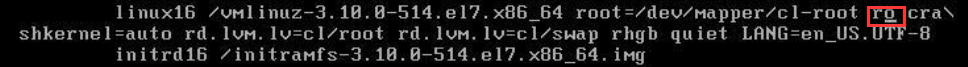

# 笔记四 CentOS 常见问题

## 问题 1：在VM中安装CentOS，强制关机，导致硬盘修复问题？

### <font color=red>报错问题:  XFS 文件元数据I/O 错误 </font>

``` bash
XFS（dm-0）：metadata I/O in (“xfs_trans_read_buf_map”) at daddr 0x3212118 len 32 error 117
```

### 解决步骤：

#### 1. 进入 **CentOS 7** 系统**`emergency `**模式。

a. 重启系统，按‘**`e`**’键，按“**`↓`**” 查看到 “**`ro`**”，修改为 **`rw init=/sysroot/bin/sh`**，最后 “**`Ctrl + x`**”就进入 **`emergency 模式`**。



#### 2. 修复 XFS 磁盘

```bash
$ ls -l /dev/mapper

# 输出如下
lrwxrwxrwx 1 root root       7 8月   7 03:38 centos-root -> ../dm-0
lrwxrwxrwx 1 root root       7 8月   7 03:38 centos-swap -> ../dm-1
crw------- 1 root root 10, 236 8月   7 03:38 control

# 执行修复
$ xfs_repair -L /dev/mapper/centos-root

# 如果输出下：
xfs_repair: /dev/mapper/centos-root contains a mounted filesystem
xfs_repair: /dev/mapper/centos-root contains a mounted and writable filesystem

fatal error -- couldn't initialize XFS library

# 解绑挂载
$ umount /dev/mapper/centos-root

# 再执行修复
$ xfs_repair -L /dev/mapper/centos-root

# 输出如下，代表修复成功
Phase 1 - find and verify superblock...
Phase 2 - using internal log 
        - zero log...
....
Phase 7 - verify and correct link counts...
Maximum metadata LSN (72:4434) is ahead of log (1:2)
Format log to cycle 75.
done

# 最后重启
$ init 6 
```


> 提醒：
>
> - 如果输出不是修复成功结果，请执行以下步骤进入恢复模式：
>
>   1. 需要进行 Troubleshooting，请参考https://www.lanhusoft.com/Article/703.html
>
>   2. 通过使用命令 lvscan 查看是否 inactive（未激活），如果未激活，执行激活 VG 卷组。
>
>      ```bash
>      $ vgchange -a y centos && reboot
>      ```
>
>   3. 在进入 **CentOS 7** 系统**`emergency `**模式，操作如上步骤一遍。