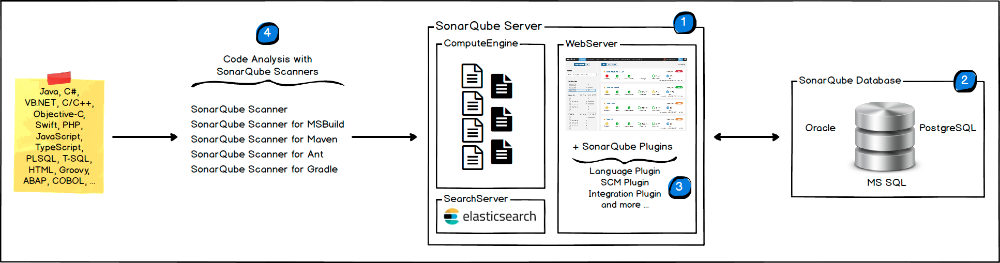

# 笔记一 SonarQube 简介

##  1. SonarQube 是什么？

> [SonarQube®](http://www.sonarqube.org/)是一种自动代码审查工具，可检测代码中的错误，漏洞和代码味道。 
>
> 它可以与您现有的工作流程集成，以实现跨项目分支和拉取请求的连续代码检查。

## 2. 为什么使用 SonarQube (作用)？

- ####  帮助您编写更干净。

- #### 使你的代码安全性更高。

- #### 帮助你分析代码的利弊性，提高你写代码的规范。

## 3. SonQube 架构与整合

### 3.1 架构

- **`SonarQube`**平台由4个组件组成：

1. 一台**`SonarQube Server`**启动3个主要过程：
   - Web服务器，供开发人员，管理人员浏览高质量的快照并配置SonarQube实例
   - 基于**`Elasticsearch`**的Search Server从UI进行后退搜索
   - **`Compute Engine`**服务器，负责处理代码分析报告并将其保存在SonarQube数据库中
2. 一个**`SonarQube数据库`**要存储：
   - **`SonarQube`**实例的配置（安全性，插件设置等）
   - 项目，视图等的质量快照。
3. 服务器上安装了多个**`SonarQube插件`**，可能包括语言，SCM，集成，身份验证和管理插件
4. 在构建/持续集成服务器上运行一个或多个**`SonarScanner`**，以分析项目

### 3.2 整合

- 以下架构显示了**`SonarQube`**如何与其他**`ALM工具`**集成以及使用**`SonarQube`**的各种组件的位置。

1. 开发人员在其IDE中进行编码，并使用[SonarLint](https://sonarlint.org/)运行本地分析。
2. 开发人员将其代码推送到他们最喜欢的**`SCM`**中：**`git，SVN，TFVC`**等。
3. **`Continuous Integration Server`**会触发自动构建，并执行运行**`SonarQube`**分析所需的**`SonarScanner`**。
4. 分析报告将发送到**`SonarQube服务器`**进行处理。
5. **`SonarQube Server`**处理分析报告结果并将其存储在**`SonarQube数据库`**中，并在**`UI`**中显示结果。
6. 开发人员通过**`SonarQube UI`**审查，评论，挑战他们的问题，以管理和减少技术债务。
7. 经理从分析中接收报告。**`Ops`**使用**`API`**自动执行配置并从**`SonarQube`**提取数据。运维人员使用**`JMX`**监视**`SonarQube Server`**。

## 4. SonarQube 注意事项

- **`SonarQube`**平台不能具有多个**`SonarQube服务器`**（尽管该服务器可以[作为群集](https://docs.sonarqube.org/latest/setup/install-cluster/)安装）和**`一个SonarQube数据库。`**
- 为了获得最佳性能，应将每个组件（服务器，数据库，扫描仪）安装在单独的计算机上，并且服务器计算机应专用。
- **`SonarScanners`**通过添加机器进行扩展。
- 所有机器必须时间同步。
- **`SonarQube服务器`**和**`SonarQube数据库`**必须位于同一网络中
- **`SonarScanners`**不必与**`SonarQube Server`**位于同一网络上。
- **`SonarScanners`**和**`SonarQube数据库`**之间没有通信。

