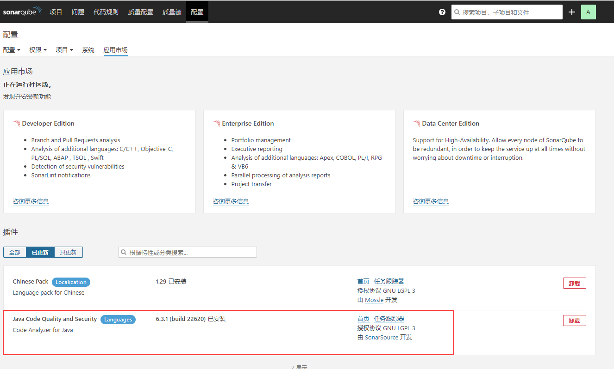

## 笔记二 SonarQube 安装和使用

## 前置准备

1. #### 安装 Docker。

2. #### 安装 docker-compose。

3. #### 可以访问外网。

## 1. 基于 Dokcer 安装 SonarQube 7.9.3

### 1.1 创建 **SonarQube** 容器挂载目录。

``` bash
# 创建容器挂载目录
$ mkdir -p /home/docker/mnt/sonarqube/

# 进入目录
$ cd /home/docker/mnt/sonarqube/

# 创建需要挂载的目录文件夹，并授予最高权限
$ mkdir -p conf data extensions logs && chmod 777 conf data extensions logs
```

### 1.2 创建编写<font color=#ff6702><b>docker-compose.yml</b></font>

```bash
# 创建容器目录，用于存放docker-compose.yml 文件
$ mkdir -p /home/docker/sonarqube

# 进入目录
$ cd /home/docker/sonarqube

# 创建文件，编写以下内容
$ vim docker-compose.yml

# 在docker-compose.yml 添加以下内容
version: '3.5'
services:
  sonarqube:
    restart: always
    image: sonarqube:7.9.3-community
    container_name: sonarqube
    ports:
      - 80:9000
    volumes:
      - /home/docker/mnt/sonarqube/conf:/opt/sonarqube/conf
      - /home/docker/mnt/sonarqube/extensions:/opt/sonarqube/extensions
      - /home/docker/mnt/sonarqube/logs:/opt/sonarqube/logs
      - /home/docker/mnt/sonarqube/data:/opt/sonarqube/data

```

### 1.3 启动<font color=#ff6702><b>SonarQube</b></font>服务。

```bash
$ docker-compose up -d 
```

### 1.4 通过浏览器访问，验证是否成功

- 访问地址：ip:80

- 默认账号：admin

- 默认密码：admin


### 1.5 在<font color=#ff6702><b>配置</b></font>中的<font color=#ff6702><b>应用市场</b></font>安装<font color=#ff6702><b>中文插件</b></font>和<font color=#ff6702><b>Java Code Quality and Security 插件</b></font>




### 1.6 在<font color=#ff6702><b>配置</b></font>中的<font color=#ff6702><b>通用设置</b></font>，设置<font color=#ff6702><b>强制登录</b></font>


## 2. 安装 SonarScanner 扫描软件，进行代码扫描。

> 下载地址：https://docs.sonarqube.org/latest/analysis/scan/sonarscanner/


### 2.1 下载、解压、安装

```bash
# 下载
$ wget https://binaries.sonarsource.com/Distribution/sonar-scanner-cli/sonar-scanner-cli-4.4.0.2170-linux.zip

# 解压
$ unzip sonar-scanner-cli-4.4.0.2170-linux.zip

# 移动放入到 /usr/local/ 中
$ mv sonar-scanner-cli-4.4.0.2170-linux /usr/local/

# 添加到环境变量
$ vim /etc/profile

# -------------------------- 添加以下内容 ------------------------------------------
export SONARQUBE_SCANNER_HOME=/usr/local/sonar-scannerxxx
export PATH=$PATH:$SONARQUBE_SCANNER_HOME/bin
#---------------------------------------------------------------------------------

# 让环境变量生效
$ source /etc/profile

# 验证是否安装成功
$ sonar-scanner -v

# -------------------------- 输出如下信息，说明安装成功 ------------------------------
INFO: Scanner configuration file: /usr/local/bin/sonar-scanner-4.4.0.2170-linux/conf/sonar-scanner.properties
INFO: Project root configuration file: NONE
INFO: SonarScanner 4.4.0.2170
INFO: Java 11.0.3 AdoptOpenJDK (64-bit)
INFO: Linux 3.10.0-1127.el7.x86_64 amd64
#---------------------------------------------------------------------------------
```

> 注意：Sonnar-Scanner 软件主要安装在跟项目代码相关地方。


### 2.2 本地分析项目

- #### 使用 sonar-scanner命令，进行项目代码扫描分析

```bash
sonar-scanner \
# 指定 SonarQuber 服务地址 ip:80
-Dsonar.host.url=http://192.168.2.167 \
# 指定 SonarQuber 登录用户名
-Dsonar.login=admin \
# 指定 SonarQuber 登录用户密码
-Dsonar.password=admin \
# 指定项目的关键字
-Dsonar.projectKey=nx-smartcity-wechat-service \
# 指定项目的名称
-Dsonar.projectName=wechat-service-impl \
# 指定项目的版本(可以用构建时间和构建ID定义)
-Dsonar.projectVersion=1.0 \
-Dsonar.ws.timeout=30 \
# 指定项目的描述信息
-Dsonar.projectDescription="南雄智慧城市项目" \
# 指定项目的主页（超链接）
-Dsonar.links.homepage=http://192.168.2.163/irf-nx-smartcity-java/nx-smartcity \
# 指定扫描的目录
-Dsonar.sources=/home/gitlab-project/nx-smartcity/wechat-service-impl/src \
# 指定扫描时的编码
-Dsonar.sourceEncoding=UTF-8 \
# 指定编译后的类文件目录(必填)
-Dsonar.java.binaries=/home/gitlab-project/nx-smartcity/wechat-service-impl/target/classes 

# 指定编译后的测试类目录
# -Dsonar.java.test.binaries=/home/gitlab-project/nx-smartcity/wechat-service-impl/target/test-classes \
# 指定测试报告目录
# -Dsonar.java.surefire.report=target/surefire-reports
```

- #### 执行成功后，打印扫描结果

```bash
INFO: Scanner configuration file: /usr/local/bin/sonar-scanner-4.4.0.2170-linux/conf/sonar-scanner.properties
INFO: Project root configuration file: NONE
INFO: SonarScanner 4.4.0.2170
INFO: Java 11.0.3 AdoptOpenJDK (64-bit)
INFO: Linux 3.10.0-1127.el7.x86_64 amd64
INFO: User cache: /root/.sonar/cache
INFO: Scanner configuration file: /usr/local/bin/sonar-scanner-4.4.0.2170-linux/conf/sonar-scanner.properties
INFO: Project root configuration file: NONE
INFO: Analyzing on SonarQube server 7.9.3
INFO: Default locale: "zh_CN", source code encoding: "UTF-8"
INFO: Load global settings
INFO: Load global settings (done) | time=554ms
INFO: Server id: BF41A1F2-AXMz52xeliEc7Kh9C4FC
INFO: User cache: /root/.sonar/cache
INFO: Load/download plugins
INFO: Load plugins index
INFO: Load plugins index (done) | time=632ms
INFO: Plugin [l10nzh] defines 'l10nen' as base plugin. This metadata can be removed from manifest of l10n plugins since version 5.2.
INFO: Load/download plugins (done) | time=737ms
INFO: Process project properties
INFO: Project key: nx-smartcity-wechat-service
INFO: Base dir: /home/gitlab-project
INFO: Working dir: /home/gitlab-project/.scannerwork
INFO: Load project settings for component key: 'nx-smartcity-wechat-service'
INFO: Load quality profiles
INFO: Load quality profiles (done) | time=804ms
INFO: Load active rules
INFO: Load active rules (done) | time=1587ms
WARN: SCM provider autodetection failed. Please use "sonar.scm.provider" to define SCM of your project, or disable the SCM Sensor in the project settings.
INFO: Indexing files...
INFO: Project configuration:
INFO: 83 files indexed
INFO: Quality profile for java: Sonar way
INFO: ------------- Run sensors on module wechat-service-impl
INFO: Load metrics repository
INFO: Load metrics repository (done) | time=484ms
INFO: Sensor JavaSquidSensor [java]
INFO: Configured Java source version (sonar.java.source): none
INFO: JavaClasspath initialization
WARN: Bytecode of dependencies was not provided for analysis of source files, you might end up with less precise results. Bytecode can be provided using sonar.java.libraries property.
INFO: JavaClasspath initialization (done) | time=20ms
INFO: JavaTestClasspath initialization
INFO: JavaTestClasspath initialization (done) | time=1ms
INFO: Java Main Files AST scan
INFO: 66 source files to be analyzed
INFO: Load project repositories
INFO: Load project repositories (done) | time=494ms
INFO: 41/66 files analyzed, current file: nx-smartcity/wechat-service-impl/src/main/java/com/irf/smartCity/util/Decode.java
INFO: Java Main Files AST scan (done) | time=13291ms
INFO: Java Test Files AST scan
INFO: 66/66 source files have been analyzed
INFO: 0 source files to be analyzed
INFO: Java Test Files AST scan (done) | time=6ms
INFO: Java Generated Files AST scan
INFO: 0 source files to be analyzed
INFO: Java Generated Files AST scan (done) | time=1ms
INFO: Sensor JavaSquidSensor [java] (done) | time=13585ms
INFO: Sensor SurefireSensor [java]
INFO: parsing [/home/gitlab-project/target/surefire-reports]
INFO: Sensor SurefireSensor [java] (done) | time=1ms
INFO: Sensor JavaXmlSensor [java]
INFO: 11 source files to be analyzed
INFO: 0/0 source files have been analyzed
INFO: 0/0 source files have been analyzed
INFO: Sensor JavaXmlSensor [java] (done) | time=396ms
INFO: ------------- Run sensors on project
INFO: Sensor Zero Coverage Sensor
INFO: 11/11 source files have been analyzed
INFO: Sensor Zero Coverage Sensor (done) | time=40ms
INFO: Sensor Java CPD Block Indexer
INFO: Sensor Java CPD Block Indexer (done) | time=118ms
INFO: No SCM system was detected. You can use the 'sonar.scm.provider' property to explicitly specify it.
INFO: 27 files had no CPD blocks
INFO: Calculating CPD for 39 files
INFO: CPD calculation finished
INFO: Analysis report generated in 104ms, dir size=471 KB
INFO: Analysis report compressed in 140ms, zip size=238 KB
INFO: Analysis report uploaded in 1005ms
INFO: ANALYSIS SUCCESSFUL, you can browse http://192.168.2.167/dashboard?id=nx-smartcity-wechat-service
INFO: Note that you will be able to access the updated dashboard once the server has processed the submitted analysis report
INFO: More about the report processing at http://192.168.2.167/api/ce/task?id=AXNWgsQwjjrwzrTPMcd1
INFO: Analysis total time: 20.674 s
INFO: ------------------------------------------------------------------------
INFO: EXECUTION SUCCESS
INFO: ------------------------------------------------------------------------
INFO: Total time: 24.521s
INFO: Final Memory: 12M/44M
INFO: ------------------------------------------------------------------------
```

> 注意：由于我的是Java 项目，所以我安装的是 **Java Code Quality and Security**插件，如果没有安装，上面命令执行会失败。

### 2.3 进入SonarQuber 查看项目分析结果

